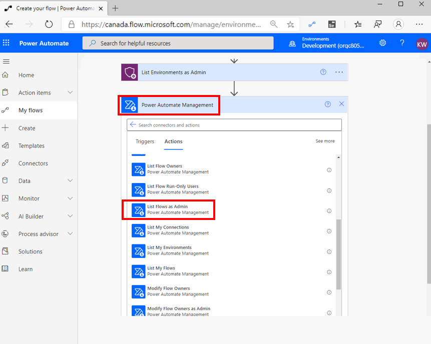
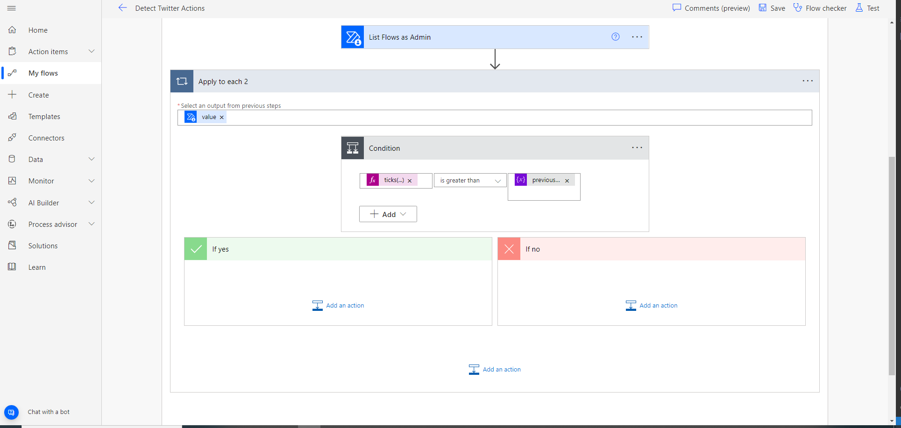
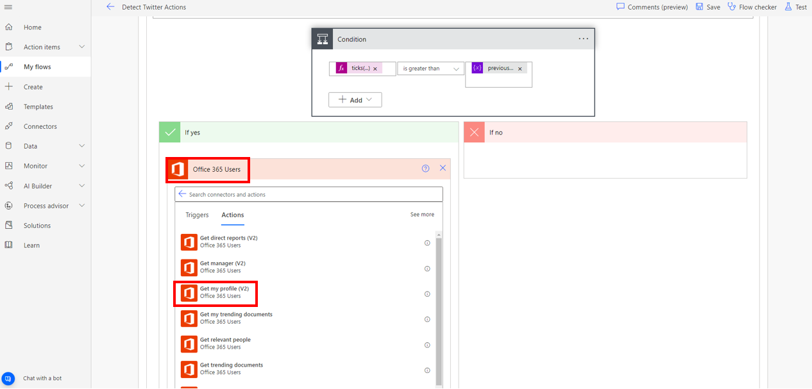

The Plan and manage your Power Automate environment module of this 
learning path discussed strategies that deal with exceptions. The
scenario that was outlined in that module involved SharePoint and 
Twitter connectors that were being used within the same flow. 

The concern that an administrator might have is that sensitive data 
could leak from SharePoint to Twitter. This type of scenario might
pose concerns for administrators, as would an alternative scenario 
where data flowed the opposite way, from Twitter to SharePoint. 
The likelihood of that scenario occurring is low because it involves 
bringing a public dataset into the enterprise.

Currently, DLP policies do not have a notion of directionality; however, 
you can implement directionality by using Power Platform Management connectors. 
The following sections explain how you can accomplish directional data governance.

The first step in accomplishing directional data governance is to create a DLP policy, from the 
[Power Automate Admin center](https://admin.flow.microsoft.com/?azure-portal=true), 
that includes the SharePoint and Twitter connectors in the **Business data only**
data group. By using this configuration, you are allowing makers to build flows 
that include both of these connectors.


Next, you will transition to the [Power Automate Maker Portal](https://flow.microsoft.com/?azure-portal=true) 
and sign in by using your administrator account so you can build your governance flow. Your goal is to build
a scheduled flow that will run every hour.


A Recurrence trigger will automatically be added to your flow. You will
now add an **Initialize variable** action to your flow. Name this
variable **previousTimestamp** and then include an expression of
**```ticks(addMinutes(utcNow(),-60))```**. This expression will calculate the
number of ticks as of 60 minutes ago. The reason for including this expression is
that you want to see if any flows have been created or modified since the
last time your flow ran, which would have been 60 minutes ago.


Add another variable called **isFlowAction** that is of type
Boolean and has a default value of **false**. You will use this variable
later in your flow when you detect that a flow includes a Twitter action.


Next, use the PowerPlatform for Admins connector and the 
**List Environments as Admin** action that will provide your flow with a complete
list of environments in your tenant. Then, subsequently loop through
each environment so that you can look for flows that include Twitter actions.


After listing all environments, you will add the Flow management
connector and use the **List Flows as Admin** action that will provide a
listing of all flows for a given environment.



The **List Flows as Admin** action requires the name of an environment as 
an input parameter. Use the **Name** field that is returned from your **List
Environments as Admin** call. When you provide this input, an **Apply to each**
action will automatically be added that will allow you to iterate through all environments.


Because you are only interested in exploring recently modified flows, you
will add a condition to your flow and will compare the ticks of the
flow's last modified timestamp to that of your variable that you
established earlier in your flow. To accomplish this task, use an
expression to calculate the ticks of your last modified timestamp. The
complete statement is **```ticks(items('Apply_to_each_2')?['properties']?['lastModifiedTime']) is greater than previousTimestamp```**.



When you detect that a flow has been modified within the past 60 minutes, you will 
want to ensure that it doesn't belong to your administrator. This verification will help 
avoid an error when you try to add the administrator as co-owner of
a flow in a future step. To detect if the current flow belongs to your
administrator, use the Office 365 Users connector and the **Get my
profile (v2)** action. This step will return information about the user who
established a connection to the connector, which in this case is the
administrator. Next, add the Office 365 Users action to the **If yes**
branch.



Now, you will add another condition that will verify if the **Creator**
object ID (from the **List Flows as Admin** action) is not equal to **ID** (from
the **Get my profile (V2)** action). In the **If yes** branch, add
the **Edit Flow Owner Role as Admin** action that belongs to the Microsoft
Flow for Admins connector. This action will add your administrator user
as a co-owner of the flow and will help extract the flow
definition, which requires you to be a co-owner of the flow. You will
retrieve the flow definition in an upcoming step, but for now, 
provide the current **Environment Name**, current **Flow Name**, and details
about your administrator user such as email address, display name, and
ID. These values are accessible from your **Get my profile (V2)** action.


After you have added your administrator account as a co-owner of the
flow, you can call the **Get Flow as Admin** action from the Flow management
connector.


The inputs to the **Get Flow as Admin** action includes the current
**Environment Name** and **Flow Name**. The output of this action includes the
flow definition that will allow you to determine if a Twitter action exists.


To check whether a Twitter action is being used, add a
condition to your flow and verify if the **Action Api** name (from the
**Get Flow as Admin** action) is equal to *shared_twitter*. After you have added this
condition, an **Apply to each** loop will be applied because the **Action Api**
name attribute is part of an array because each flow can have many actions.

Within the **If yes** branch, update your **isFlowAction** variable
to be set to **true** because you have now found a flow that includes a Twitter
action. You will use this variable later in your flow to determine whether
you need to disable a flow and send an email to the flow owner.


Outside the **Apply to each** variable that allows you to iterate through all actions
in your flow, add another condition. This condition will verify if the value of your **isFlowAction** variable is **true**.


In the **If yes** branch, add the Microsoft Flow for Admins
connector and then select the **Disable Flow as Admin** action. This action
will allow you to disable the flow so that information cannot be sent to
Twitter. To call this action, include the current **Environment Name** and **Flow Name**.


When disabling someone's flow, you will want to send an email to them so they
are aware that their flow is no longer running. To get the flow owner's 
email address, use the Office 365 Users connector and use the **Get
user profile (V2)** action to return the owner's email address. To get
their email address, you will need to add the **Creator object** ID, which can
be retrieved from the **List Flows as Admin** action.


Send an email to the flow owner by using the Office 365 Outlook
connector and the **Send an email (V2)** action. Use information
that is returned from the **Get user profile (V2)** action to send this email,
including the **Mail** and **Given Name** attributes. In addition, you can
include the name of the flow by adding the **Flow Display Name**
attribute found in the **List Flows as Admin** output.


Because you are looping through all flows in your tenant, you will need to set your
**isFlowAction** variable back to **false** so that you can look for other flows
that might have a Twitter action. You can now save your administrative flow.


To test your flow, sign in to the Power Automate maker portal by using
a different account. Now, you will create a simple flow that includes a
SharePoint trigger and a Twitter action. This scenario
will not be blocked by your DLP policy, but it should be detected by the
administrative flow that you created.


Now, you can run your Detect Twitter Actions flow that you previously
created as an administrator. When this flow runs, it should detect that
a flow was recently modified and that it includes a Twitter action. As a
result, an email will be sent to the flow owner.


If you examine the SharePoint to Twitter flow, you will discover that it
has been disabled as a result of your administrator disabling the flow.


However, retrieving information from Twitter
and sending it to SharePoint does not violate your governance rules. As
a result, you can create another flow by using your flow maker's account,
which includes a Twitter trigger and a SharePoint action. When you run your
Detect Twitter Actions governance flow, it remains functional and
is not disabled because this is a permitted use case.


