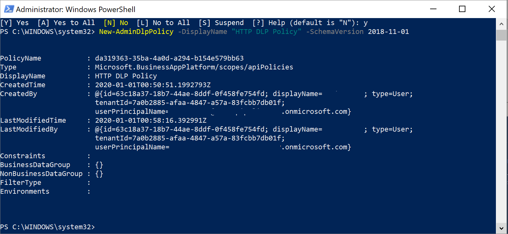
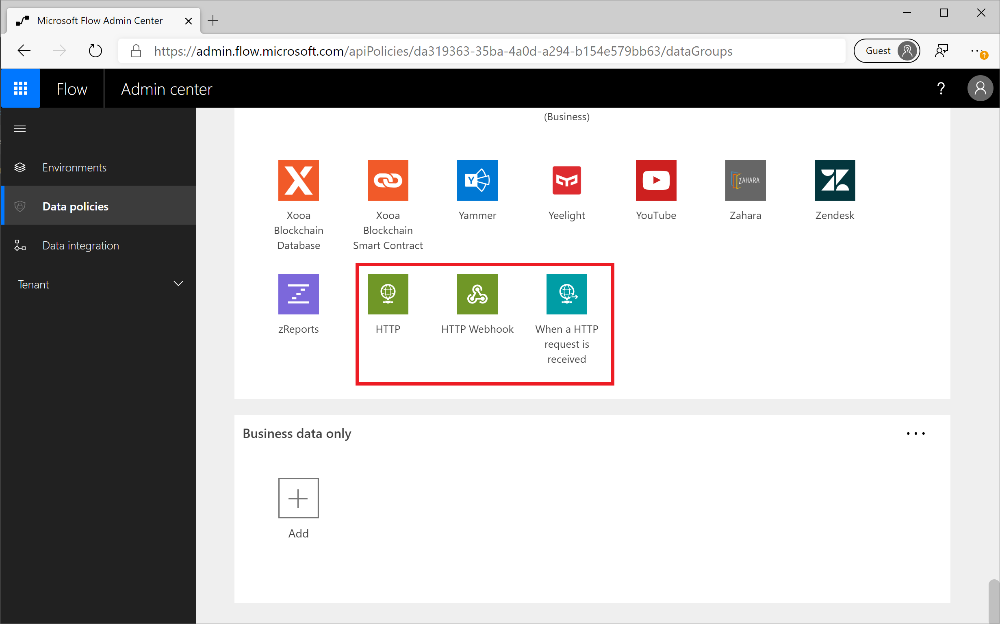

A scenario that administrators need to be aware of is that HTTP
triggers and actions can only be managed through the existing DLP editor,
with some actions being performed by an administrator. The partial reason for this parameter 
is because HTTP triggers and actions are considered to be built in 
and technically aren't considered connectors, even though they might have similar
characteristics.

However, because of customer needs and past feedback, it is possible to manage 
the triggers/actions that are shown in the following image.

These triggers/actions can only be managed in DLP policies that have a [schema version](https://flow.microsoft.com/blog/introducing-http-and-custom-connector-support-for-data-loss-prevention-policies//?azure-portal=true) of 2018-11-01, which is discussed in the linked blog. By using a new schema version, it allows organizations to
make the decision to implement these changes. Otherwise, it's highly possible that some flows will be broken, depending on how an organization wants to classify the connectors as business or non-business. 

For example, if the HTTP action was previously not managed and is being used 
with connectors from the **Business** data group and is then placed in 
the **Non-business** data group, then any flows that are using this configuration
will be suspended because of DLP violations.

By using this new schema version, DLP policies can be constructed by using
either of the following tables:

-   Power Platform Management connector

-   Power Apps and Power Automate PowerShell cmdlets

However, using PowerShell is the simplest path forward. Additional
information about PowerApps and Power Automate PowerShell cmdlets can be
found at [PowerShell support for Power Apps ](https://docs.microsoft.com/power-platform/admin/powerapps-powershell/?azure-portal=true).

After installing the prerequisite PowerShell modules, you can run the following statement, (**New-AdminDlpPolicy -DisplayName "HTTP DLP Policy" -SchemaVersion 2018-11-01**), which will create a new DLP policy that includes support for HTTP when you include a **-SchemaVersion** parameter of **2018-11-01**. After you have run the previous statement, you'll be asked to sign in by using your admin credentials.

After the command has been run, you'll be provided a status output
that includes the internal **PolicyName** and other attributes.

If you go to the [Power Automate Admin Center](https://admin.flow.microsoft.com/apiPolicies/?azure-portal=true), you'll discover that the DLP policy has been created.

> [!NOTE]
> Because an environment parameter was not specified when you
created this DLP policy, it will be applicable to the entire tenant.

After you have explored this DLP policy, you'll find that your HTTP
triggers and actions are included in your default data group, which in
this case is **No business data allowed**. These connectors can be
managed just like any other connectors and can be added to the
**Business data only** data group.

