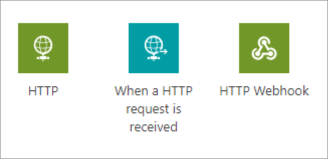

Another scenario that administrators need to be aware of is that HTTP
triggers and actions can only be managed through the existing DLP editor,
with some actions done by an administrator. The reason, in part for this, 
is HTTP triggers and actions are considered to be built in,
and technically they aren't a connector, even though they may have similar
characteristics.

However, because of customer needs and past feedback, it is possible to manage 
the following triggers/actions:

It's important to understand that these triggers/actions can only be managed in DLP policies that have a [schema version](https://flow.microsoft.com/blog/introducing-http-and-custom-connector-support-for-data-loss-prevention-policies//?azure-portal=true) of 2018-11-01. By using a new schema version, it allows organizations to
make the decision to implement these changes. Otherwise, there's a high potential that some flows will be broken, depending upon how an organization wants to classify the
connectors as business or non-business. 

For example, if the HTTP action was previously not managed and is being used 
with connectors from the Business data only data group and is then placed in 
the No business data allowed data group, then any flows using this configuration
will be suspended because of DLP violations.

DLP policies, using this new schema version, can be constructed using
either of the following:

-   Power Platform Management connector

-   Power Apps and Power Automate PowerShell Cmdlets

However, using PowerShell is the easiest path forward. Additional
information about PowerApps and Power Automate PowerShell Cmdlets can be
found at [PowerShell support for Power Apps ](https://docs.microsoft.com/power-platform/admin/powerapps-powershell/?azure-portal=true).

After installing the pre-requisite PowerShell modules, we can run the following statement, (**New-AdminDlpPolicy -DisplayName "HTTP DLP Policy" -SchemaVersion 2018-11-01**) which will create a new DLP policy that includes support for HTTP when we include a **-SchemaVersion** parameter of **2018-11-01**. Once we've executed the previous statement, we'll be asked to log in using our admin credentials.

Once the command has been executed, you'll be provided a status output
that includes the internal **PolicyName** and other attributes.

If you navigate to the [Power Automate Admin Center](https://admin.flow.microsoft.com/apiPolicies/?azure-portal=true), you'll discover that our DLP Policy has been created.

> [!NOTE]
> Since we did not specify an Environment parameter when we
created this DLP policy, it will be applicable to the entire tenant.

Once we've explored this DLP Policy, we'll find that our HTTP
triggers and actions are included in our default data group, which in
this case is **No business data allowed**. These connectors can be
managed just like any other connectors and can be added to the
**Business data allowed** data group.

