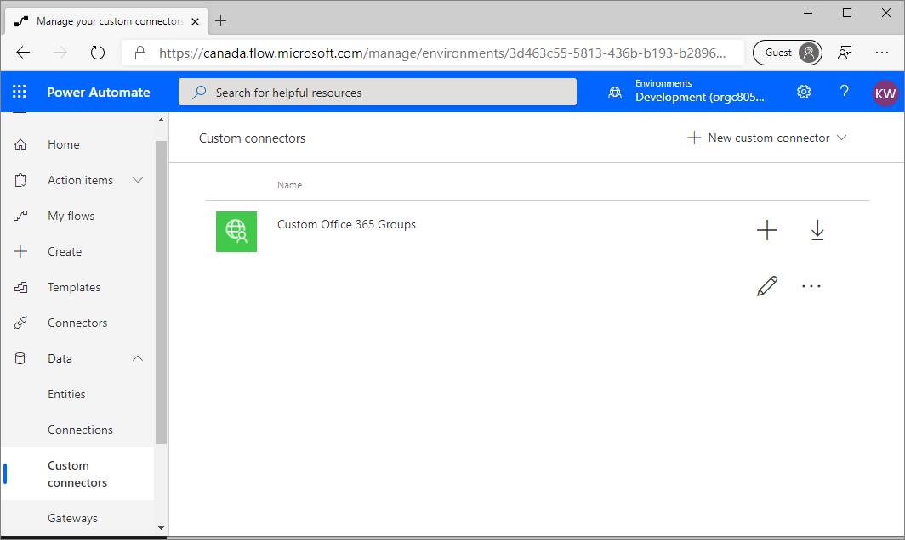
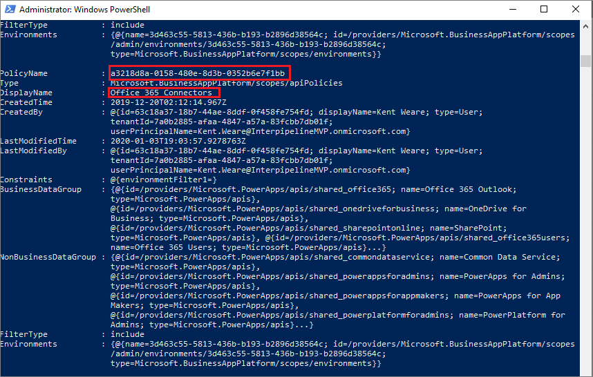

In this exercise, you will manage a custom connector in a DLP
policy. To manage a custom connector, you need to ensure that you have one
in your environment, so the first part of this exercise will be
publishing a custom connector from GitHub. After you have deployed that connector,
you will then manage it by using the PowerShell cmdlets that are provided by Microsoft.

### Publish a custom connector

The custom connector that you will deploy comes from Microsoft's
GitHub repository. The connector's functionality is arbitrary; you only need a custom connector for the purposes of DLP policy management.

Follow these steps to install the custom connector:

1. Go to the [Microsoft Power Platform GitHub repository](https://github.com/microsoft/PowerPlatformConnectors/?azure-portal=true) in a web browser.

2. Select the **Clone or download** button and then select the **Download ZIP** link. Note where you save this zip file.

    

3. Locate the zip file that you downloaded. Right-click the file in Windows Explorer and select **Extract All...**

4. Go to the extracted folder and open the **PowerPlatformConnectors-master** folder.

5. Open the **samples** folder.

6. Open the **Office365Groups** folder.

7. Note the location of the **apiDefinition.swagger.json** file. You will need this file when you create your custom connector in subsequent steps.

8. Go to the [Power Automate maker portal](https://flow.microsoft.com/?azure-portal=true) in a web browser and sign in.

9. From the environment picker, select the environment that you created in the first module of this learning path. If you recall, an environment called **Development** was created. By selecting this environment, your custom connector will only be deployed in this environment and will not be available in your default environment.

10. Within the left navigation pane, expand **Data** and then select **Custom connectors**.

11. Select **+ New custom connector** and then **Import an OpenAPI file**.

    

12. Enter **Custom Office 365 Groups** in the **Connector name** column. In the **Import an OpenAPI file** column, enter **apiDefinition.swagger.json**, select the **Import** button, and then select **Continue**. If you recall, this is the file that you located in step 7 of this exercise.

    

    The custom connector publisher wizard will now be displayed. You do not need to complete actions on the **General** tab.

13. Select the **Security** tab and then select an Authentication type of **No authentication**.

14. No further actions are necessary on the **Definition** or **Test** tabs, so select the **Create connector** link to publish your  connector.

15. In the upper-left corner, a message will briefly appear indicating that your custom connector has been published. Select the **Close** label to complete publishing the custom connector.

    You should now see your custom connector available within the **Custom connectors** experience.

    

You have now published your custom connector. In the next topic, you will manage this custom connector in a DLP policy.

### Manage a custom connector in a DLP policy

Currently, a custom connector cannot be managed through the Power Automate Admin center's DLP experience without some administrative actions. In this section, you will use the [Microsoft Power Apps and Power Automate PowerShell cmdlets](https://docs.microsoft.com/power-platform/admin/powerapps-powershell/?azure-portal=true) for administrators.

To add a custom connector to a DLP policy, you will need to retrieve some
unique identifiers for your custom connector and DLP policy
to provide them as inputs when adding your
custom connector. These steps are also covered in the following section.

> [!NOTE]
> Prior to attempting the following actions, ensure that you meet the prerequisites that were outlined earlier in this module.

1. Launch **Windows PowerShell** and select **Run as Administrator**.

    

2. Import the required modules by using the following commands:

    **Install-Module -Name Microsoft.PowerApps.Administration.PowerShell**

    **Install-Module -Name Microsoft.PowerApps.PowerShell -AllowClobber**

3. If you are prompted to accept the change to the *InstallationPolicy* value of the repository, accept **[A] Yes to all modules** by entering **A** and then selecting **Enter** for each module.

4. List all your DLP policies by running the following command in the **Windows PowerShell** command-line tool: **Get-AdminDlpPolicy**.

    

    > [!NOTE]
    > You will be prompted for credentials at this point. Ensure that the credentials you are using have Environment or Tenant Administrator permissions.

5. A list of DLP policies will be displayed. Look for the DLP policy that you created in the previous module. When you find the policy, copy the **PolicyName**, which is represented as a GUID, to a text editor like Notepad.

    

6. You now need to retrieve more details about your custom connector. To do so, enter **Get-AdminPowerAppConnector** in the **Windows PowerShell** command-line tool. When the results have returned, copy the **ConnectorName** and **ConnectorId** values to a text editor.

    

7. Enter **Add-CustomConnectorToPolicy** in the Windows PowerShell command-line tool.

8. When prompted, provide the **PolicyName** that you copied in step 5.

9. Provide the **ConnectorName** value that you copied in step 6.

10. Provide the **GroupName** of **hbi** to put it into the **Business data only** data group. Use **lbi** if you would rather put the custom connector in the **No business data allowed** data group.

11. Provide the **ConnectorId** that you copied in step 6.

12. You will now be prompted to provide a **ConnectorType**. Provide a value of **Microsoft.PowerApps/apis**.

13. Your command should now run and you should be presented with a status **Code** of **200** and a **Description** of **OK**.

    

14. Validate that your custom connector can be managed through DLP policies by going to the [Power Automate Admin center](https://admin.flow.microsoft.com/apiPolicies/?azure-portal=true), and then explore your **Office 365 Connectors** DLP policy to ensure that your custom connector appears in your **Business data only** data group. You can now manage this custom connector, much like any other connector.

> [!NOTE]
> Currently, you will not be able to rename the custom connector from this experience.
