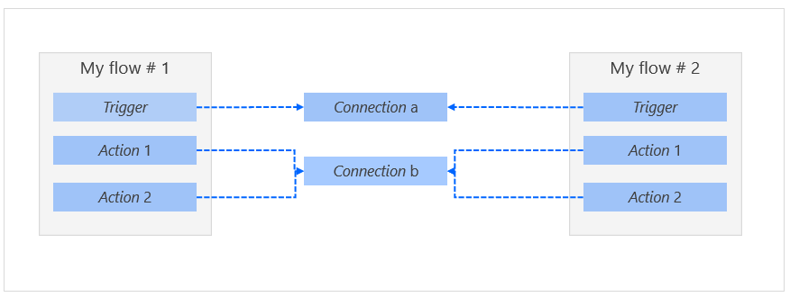
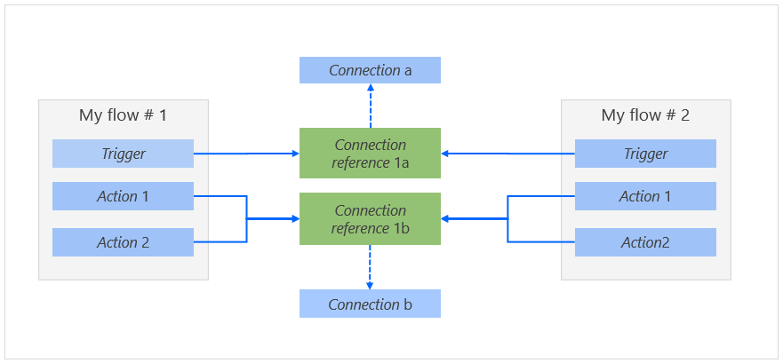
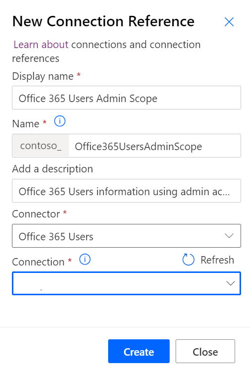
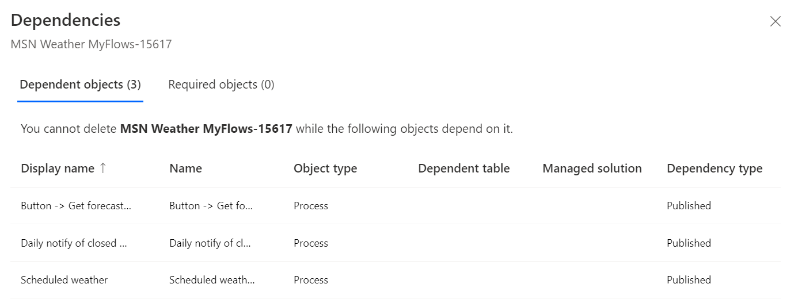

Connection references make cloud flows in solutions easier to transport between Power Platform environments by abstracting environment specific dependencies. This enables you to implement [healthy Application Lifecycle Management (ALM) practices](/power-platform/alm/implement-healthy-alm/?azure-portal=true). For new cloud flows created in solutions, connection references are created automatically. However, understanding their purpose and how to manually configure them can help you optimize their use.

Power Automate cloud flows use connectors for triggers and to perform actions in a flow. When you use a connector, a connection is established using your account information to the underlying service. In this example of a cloud flow not in a solution, your cloud flow has a direct dependency on the connection. Connections are specific to a Power Platform environment. The following diagram illustrates how a cloud flow depends on the connection directly when it isn't using connection references.

> [!div class="mx-imgBorder"]
> 

If this same architecture was used with a cloud flow in a solution, the flow definition that is transported between environments for the cloud flow would need to be edited in each environment changing the flow definition. Good ALM practices call for only editing the flow definition in a development environment, and not in downstream environments like test and production. To facilitate healthy ALM and to make it easier to deploy solutions, connection references are used with cloud flows in solutions.

Connection references are a solution component that contains information about a connector. They allow the cloud flow trigger and actions to be bound to a connection reference instead of directly to a connection. The connection reference then binds to a connection in a special way that doesn't modify the flow definition and maintains healthy ALM practices. The following diagram illustrates how connection references are used.

> [!div class="mx-imgBorder"]
> 

A solution with cloud flows that use connection references will list the cloud flow and one or more connection references on the solution object list.

> [!div class="mx-imgBorder"]
> 

When the solution is imported into another environment, the first time a connection reference has been added a prompt for a connection will be displayed.

> [!div class="mx-imgBorder"]
> 

No further configuration is needed after the import completes. This relationship between the connection reference and the connection will be maintained for future updates. To change a specific connection associated with a flow, you can edit the connection reference and change the connection selected.

## Configuring triggers and actions

When you select a trigger or an action to add to your flow, the flow designer will check if there's already a connection reference available for the connector and if not, one will be added. From a trigger or action card, you can select ... and see the connection reference used and others available. From here, you can select another connection reference or add a new one. If you add a new one from here, you won't have control over the name used.

> [!div class="mx-imgBorder"]
> 

Typically, you would want all the steps in a flow to use the same connection reference. There are some scenarios where using multiple connection references is important. For example, having multiple connection references allows the configuration of different user account information for each connection. When you intend to use multiple connection references, it's best to manually pre-create them as described later in this topic so you have unique names that are meaningful.

Connection references also can be used by multiple cloud flows. This is important to remember if you later change the connection used, it changes it for all cloud flows that use the connection reference.

## Pre-creating connection references

By pre-creating connection references in your solution, you can have control over the naming. You can create a new connection reference from solution explorer by selecting **+ New > More > Connection reference**.

> [!div class="mx-imgBorder"]
> 

In the above example, we're creating a connection reference for an admin service account that would be used in flows to perform elevated operations. By naming it Office 365 Users Admin Scope, we intend to make it clear that when a connection is set up for this connection reference, an administrator service account should be used. The Display Name is important to know the intent of a connection reference. It should be concise and unique to make it clear the intended purpose.

If you didn't pre-create or just want to change a connection reference naming, you can edit the connection reference and change everything except the Name field used to uniquely identify the connection reference. By default, a connection reference name includes the target connector, the current solution name for context, and includes a random suffix to ensure uniqueness. Consider adjusting the default connection reference name to something unique and something that explains what it will be used for.

## Using existing connection references

Power Automate will try to use existing connection references from the current solution but also will look at them in other solutions in the same environment. If you look at your solution object list and don't see a connection reference for the connections, you're using after creating your flow that means your flow is probably using a connection reference from another solution. If that's not intended, use the pre-create process above to add a new connection reference in your solution and then change your flow actions to use that connection reference. If you intend to share the connection, you should **Add existing > More > Connection references** and choose the existing connection reference to add to your current solution.

## Removing connection references

Connection references like any other solution component can be either removed from the current solution or physically deleted from the environment. A common reason to remove connection references is when no longer needed or when you consolidate automatically created ones. Before removing or deleting, it's a good practice to check if anything is using the connection reference. You can do that by selecting the connection reference and selecting Show dependencies.

> [!div class="mx-imgBorder"]
> 

The following is an example of what you will see listing any solution component depending on that connection reference.

> [!div class="mx-imgBorder"]
> 

If none of the dependencies are from your current solution, you can proceed to remove the connection reference from the solution without any problems. If there are any dependencies listed, you'll be blocked from physically deleting the connection reference. In that event, you must edit each of the dependent components and remove their use of the connection reference before you can delete it.

