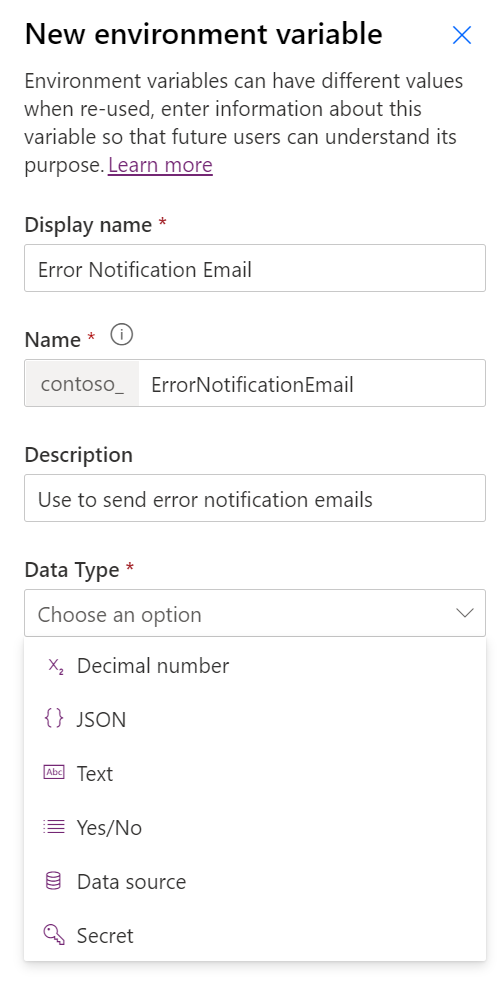
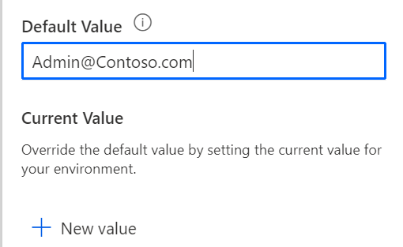
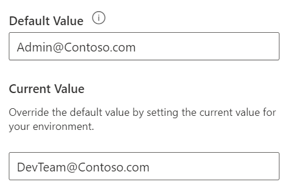
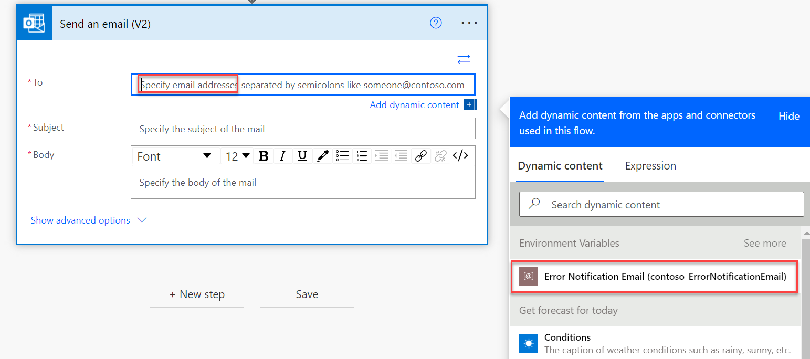

When you build Power Automate cloud flows, it's common to have values you specify on the flow steps that are specific to an environment that the flow is executing in. For example, flow actions may refer to document name, or external service URL, or email address for notifications that can vary between the environments like development, test, and production.

Environment variables allow separate definition and configuration of those values from the cloud flow definition. The environment variable can then have a different value in each environment the cloud flow is deployed. Environment variables can also be used by other Power Platform resources such as Power Apps or custom connectors. Once defined, cloud flows can replace hardcoded content with environment variable values like how other dynamic content is used.

Environment variables consist of two parts definition and current value. The definition defines the data type of a variable and can contain a default value. The second part is a current value that can be optionally provided in each environment to override the default value. When a solution containing an environment variable definition is imported to another environment, if there isn't already a current value established, the import will prompt for the value.

Environment variables are created in a solution by selecting **+ New > More > Environment variable**. The following shows an example of creating an Error Notification Email variable.

> [!div class="mx-imgBorder"]
> 

As you configure the Display Name and Name, keep in mind the name used should be clear on the purpose and unique. For example, if we had named the example variable Email, that is too generic. The Display Name, which is viewed by users, can be changed after creation. The Name, which is used internally and when the variable is programmatically accessed it isn't changeable to prevent breaking anything consuming the variable value. The data type determines what type of values can be stored and is also not changeable after creation. Data types of Data Source and Secret are special and will be described later in this article.

Once a Data type has been chosen, you can configure a default value. A default value isn't required but is helpful if you've one. For example, if you had an Expiration Days variable, you might default it to 28 days, but it could be overridden by a Current Value in any environment. The following shows providing a Default value for the variable.

> [!div class="mx-imgBorder"]
> ]

You can also provide a Current value for this environment. For example, in development, the DevTeam alias might be used.

> [!div class="mx-imgBorder"]
> ]

If you do set a Current Value here, it's important that you open the variable for edit again and Remove the Current value from the solution after the variable is created. If you don't do this, the development environment's Current Value will be included in any exports of the solution. This would cause the development environment Current Value to be used in any other environment,  for example, test and production. To remove it from the solution but keep it configured for the development environment only, select **Remove from this solution**.

> [!div class="mx-imgBorder"]
> 

## Data source environment variables

When you select a Data type of Data Source, it's designed to store configuration on how to point a connection to a specific data source. Once selected as the Data type, you'll be required to pick a connector that is supported for this type of configuration. Currently, only SharePoint is supported. For example, if SharePoint is selected you'll need to choose a Parameter type of Site or List. You must configure a Site data source environment variable before you can configure a List one. The following is an example of creating a Site data source variable.

> [!div class="mx-imgBorder"]
> 

## Secret environment variables

When you select a Data type of Secret, it's designed for referencing secrets stored in Azure Key Vault. This type of variable requires other configuration you can learn more about by reading [Use Azure Key Vault secrets](/powerapps/maker/data-platform/environmentvariables?azure-portal=true#use-azure-key-vault-secrets-preview). Secret environment variables help prevent sensitive information being accidentally exposed to the users or in the flow run history.

## Use environment variables

In your solution cloud flow, you can replace hard coded values by referencing the environment variables. Once defined in an environment, the available environment variables will be selectable from the Dynamic content pane. The following is an example of using the Error Notification Email variable we defined earlier.

> [!div class="mx-imgBorder"]
> 

You can also use the parameters expression to get the value. For example, ***parameters(\'contoso_ErrorNotificationEmail\')*** would retrieve the same value.
