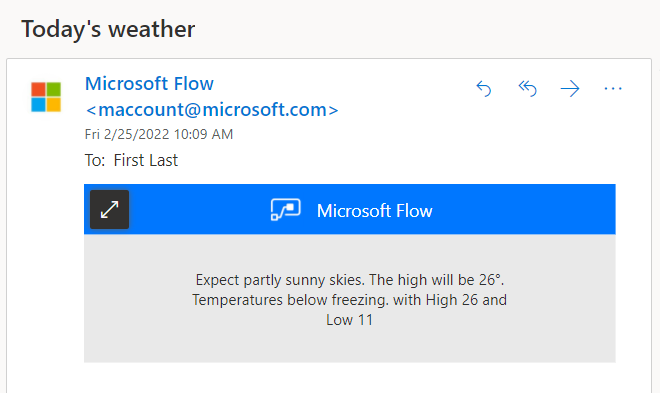
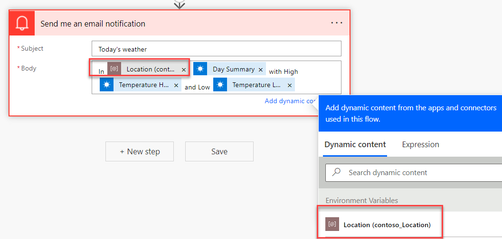

In this exercise, you'll create a cloud flow outside of Dataverse solution.

> [!IMPORTANT]
> Use a test environment with Dataverse.

## Exercise 1: Create cloud flow

In this task, you'll a create a cloud flow that will send a daily weather notification for a given city.

1.  Navigate to [Power Automate](https://powerautomate.microsoft.com/?azure-portal=true) and make sure you are in the correct environment.

1.  Select **My flows**.

1.  Select **+ New flow** and select **Scheduled cloud flow**.

1.  Enter **Daily weather** for Flow name, select Repeat every **1 Day**, and select **Create**.

	> [!div class="mx-imgBorder"]
	> 

1.  Select **+ New step**.

1.  Search for weather and select **Get forecast for today** (MSN Weather).

1.  Enter **Denver** or any city you like for Location, select **Imperial** for Units, and select **+ New step**.

	> [!div class="mx-imgBorder"]
	> 

1.  Search for send email and select **Send me an email notification**.

1.  Enter **Today's weather** for Subject, select on the Body and select **Day Summary** from the dynamic content pane.

	> [!div class="mx-imgBorder"]
	> 

1. Type **with High** on the body and select **Temperature High** from the dynamic content pane.

1. Type **and Low** on the body and select **Temperature Low** from the dynamic content pane.

1. The Send me an email notification step should now look like the Image below. Select **Save** and wait for the flow to be saved.

	> [!div class="mx-imgBorder"]
	> 

1. Select on the back button.

	> [!div class="mx-imgBorder"]
	> 

1. Select **Run**.

1. Select **Run flow**.

1. Select **Done**.

1. The flow run should succeed.

	> [!div class="mx-imgBorder"]
	> 

1. Select on the **App** launcher, right select **Outlook** and select **Open in a new tab**.

	> [!div class="mx-imgBorder"]
	> 

1. You should receive the email notification sent by the flow. Select to open the email.

1. The email should look like the image below.

	> [!div class="mx-imgBorder"]
	> 

## Exercise 2: Create a solution and a publisher

In this exercise, you'll create a solution and a publisher, and then you'll add the cloud flow you created to the solution.

### Task 1: Create solution and publisher

1.  Navigate to [Power Automate](https://powerautomate.microsoft.com/?azure-portal=true) and make sure you are in the correct environment.

1.  Select **Solutions** and select **+ New solution**.

1.  Enter **My Automations** for Display name, **MyAutomations** for Name, and select the **+ New publisher** button.

	> [!div class="mx-imgBorder"]
	> 

1.  Enter **Contoso** for Display name, **Contoso** for Name, **contoso** for Prefix, and select **Save**.

1.  Select the **Contoso** publisher you created and Publisher and select **Create**.

1.  Don't navigate away from this page.

### Task 2: Add the cloud flow to your solution

1.  Make sure you still have **Solutions** selected.

1.  Open the **My Automations** solution you created.

1.  Select **Add existing** and select **Automation > Cloud flow**.

1.  Select the **Outside Dataverse** tab.

1.  Select the **Daily weather** cloud flow you created and select **Add**.

	> [!div class="mx-imgBorder"]
	> 

1.  Don't navigate away from this page.

## Exercise 3: Use environment variables

In this exercise, you'll create an environment variable for the weather location and use location in the cloud flow.

### Task 1: Create environment variable

1.  Make sure you still have the **My Automations** solution selected.

1.  Select **+ New** and select **More > Environment variable**.

	> [!div class="mx-imgBorder"]
	> 

1.  Enter **Location** for Display name, **Location** for Name, **Text** for Data type, and select the **+ New value** button.

1.  Enter **Seattle** for current value and select **Save**.

	> [!div class="mx-imgBorder"]
	> 

1.  Select to open the **Location** environment variable you created.

1.  Select the **...** button next to Current value and select **Remove from this solution**. You're removing it from the solution because you want to other people who use this solution to provide their location.

	> [!div class="mx-imgBorder"]
	> 

1.  Close the Edit location pane.

1.  Don't navigate away from this page.

### Task 2: Edit flow

In this task, you'll edit the flow to use the environment location variable.

1.  From the solution, open the **Daily weather** cloud flow you added to the solution.

1.  Select **Edit**.

	> [!div class="mx-imgBorder"]
	> 

1.  Expand the **Get forecast for today** step.

1.  Remove the location text that says currently has Denver.

1.  Select the **Location** field, go to the dynamic content pane and select **Location**.

	> [!div class="mx-imgBorder"]
	> 

1.  Expand the **Send an email notification** step.

1.  In front of the **Body** text, add **In** and select **Location** from the dynamic content pane.

	> [!div class="mx-imgBorder"]
	> 

1.  Add **:** after the location and select **Save**.

1.  Wait for the flow to be saved.

1. Select **Test**.

1. Select **Manually** and select **Test**.

1. Select **Run flow**.

1. Select **Done**.

1. The flow should run successfully.

1. Select on the **App** launcher, right select **Outlook,** and select **Open in a new tab**.

	> [!div class="mx-imgBorder"]
	> 

1. You should receive the email notification sent by the flow. Select to open the email.

1. The email should show the weather for Seattle.

	> [!div class="mx-imgBorder"]
	> 

## Exercise 4: Export solution

In this exercise, you'll export the solution you created

### Task 1: Export solution

1.  Navigate to [Power Automate](https://powerautomate.microsoft.com/?azure-portal=true) and make sure you are in the correct environment.

1.  Select **Solutions**, select the **My Automation** solution you create and select **Export**.

	> [!div class="mx-imgBorder"]
	> 

1.  Select **Publish** and wait for the publishing to complete.

1. Select **Next**.

1. Select **Managed** and then select **Export**.

1. Wait for the solution to be exported.

1. Save the exported solution on your machine.

## Exercise 5: (Optional) Import solution

In this exercise, you'll import the solution you created into a new environment

> [!IMPORTANT]
> You will need a second test environment.

### Task 1: Import solution

1.  Navigate to [Power Automate](https://powerautomate.microsoft.com/?azure-portal=true) and make sure you are in the correct environment.

1.  Select **Solutions**. Select **Import**.

	> [!div class="mx-imgBorder"]
	> 

1.  Select **Browse**.

1.  Select the **MyAutomation_1_0_0_1_managed.zip** solution you exported and select **Open**.

1.  Select **Next**.

1.  Select **Next** again.

1.  You should be asked to provide **Location**.

1.  Enter **Phoenix** for Location and select **Import**.

	> [!div class="mx-imgBorder"]
	> 

1.  Wait for the import to complete.

1. Open the **My Automations** solution you.

1. Open the **Daily weather** cloud flow inside the solution.

1. Select **Edit**.

1. Expand the weather step and select **+ Add new connection**.

	> [!div class="mx-imgBorder"]
	> 

1. Expand the email step and select **+ Add new connection**.

1. Select **Save** to save the flow and wait for the flow to be saved.

1. Select the back button next to the flow name.

1. Select the **Turn on** button to turn on the flow.

1. Select **Run** to run the flow.

1. Select **Run flow**.

1. Select **Done**.

1. Select on the **App** launcher, right select **Outlook,** and select **Open in a new tab**.

	> [!div class="mx-imgBorder"]
	> 

1. You should receive the email notification sent by the flow. Select to open the email.

1. The email should show the weather for Phoenix.

	> [!div class="mx-imgBorder"]
	> 