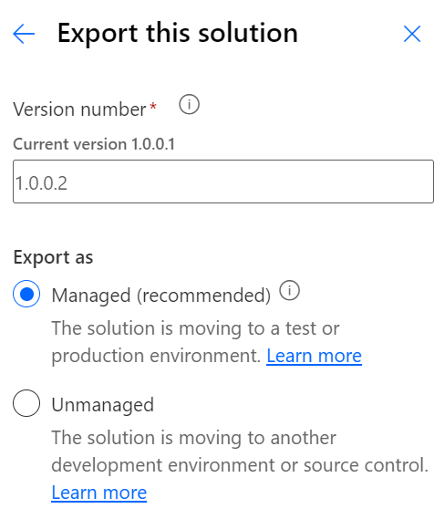
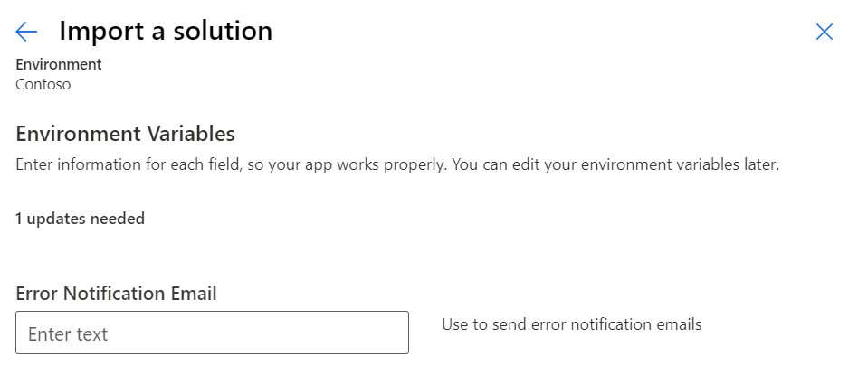

A key benefit of using solutions is exporting and importing solutions from Power Platform environments. This enables the following key use cases:

-   Import of an exported solution into other environments.

-   Export of a solution for storing in source control.

-   On demand backup of solution components and the ability to restore solution components without restoring full environments.

Export and import of solutions can be done manually from Solution Explorer or automated using the [Power Platform Build Tools](/power-platform/alm/devops-build-tools/?azure-portal=true).

## Managed and unmanaged solutions

A solution can be either managed or unmanaged. This is important to understand because it determines what you can do with the solution. Unmanaged solutions are used in development environments while you make changes to your cloud flows and other solution components. Managed solutions are used to deploy to any environment that isn't a development environment for that solution. The type of solution is determined by choice when you export and becomes active when the exported solution is imported into another environment.

For example, a common practice is to have a development environment with your solution (unmanaged) where you build your cloud flows and other solution components. From there, you export both an unmanaged version and a managed version of your solution when you're ready to publish to your test environment. The unmanaged solution you can keep safe as a backup copy of your work. You can also use tools like [Solution Packager](/power-platform/alm/solution-packager-tool/?azure-portal=true) or the [Power Platform CLI](/powerapps/developer/common-data-service/powerapps-cli/?azure-portal=true) to extract the individual files from the exported unmanaged solution and check them into source control like GitHub or Azure DevOps. The unmanaged solution is also used if you had to re-create your development environment. That is why it's so important to always have an exported unmanaged solution. When you import into the test environment, the managed version of the solution file will be used. Finally, once testing is successful, the same managed version will be imported into production. The key point is that any change to a solution component is only done in the development environment. To help enforce that you can't directly change a managed solution component, which helps prevent accidental changes.

## Exporting solutions

When you export solutions manually from Solution Explorer, you'll be prompted for some choices each time. The first choices are Publish and Check for issues.

> [!div class="mx-imgBorder"]
> 

Publish isn't required for cloud flows but is a good idea if you have other solution components. Certain customizations that make changes to the user interface components require that they be published before export.

Check for issues by running an analysis on all your solution components and it will warn you of any issues. It is like flow checker but for all components in your solution.

Next is a prompt for a version number and choice of Managed or Unmanaged.

> [!div class="mx-imgBorder"]
> 

By default, the version number is incremented each time you export. That means if you export both a managed and unmanaged solution in the same session, they'll have different version numbers but represent the same version. To avoid this, it's common to manually adjust the version to be the same as for both versions.

For the Export as choice as discussed earlier, we recommend you do the export twice, once for managed and once for unmanaged. You should always have an unmanaged copy exported when you export a managed solution.

## Importing solutions

To deploy a solution to another environment, you import an exported solution file. You can import either the managed or unmanaged solution file.

Importing an unmanaged solution should target development environments. Once the import completes, the solution components will have been merged into the environment. There's no undo, and removing the solution will only remove the solution and not the solution components merged into the environment. If the solution already exists in the environment, an import will update and overwrite existing matching resources. All solution imports are additive and any solution component not in the new version will still exist in the environment after an update import completes. Care should be taken to ensure that you don't accidentally overwrite recent work since the last export, and that you only import unmanaged solutions into intended environments.

Importing a managed solution should target non-development environments like test and production. Unlike unmanaged solutions, when you import a managed solution, it isn't merged the same way, but creates its own customization layer to track and manage the changes made to the environment. The solution layering allows for tracking of changes made to the solution components of your managed solution. If you import an update to a managed solution, the default behavior is to process the import as an upgrade. The updated solution version is imported and then the older version is removed. When the older version is removed any solution components no longer in the new version are removed from the environment. For example, if you deleted a cloud flow in development, when the newer version was imported to the test environment, the deleted flow would be removed from the test environment also. Removing a managed solution is like an uninstall, all solution components that aren't referenced by another solution will be removed **including their data.** You should avoid manually updating cloud flows directly in environments where the solution is deployed as managed because this creates an unmanaged change that will prevent future updates. For example, if you fix a cloud flow in production, the next deployment the import of a new version works fine, however, your production cloud flow won't be updated. You can identify and resolve this using the [solution layer management features](/powerapps/maker/data-platform/solution-layers/?azure-portal=true). You can also avoid this problem by only making changes in your development environment.

For either type of solution import, you'll be prompted to update any connection references not previously established.

> [!div class="mx-imgBorder"]
> 

Additionally, if there are any environment variables in the solution that don't have a value you'll be prompted to provide a current value for this environment.

> [!div class="mx-imgBorder"]
> 

Both solution imports and exports will run in the background, and you'll be notified of their completion.

