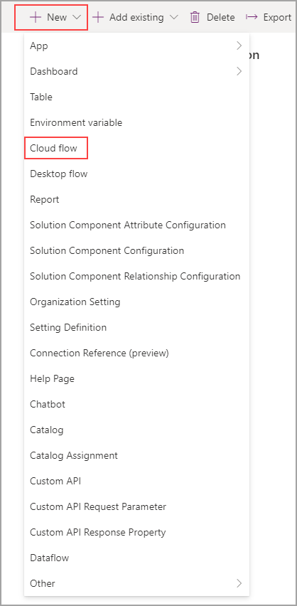
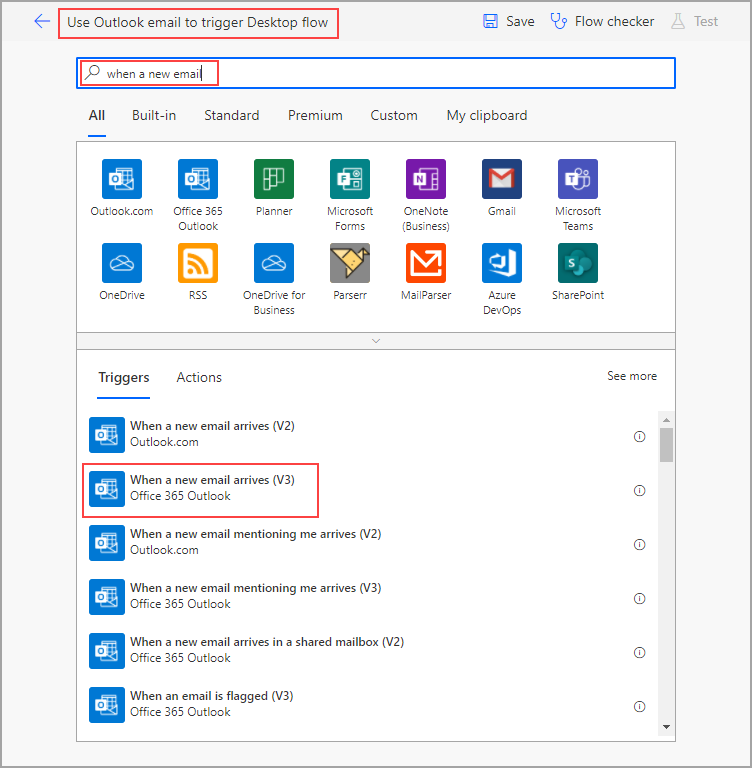

Now that you have a desktop flow, you are ready to create a solution in Power Automate. Solutions are groups of apps and flows that are packaged together in order to better organize your data. In addition to offering the ability to logically group your flows and apps by topic or project, you can import or export entire solutions rather than doing so for each flow. Flows built inside solutions are called solution-aware flows. You cannot move a non-solution-aware flow into a solution, so if you think you will need a solution, start with one from the beginning to avoid rebuilding your flow. Navigate to powerautomate.microsoft.com to get started and select **Solutions** on the left-hand navigation menu. Select **New solution**.

> [!div class="mx-imgBorder"]
> 

Set the display name for your solution. In this case, the display name is "Invoice processing solution", but you can choose whatever fits your needs. Notice that the name fills in automatically as you set the display name. Solutions are built on Dataverse and the names cannot use spaces, allowing for easier calling inside of other apps and solution-aware flows. Set the publisher as CDS Default Publisher and select **Create**.

> [!div class="mx-imgBorder"]
> 

Once you select create, the Solutions screen will populate with your new solution. Select the name (in this case Invoice processing solution) to open it.

> [!div class="mx-imgBorder"]
> 

This is where we create and edit flows specific to this solution. To create a new solution-aware flow, select New and then Cloud flow.

> [!div class="mx-imgBorder"]
> 

Rename your flow. The below flow has been named "Use Outlook email to trigger a Desktop flow" but you can choose whatever name you want. Search the actions to find **When a new email arrives (V3)**.

> [!div class="mx-imgBorder"]
> 

Always use the latest version of the action you are seeking. This ensures you have access to any new features that have been released.

You may need to wait a moment for Outlook to sign in. Once you see the Folder option, which should automatically be populated with "Inbox", select **Show advanced options** and ensure that **Include Attachments** and **Only with Attachments** have "Yes" selected. For the Subject Filter, write "new invoice".

> [!div class="mx-imgBorder"]
> 

> [!div class="mx-imgBorder"]
> 

Select **New step** and search for and select the action **Run a flow built with Power Automate Desktop**.

> [!div class="mx-imgBorder"]
> 

If you have not already configured your gateway connection, use the dropdown under Gateway name to select the appropriate gateway.

If you don't see your gateway, you may need to delete this step and recreate it in order to refresh the list. If your gateway still does not appear, you may need to restart the gateway on your PC and retry.

The next two fields request your credentials to log into your computer. If you are unsure what to put in the Domain and username field, you can open a Command Prompt window by opening Start, typing CMD and pressing enter. Once the command prompt opens, type "Set user" and press Enter.

Several lines of code will appear. Take the user domain and the username and separate them by a backward slash as seen below. Select **Create**.

> [!div class="mx-imgBorder"]
> 

Once you have connected to your desktop, Power Automate will prompt you for information specific to your desktop flow. Use the dropdown to select the name of your desired flow (in this case Invoicing) and choose Attended for your Run Mode.

> [!div class="mx-imgBorder"]
> 

Once you have chosen your desktop flow, any input variables you have defined in your flow will be requested. You can see that the Invoice flow below requests an Amount, a Contact email, and an Account name to feed into the Contoso Invoicing App. Put some placeholders in these fields for now, although you can use information from the email or attachments later. You can also use the output variables provided by the desktop flow in later actions. **Save** your flow.

> [!div class="mx-imgBorder"]
> 

Now that you have configured your desktop connection and created a cloud flow to trigger your desktop flow and provide inputs, you can test that everything is functioning properly.
