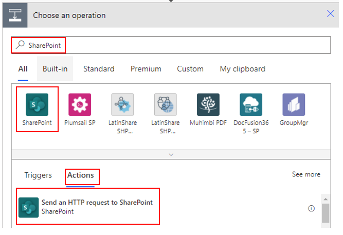
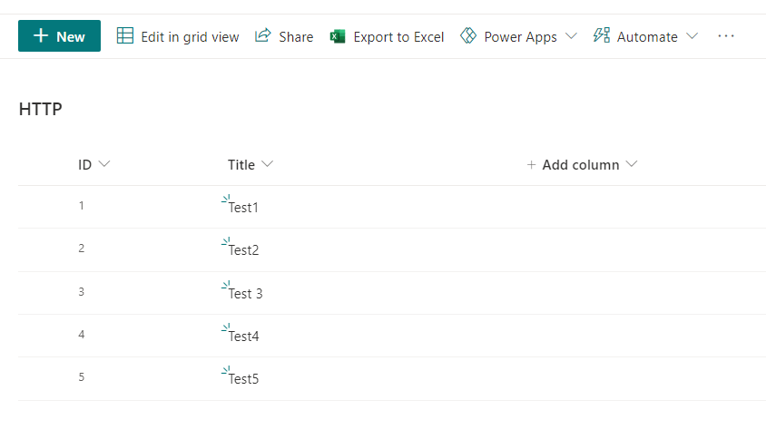

The SharePoint connector in Power Automate comes with a **Send an HTTP request to SharePoint** action.

> [!div class="mx-imgBorder"]
> 

We will use the **GET**, **POST**, and **DELETE** methods to make changes to a SharePoint list.

> [!div class="mx-imgBorder"]
> 

## Get item from SharePoint using GET

The GET method allows you to leverage the REST API of SharePoint to find specific information. In this example, we can confirm if there a list name **location** in a SharePoint.

The **Manually trigger a flow** simply triggers a flow without any input. The **Send an HTTP request to SharePoint** is the main action to gather the information we seek.

**Site Address, Method, Uri, and Headers** are the required fields.

In this example, we were able to **GET** the information of a specific item.

> [!div class="mx-imgBorder"]
> 

When the flow runs successfully, it confirms the list exists and provides some information in return.

> [!div class="mx-imgBorder"]
> 

## Add and edit an item to a SharePoint list using POST

To add an item, you need an action with the following settings.

**Site Address:** `https://domainame.sharepoint.com/sites/sitename`

**Method:** POST

**Uri:** /_api/web/lists/getbytitle('*listname*')/items

**Headers:** Accept and Content-Type

Here is a screenshot of what the action looks like.

> [!div class="mx-imgBorder"]
> 

And here is a screenshot of a successful run.

> [!div class="mx-imgBorder"]
> 

Editing requires providing the exact item number and other headers.

Consider a SharePoint List that has the following items.

> [!div class="mx-imgBorder"]
> 

Using the following **HTTP request to SharePoint** action, the title 'Test 3' of item 3 can be changed to 'New Test 3'.

> [!div class="mx-imgBorder"]
> 

Once the flow runs successfully, the list item is updated.

> [!div class="mx-imgBorder"]
> 

## Delete an item to a SharePoint list using DELETE.

Delete is similar to Edit, the only change is updating the **X-HTTP-Method**'s **MERGE** to **DELETE.**

> [!div class="mx-imgBorder"]
> 

Once the flow runs successfully, the list item is deleted.

> [!div class="mx-imgBorder"]
> 