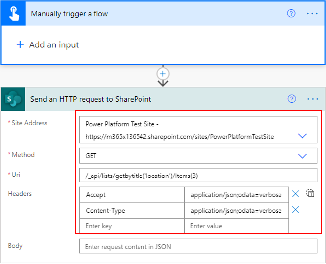
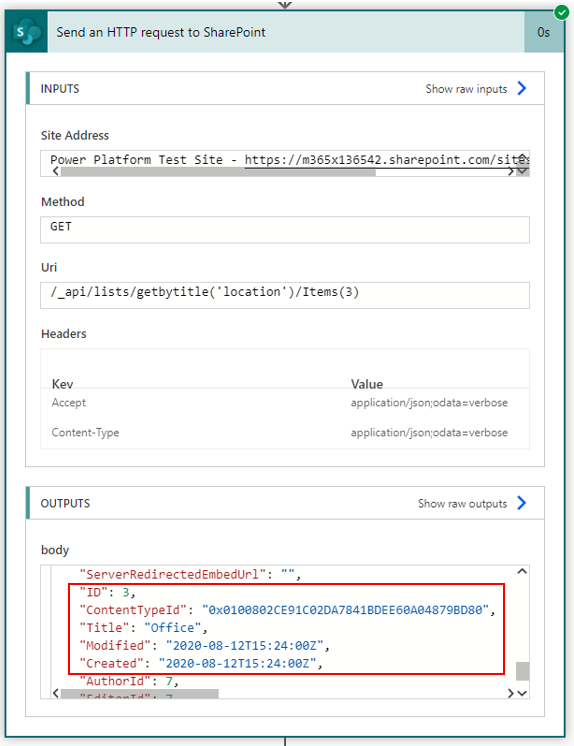
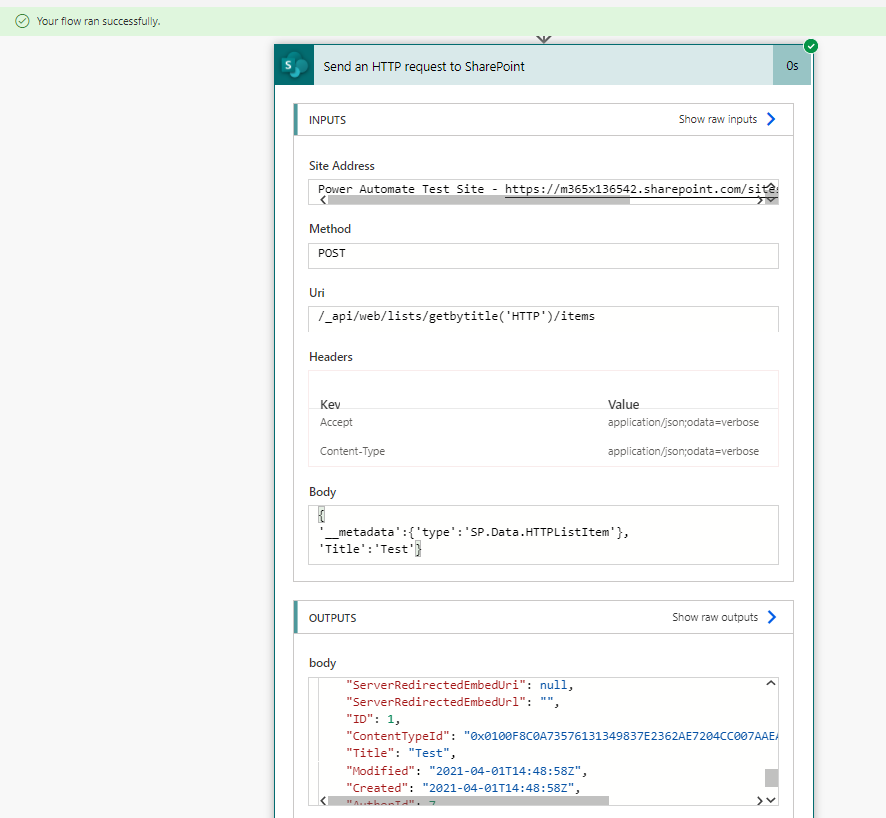
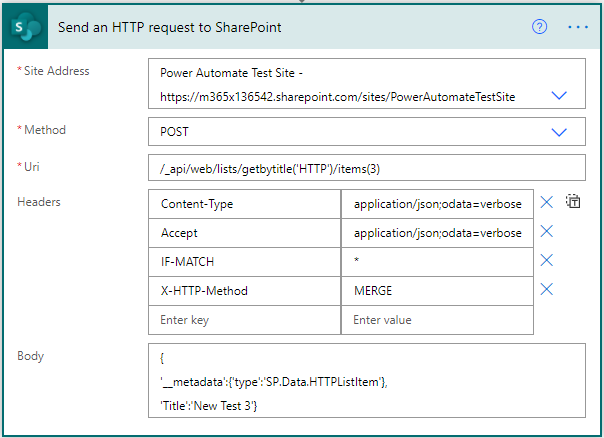
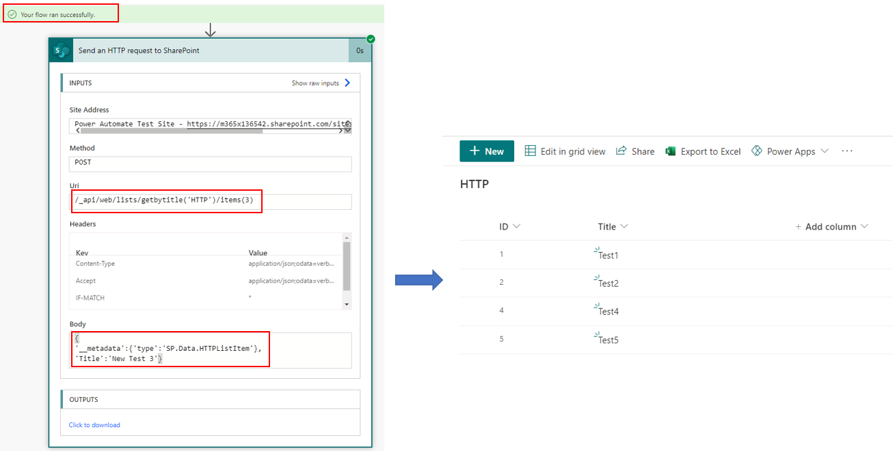

The SharePoint connector in Microsoft Power Automate comes with a **Send an HTTP request to SharePoint** action.

> [!div class="mx-imgBorder"]
> 

The following sections will describe how to use the **GET**, **POST**, and **DELETE** methods to change a SharePoint list.

> [!div class="mx-imgBorder"]
> 

## Use the GET method to get an item from SharePoint

The GET method allows you to use the REST API of SharePoint to find specific information. In this example, you can confirm if the **location** list name exists in SharePoint.

The **Manually trigger a flow** action triggers a flow without input. The **Send an HTTP request to SharePoint** action is the main action to gather the information that you seek.

**Site Address**, **Method**, **Uri**, and **Headers** are the required fields.

This example shows that you are able to **GET** the information of a specific item.

> [!div class="mx-imgBorder"]
> 

When the flow runs successfully, it confirms that the list exists and provides information in return.

> [!div class="mx-imgBorder"]
> 

## Use the POST method to add and edit an item

To add an item to a SharePoint list, you need an action with the following settings:

- **Site Address** - `https://domainame.sharepoint.com/sites/sitename`

- **Method** - POST

- **Uri** - /_api/web/lists/getbytitle('*listname*')/items

- **Headers** - Accept and Content-Type

The following screenshot shows what the action looks like.

> [!div class="mx-imgBorder"]
> 

The following screenshot shows an example of a successful run.

> [!div class="mx-imgBorder"]
> 

Editing requires you to provide the exact item number and other headers.

Consider a SharePoint list that contains the items that are shown in the following image.

> [!div class="mx-imgBorder"]
> 

By using the following **HTTP request to SharePoint** action, change the **Test 3** title of item 3 to **New Test 3**.

> [!div class="mx-imgBorder"]
> 

After the flow has run successfully, the list item will be updated.

> [!div class="mx-imgBorder"]
> 

## Use the DELETE method to delete an item

The DELETE method is similar to the EDIT method, except that you will be updating the **X-HTTP-Method** from **MERGE** to **DELETE**.

> [!div class="mx-imgBorder"]
> 

After the flow has run successfully, the list item will be deleted.

> [!div class="mx-imgBorder"]
> 
