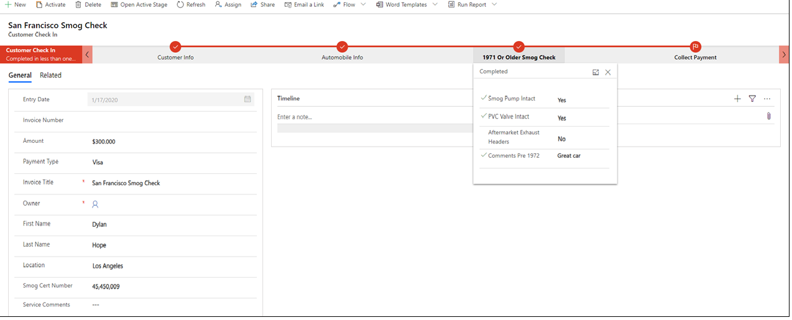

A business process flow is a visual guide meant to help users complete a business process by using a set of predefined stages. Users are not limited on how long they run a business process or how long they have a stage open. All data associated with the business process flow can only be stored in one or more tables in Microsoft Dataverse. Business process flows can only have Dataverse as a data source.  Dataverse has many different out-of-the-box business process flows that you can use as-is or modify them to fit your needs.

A Power Automate flow does not have any visual components like a business process flow. Power Automate flows can be configured to work with many different data sources, and a flow can connect to many different data sources within the same flow. A flow can be configured to time out if it is not completed in a certain time and can be triggered to move between steps based on data or user interaction. Flows support complex logic and looping, and a Power Automate flow can call another Power Automate flow as needed.

## Business process flows value to organizations

Business process flows allow organizations to quickly standardize how processes are completed and what data is collected at each stage. Business process flows support logical branching and can be used to standardize many common business processes within an organization.

Business process flows offer the following benefits:

- Improved outcomes

- Consistent stages and work steps across all instances of the process

- Improved data collection and reporting

- Decreased time to complete the process

- Predictable outcomes

Business process flows are simple to set up and administer. Business process users close to business operations and processes can create new business process flows or modify out-of-the-box business process flows by using Power Automate.

Business process flows can be customized based on security roles, allowing access to the appropriate stages and steps based on a security role. Finally, the process of each instance of a business process flow can be monitored, and the data from the process flow can be used in Power BI dashboards and reporting for simplified administration. 

## Business process flows and the larger Microsoft Power Platform

Business process flows are deeply integrated with the Microsoft Power Platform. They are created, customized, and managed by using Power Automate. 

You can manage or create new business process flows by launching Power Automate and selecting Business process flows under My Flows in Power Automate, as shown in the following image.

> [!div class="mx-imgBorder"]
> 

You can launch the new business process flows as a component of a model-driven Power App or a stand-alone application within Power Automate (called an immersive business process flow), as shown in the following image.

> [!div class="mx-imgBorder"]
> 

All data that is associated with a business process flow is stored in one or more Dataverse tables (custom or standard). You could launch an instant Power Automate flow in conjunction with a business process flow to store data outside of Microsoft Dataverse if needed. Additionally, you can create Power BI dashboards from the data that was collected within the business process flow.

Business process flows are deeply integrated within Power Platform and offer powerful ways to improve how you manage common business processes.