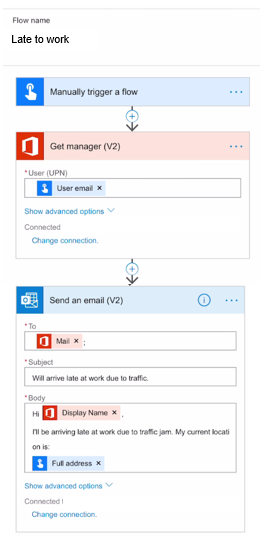

Trigger tokens are data points that are known and available to the
device on which the button flow is running. These tokens are dependent
on factors such as time and the geographic location of the device at a
given moment.

When you run a flow from a virtual button on a smart phone, the date,
time, and the current address where the phone is located are
automatically available for use. You can use these trigger tokens to
build useful flows that will minimize repetitive tasks such as providing
your location to someone or tracking how much time you spent on a
particular job/service call.

Here is the list of the button trigger tokens that are available for
you to use when creating your button flows.

| Parameter        | Description                                                                     |
|------------------|---------------------------------------------------------------------------------|
| City             | The city in which the device that's running the flow is located.                |
| Country/Region | The country/region in which the device that's running the flow is located.      |
| Full address     | The full address where the device that's running the flow is located.           |
| Latitude         | The latitude in which the device that's running the flow is located.            |
| Longitude        | The longitude in which the device that's running the flow is located.           |
| Postal Code      | The postal code in which the device that's running the flow is located.         |
| State            | The state in which the device that's running the flow is located.               |
| Street           | The street on which the device that's running the flow is located.              |
| Timestamp        | The time in the area where the device that's running the flow is located.       |
| Date             | The date in the area where the device that's running the flow is located.       |
| Username         | The username of the person signed into the device that's running the flow.      |
| User email       | The email address of the person signed into the device that's running the flow. |

Trigger tokens provide you the rich functionality to add to your flow
when you create a button. Let's consider a scenario when you want to
send an email to your manager that you'll be late to work.

The prerequisites for this example are a Microsoft Account with access to Microsoft Power Automate.

Here are the steps to create a Microsoft Power Automate mobile app for
your Android or IOS smart phone.

1.  In your Microsoft Power Automate app click on **Flows** icon, which is available at the bottom of the app, then click on the **+** icon, which is available on the top right.

1.  You should see a menu option slide up from the bottom, select the **Create from blank** option.

1.  In the **Connectors** option click on **Flow button for mobile.** If you don't see it, then search for it in the **Search all connectors and triggers** and then click on it.

1.  Select **Flow button for mobile**.

1.  In the **Manually trigger a flow** trigger click on **+** **Add an input** and select **Text** by clicking on **Input**, deleting Input, and typing in **Reason**. Click on Done, which is available on the top-right.

1.  Click on **+** **New step**.

1.  Click on **Add an action**.

1.  In the **Connectors** option click on **Office 365 Users**. If you don't see it, then search for it in the **Search all connectors and triggers** and then click on it.

1.  Click on **Office 365 Users Get Manager (V2)**.

1. Type your email address in the **User (UPN)**.

1. Click on **+ New step**.

1. Click on **Add an action**.

1. In the **Connectors** option, click on **Office 365 Outlook**. If you don't see it, then search for it in the **Search all connectors and triggers** and then click on it.

1. Select **Office 365 Outlook Send an email (V2)**.

1. Click on **To**. In the **Get manager (V2)** click on **See more** and select **Mail**. Then click on **Done**.

1. In Subject type in **Will arrive late for work due to traffic**. Click on **Done**.

1. Click on **Body** and type in Hi and add space. Then in **Get Manager (V2)** click on **See more** and click on **Display Name**.

1. Click on **Return** to take the cursor to the next line and type in **I'll be arriving to work late due to a traffic jam. My current location:**. Click on **Return** to take the cursor to the next line.

1. Next in the **Manually trigger a flow** click on **See more**. Select **Full address**. Then click on **Done**.

1. Finally give your flow a name such as **Late at work** and click on **Create** which is on the top-right.

1. Your flow should look something like this:

	

1. Now when you click on the **Buttons** option available on the bottom, you should see a circular button called **Late at work**. When you click on it, you can add the **Reason** and click on Done, which is available on the top right of the screen.

1. Clicking on **Done** will redirect you back to the **Buttons** screen.
