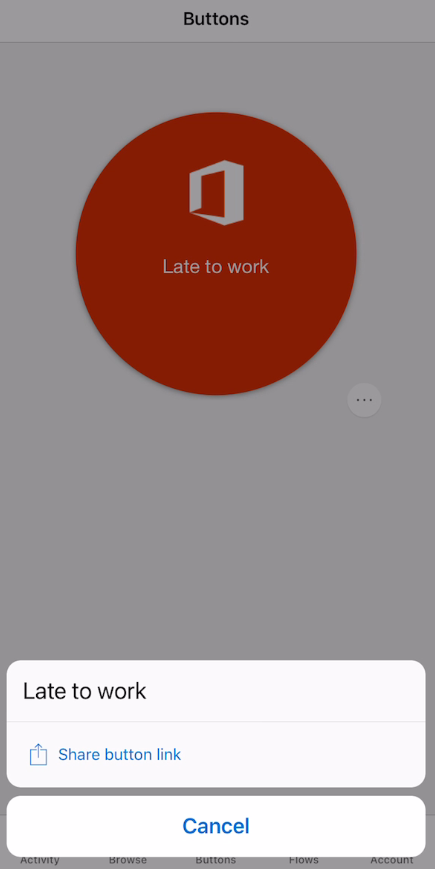

In the Microsoft Power Automate mobile app, you can share a button
with other users or **Office 365 Groups** within your tenant. When you
share a button, the person or group with whom you share can run your
button. You can also share a link to buttons that another person shared
with you. You can stop sharing your buttons at any time.

Here are the steps to share the button we created in the previous unit.

1.  In the Microsoft Power Automate app, click on the **Buttons** icon
    in the bottom menu. You should see the **Late to work** button that
    was created above. On the bottom right of the button you should see
    three dots **...** also known as ellipses. You should see a pop-up
    with two options, **Invite Others** or **Share Button link**.

2.  Invite others gives me the option to search people or groups who are
    part of your company tenant. You can search using their first or
    last name and then click on the plus sign **+** next to their name.
    Then select **Send**. You will then be redirected to a screen that
    says **Button was shared successfully**. 
    
    You will also see a **Manage connections** option. Clicking this option 
    will show you the connections used for that flow. In this example, you'll see 
    **Office 365 Outlook** and **Office 365 Users**. Each connection has an
    **Edit** option next to it. Clicking on **Edit** will let you select
    which connection the user should use. The connection options are
    those created by the maker of the button or those created by user.

3.  **Share Button link** provides you the options to share via text
    message, emails or other methods the smart phone device type and
    service provider allows. For example, in **iPhone iOS** you can 
    use **AirDrop** as well. 
    
    Once the end user receives the link, the user will need to
    use their credentials to log in and then start the button from the
    browser. After logging in the credentials, the data connections are
    first verified and then you click on the continue button.

Here is an example of what the two-sharing options look like.

