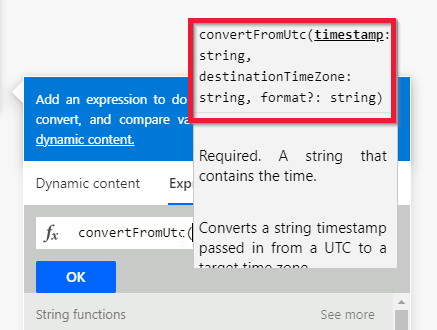
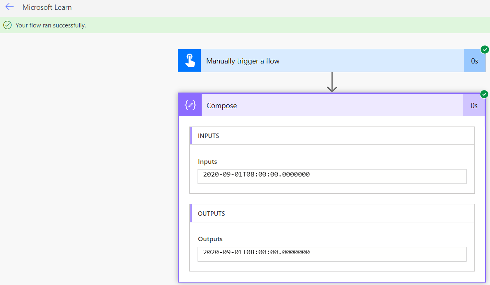

To write an expression in flow, you select in a field to open the Dynamic content menu and then you select "Expression" as shown below.

> [!div class="mx-imgBorder"]
> 

In the formula box, you will then write your expression by combining one or more functions. Before you learn about the different types of functions and their usage, there are some commonalities you should learn first. Function names are not case-sensitive.

> [!TIP]
> Notice in the screenshot that we used a Manually triggers a flow trigger and a *Compose* action. This allows you to have a simple setup for writing and testing your expressions without worrying about other inputs or actions. Use this setup to follow along in this app or anytime you want to try out something new.

## Auto suggest, hints, and links in the formula bar

When you enter a function in the formula bar, you will see a pop-up with syntax suggestions.

> [!div class="mx-imgBorder"]
> 

Here you can see for the *convertFromUtc* function that it has two required inputs and one optional input. *Timestamp* is required and expects a string, *destinationTimeZone* is required and expects a string, and *format?* is optional and expects a string. Note the "*?*" at the end of *format*. That tells you it is an optional input.

After entering a Timestamp as a string typing a comma, then prompts for the destinationTimeZone:

> [!div class="mx-imgBorder"]
> 

This can be daunting. What does it want for the time zone? If you look in the pop-up, you'll see that it provides a link to the [list of time zone values](https://msdn.microsoft.com/library/gg154758.aspx/?azure-portal=true). This page provides you the string for the *destinationTimeZone*. With that information, we can now complete the expression.

`convertFromUtc('2020-09-01T12:00:00Z','Eastern Standard Time')`

With the complete formula, you can select OK to save your changes. Always be sure to select OK or UPDATE when editing an expression. If you select out of the inputs, you will lose your changes. Flow does not have autosave.

With your first expression complete, you can now select Test in the top right-hand corner. Then select Save & Test. select the Run flow button and then Done.

You should see the green bar that says "Your flow ran successfully." Expand the *Compose* action and you will see that the OUTPUTS is your date time converted to the new time zone.

> [!div class="mx-imgBorder"]
> 

Use this same process to see the output of any test expressions you create.
