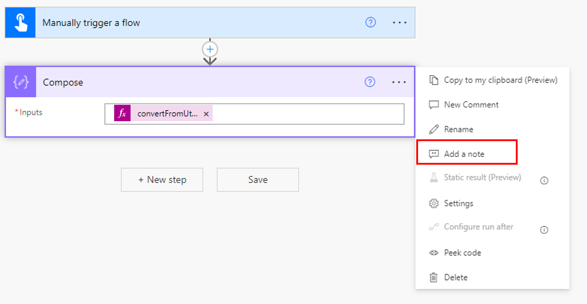
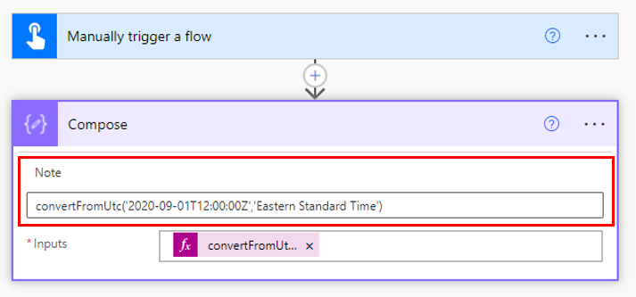
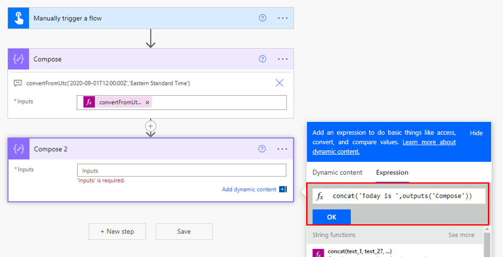

When you look at the *convertToUtc* expression you wrote earlier, you might notice that you need to scroll to see the whole formula in the function bar. A common technique to make reviewing your expression easier is to use comments and paste the whole formula into the comment.

> [!div class="mx-imgBorder"]
> [](../media/paste-formula-ss.png#lightbox)

To add a comment, select the ellipse to show the menu. Then select **Add a comment**.

> [!div class="mx-imgBorder"]
> [](../media/ellipsis-comment-ssm.png#lightbox)

In this box, you can type any text you want. This can be text or just a copy and paste of the expression used in your action.

> [!div class="mx-imgBorder"]
> [](../media/comment.png#lightbox)

## Defining text

When you use text in a Power Automate expression, you'll use the single quote (') at the beginning and end of each string. For example, if you wanted to combine the string “Today is” and the output from our expression above that returns a date in an expression, you would use the **Concat** function and your syntax would be:

```regex
concat('Today is ',outputs('Compose'))
```

> [!div class="mx-imgBorder"]
> [](../media/concat-function-ss.png#lightbox)

These little details will help you become more effective when working with expressions. One of the great things about expressions is that they're consistent. As you learn about one function you can often apply those learnings to the next function, rapidly speeding up your learning.
