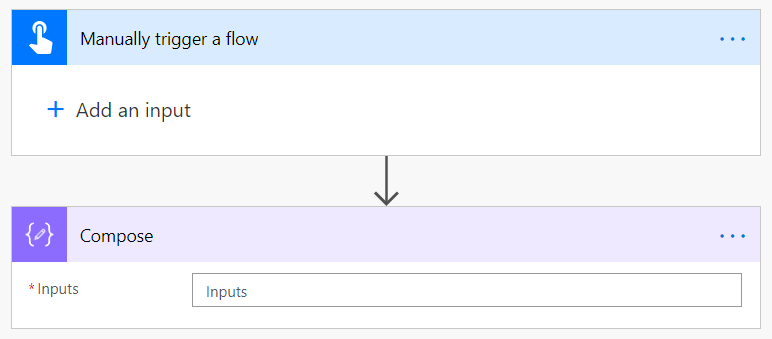
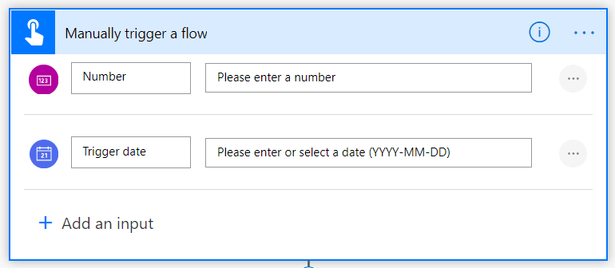
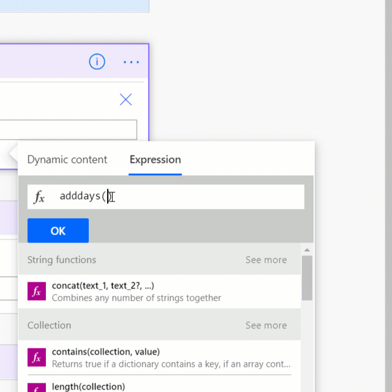
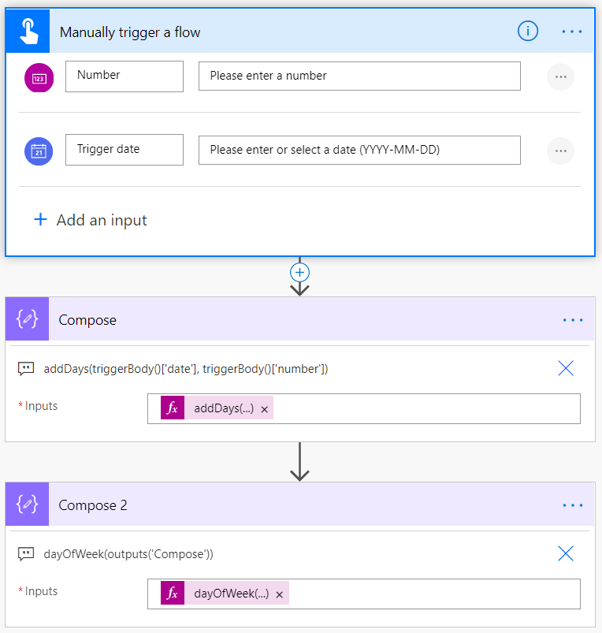

Complex expressions are when you combine more than one function to get your desired result. In the Math functions and Date Time functions sections, you have already seen examples of this. You saw how in order to add three numbers, you need to combine two add functions like:

`add(add(12,13),15)`

Which resulted in the output of 40.

Then you saw how you use the utcNow function to get the current date and time and the use convertFromUtc to change it to the Eastern Standard time zone as shown below:

`convertFromUtc(utcNow(), 'Eastern Standard Time', 'dd-MM-yyyy hh:mm tt' )`

Which resulted in the output of 01-09-2020 05:39 PM.

When you think of complex expressions, that is it. More than one function in an expression where you use the output of one function as an input of another. There is no special syntax, operators, or considerations.

For a final example of a complex expression, take the scenario of having a couple of inputs as part of your "Manually trigger a flow" trigger and then using that input in a formula to compute a new time. You can use the example flow that you have used to test your expressions or to build a new flow that looks like this one below.

> [!div class="mx-imgBorder"]
> 

Now click on "Add an input" under "Manually trigger a flow" and add a Number. Then click "Add an input" again and add a Date. Your trigger should now look like this:

> [!div class="mx-imgBorder"]
> 

Now, in the Compose step you will add an expression to add the number of days from the trigger to the date.

`addDays(triggerBody()['date'], triggerBody()['number'])`

This is leveraging the Date Time function *addDays* and the Referencing function *triggerBody*.

> [!NOTE]
> If you find yourself asking "How do I know what goes in for trigger body?" then you are thinking correctly. The secret is you can combine dynamic content into your expressions. To do so, start your expression by typing addDays() and then with your cursor between the (), click Dynamic content. Then you can choose your fields as shown below. This is a great way to reference that content while letting flow do the hard work of writing the formula.

> [!div class="mx-imgBorder"]
> 

If you test your flow and enter the date 2020-09-01 and the number 2, your output will be 2020-09-03T00:00:00.0000000, which is UTC format for September 3rd, 2020.

Now you can find out what day of the week that is by using another Compose action with the following expression:

`dayOfWeek(outputs('Compose'))`

This returns the value of 4, which represents Thursday as it counts up from Sunday as 0. Here is a screenshot of the current flow to validate what you have built. Note the expressions have been placed in a comment to make them easier to read.

> [!div class="mx-imgBorder"]
> 

Now add another Compose step to check to see if the date they selected is a Thursday. Do this with the following expression in Compose 3.

`if(equals(outputs('Compose_2'),4), 'You chose a Thursday', 'You did not choose a Thursday')`

For September 3, 2020 this will return the string "You chose a Thursday".

This example is a typical build pattern for a complex expression, building piece by piece in separate steps. Now that you have all of the functions necessary worked out, add another Compose step. In Compose 4, write one large expression that does everything in one step. The expression will look like:

`if(equals(dayOfWeek(addDays(triggerBody()['date'], triggerBody()['number'])),4), 'You chose a Thursday', 'You did not choose a Thursday' )`

The output for September 3, 2020 will be the string "You chose a Thursday". Congratulations. You have written a complex expression by doing small steps and then putting it all together in the end.
