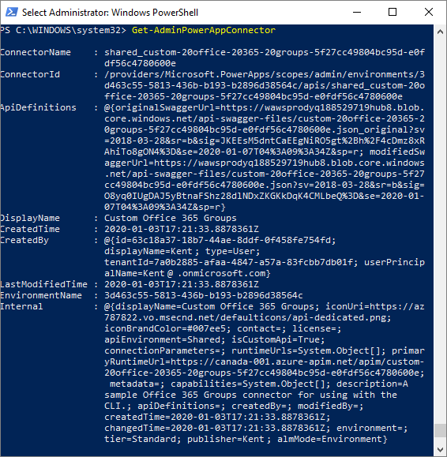
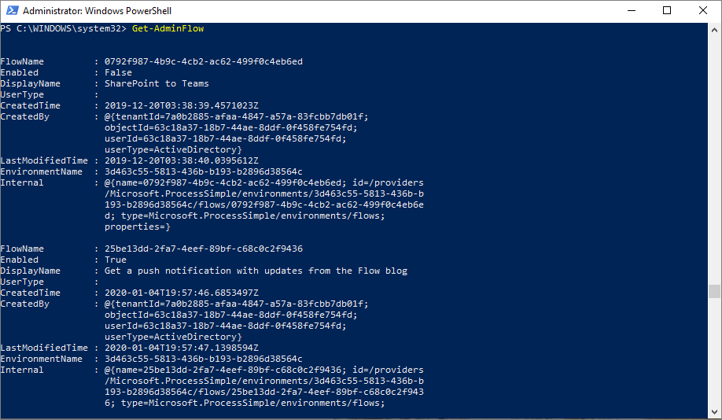

Different Power Automate PowerShell cmdlets help provide administrators with
visibility into how app makers are using Power Automate.

After learning about the different cmdlets that are available, you will be able to complete the exercise at the end of this module to observe how an administrator can use the Power Automate PowerShell cmdlets
to identify all the connections that have been created within the
tenant. The exercise will also explain how to set up the prerequisite PowerShell modules.

The different cmdlets that you can use are explained in the following sections.

### Read connection permissions

In the *read connection permissions* (Get-AdminPowerAppConnectionRoleAssignment) cmdlet, administrators can retrieve all connection permissions for Power Apps and Power Automate. The returned data includes whether the connection belongs to an owner or if the connection has been shared with another user.


### Read and delete custom connectors

In the *read and delete custom connectors* (Get-AdminPowerAppConnector) cmdlet, administrators can retrieve all custom connectors that have been deployed in the tenant.



### Read environments

In the *read environments* (Get-FlowEnvironment) cmdlet, administrators can retrieve all environments that have
been created within the tenant. The returned information will also include the name of the person who created the environment, when it was created, and its location.


### Read default environment

The *read default environment* (Get-FlowEnvironment -Default) cmdlet is one that has already been discussed, but the difference in this case is that you can provide a parameter of **-Default** that will result in only the default environment being returned.


### List all flows in tenant

The *list all flows in tenant* (Get-AdminFlow) cmdlet will list all flows that exist within the tenant. The returned information includes when the flow was created, who created it, and the environment that it was created in.



If you want to export this information in CSV format, you can use the following
command, which will write this information to a file.

```Get-AdminFlow | Export-Csv -Path '.\FlowExport.csv'```

Because the output of PowerShell cmdlet is a CSV file, you can load the results into a
business intelligence tool, like Power BI or Microsoft Excel, where you can further
analyze the results.
