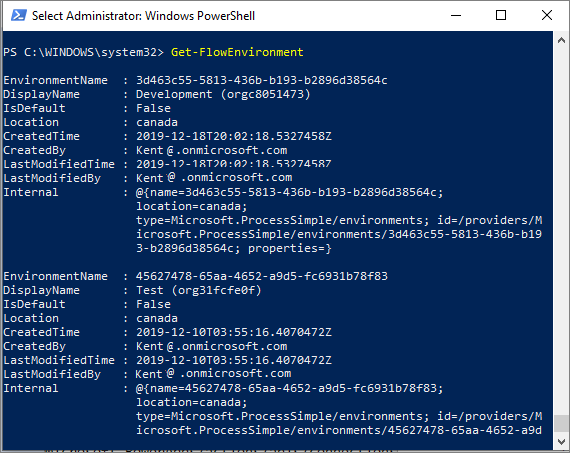
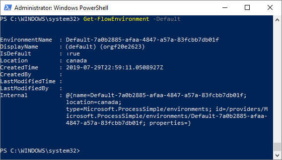

In this unit, we are going to explore some of the different Power 
Automate PowerShell Cmdlets that provide administrators with 
visibility into how app makers are using Power Automate.

In the exercise at the end of this module, we will demonstrate 
how an administrator can use the Power Automate PowerShell Cmdlets 
to identify all the connections that have been created within the 
tenant. We will also discuss setting up the prerequisite PowerShell 
modules. 

Here are some of the different Cmdlets you can use: 

**Read connection permissions**: Get-AdminPowerAppConnectionRoleAssignment

In this Cmdlet, administrators can retrieve all connection permissions for 
Power Apps and Power Automate. The data returned includes whether the 
connection belongs to an owner or if the connection has been shared with 
another user.


**Read and delete custom connectors**: Get-AdminPowerAppConnector

In this Cmdlet, administrators can retrieve all the custom connectors that 
have been deployed in the tenant.


**Read environments**: Get-FlowEnvironment

In this Cmdlet, administrators can retrieve all the environments that have 
been created within the tenant. The information returned will also include 
the name of the person who created the environment, when it was created and 
its location.



**Read default environment**: Get-FlowEnvironment -Default

This is a Cmdlet that we previously discussed, but the difference here is 
that we can provide a parameter of **-Default** that will result in only 
the default environment being returned.



**List all flows in tenant**: Get-AdminFlow
This Cmdlet will list all flows that exist within the tenant. The information 
returned includes when the flow was created, who created it and the environment 
that it was created in.


If you would like to export this information in CSV format, you can use the following 
command that will write this information to a file.

```Get-AdminFlow | Export-Csv -Path '.\FlowExport.csv'```

Since the output of PowerShell Cmdlet is a CSV file you can load the results into a 
business intelligence tool, like Power Bi or Microsoft Excel, where you can further 
analyze the results.

