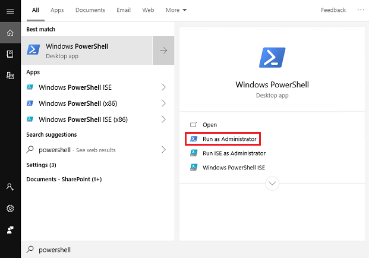
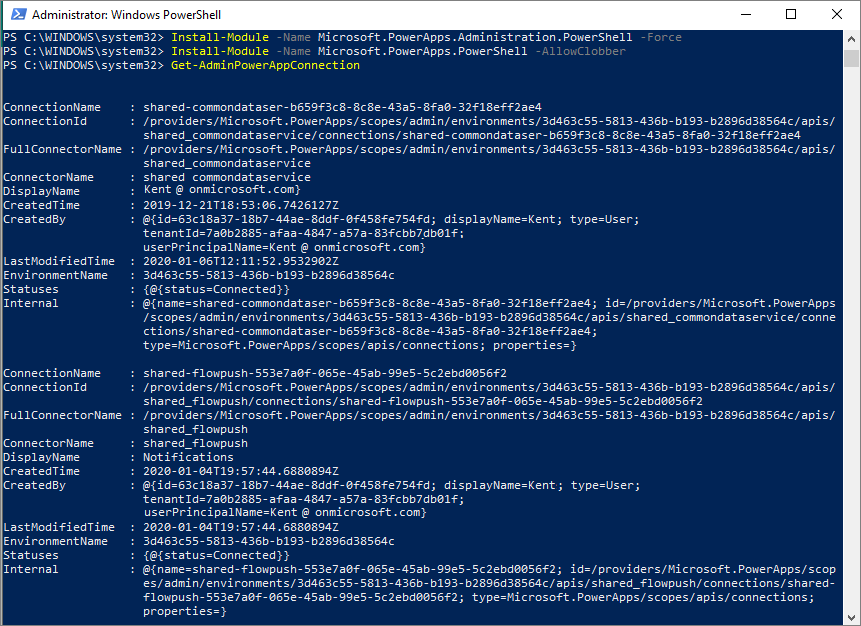

In this exercise, you will connect to Power
Apps and Power Automate PowerShell cmdlets to list all connections
that are in your tenant. You can use this information to determine which
users are making connections through different connectors.

1. Launch **Windows PowerShell** and select **Run as Administrator**.

    

2. Import the required modules by using the following commands:

    **Install-Module -Name Microsoft.PowerApps.Administration.PowerShell**

    **Install-Module -Name Microsoft.PowerApps.PowerShell-AllowClobber**

3. If you are prompted to accept the change to the *InstallationPolicy*
    value of the repository, accept this change for all modules by entering
    **A** and then pressing **Enter** for each module.

4. List all connections by using the **Get-AdminPowerAppConnection** command.

5. At this point, you should be prompted for credentials. Enter your
    credentials while accounting for the prerequisites that were
    discussed at the beginning of this module.

6. After you have entered your credentials, the cmdlet will run and
    all of the connections will be returned. Data that is returned
    includes the name of the connector, who created the connection, the
    environment, and its current status.

    
