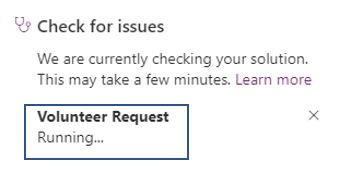
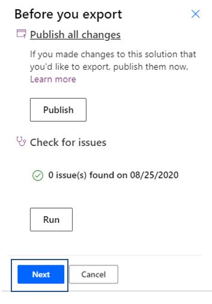
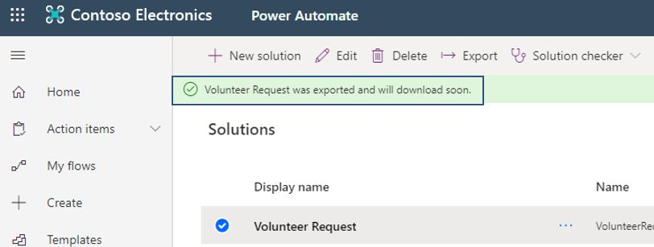
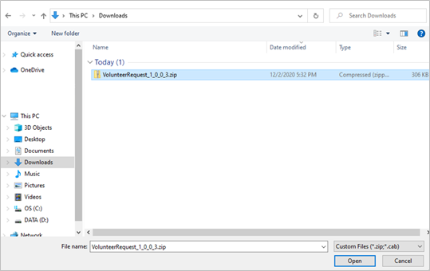
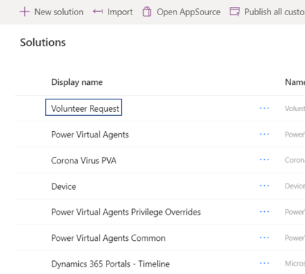

Consider a scenario where you have a solution that includes an app, table, and a flow. You now want to export this solution from one tenant, which is the source, and then import it to another tenant, which is the destination. 

1. In the source tenant, sign in to Power Apps and then select **Solutions**, which is available in the left vertical navigation. Select **Export**.

	> [!div class="mx-imgBorder"]
	> 

1. Select **Publish**. This selection will make sure that all changes that are made to this solution are part of this published solution. 

	> [!div class="mx-imgBorder"]
	> 

1. Select **Run** to check for issues.

	> [!div class="mx-imgBorder"]
	> 

	While the check is running, you should see the **Running…** notification beneath your solution name.

	> [!div class="mx-imgBorder"]
	> 

1. When the check is complete, and no issues have been found, select **Next**.

	> [!div class="mx-imgBorder"]
	> 

1. You need to decide which environment that this solution will be exported to. If it's a test or a production environment, then select **Managed** (recommended). If you're moving it to another development environment, select **Unmanaged** and then select **Export**.

	> [!div class="mx-imgBorder"]
	> 

   In the upper left of the screen, you should see a message stating that the solution was exported and will download soon. Presently, a zipped file will be downloaded to your default download location. 

	> [!div class="mx-imgBorder"]
	> 

	The zipped file name contains the solution name, if it's managed or unmanaged, and the version number.

	> [!div class="mx-imgBorder"]
	> 

1. Go to your destination tenant, sign in to Power Apps, and then select **Solutions**, which is available in the left vertical navigation. Select **Import**.

	> [!div class="mx-imgBorder"]
	> 

1. If you receive an authentication window, enter your credentials to continue.

	> [!div class="mx-imgBorder"]
	> 

1. Select the zipped file that was exported.

	> [!div class="mx-imgBorder"]
	> 

1. Select **Next**.

	> [!div class="mx-imgBorder"]
	> 

1. If solution items are available, the following window will appear. If you have missed anything, for example, a choice, then you'll get an error message with details on what you are missing. Select **Next**.

	> [!div class="mx-imgBorder"]
	> 

1. Keep the **Enable any SDK message processing steps included in the solution** selected and then select **Import**.

	> [!div class="mx-imgBorder"]
	> 

1. Wait until the solution importing process has been completed.

	> [!div class="mx-imgBorder"]
	> 

1. If you receive warnings, then you can select the warning or download the log file.

	> [!div class="mx-imgBorder"]
	> 

You'll now see your solution imported successfully in the new tenant.

> [!div class="mx-imgBorder"]
> 
