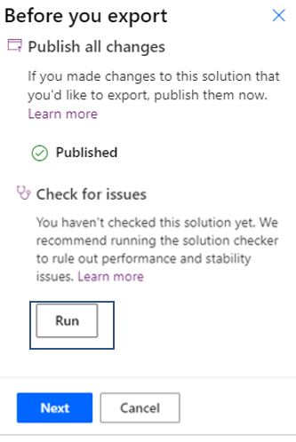
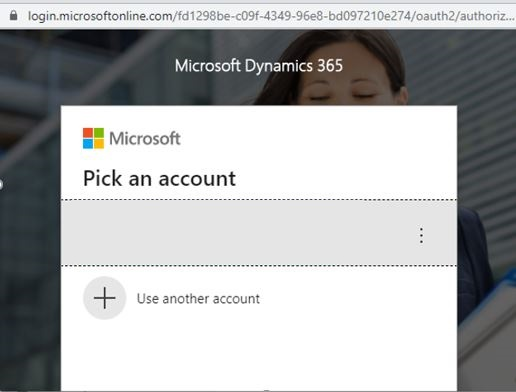
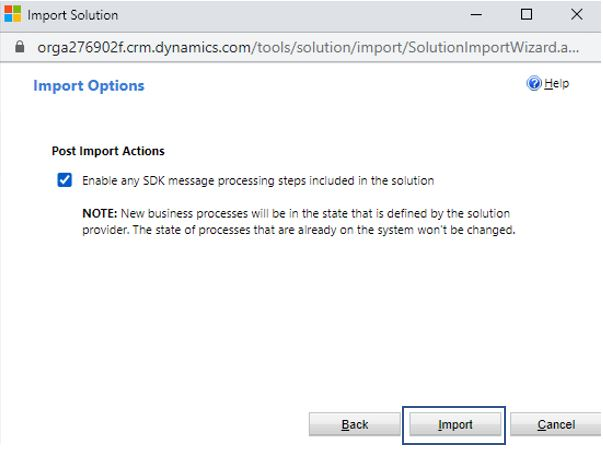

Consider a scenario where you have a solution that includes a Microsoft Dataverse entity and its flow. You now want to export this solution from one tenant, which is the source, and import it to another tenant that is the destination.

1. In the source tenant, go to [Power Automate](https://flow.microsoft.com/?azure-portal=true). Then, on the left vertical navigation pane, select **Solutions**, select your solution, and then select **Export**.

	> [!div class="mx-imgBorder"]
	> 

1. Select **Publish**, which will make sure that all changes that were made to this solution are part of the published solution.

	> [!div class="mx-imgBorder"]
	> 

1. Select **Run** to check for issues.

	> [!div class="mx-imgBorder"]
	> 

	While the check is running, the **Running...** notification should show below your solution name.

	> [!div class="mx-imgBorder"]
	> 

1. When the check is complete, and if no issues have been found, select **Next**.

	> [!div class="mx-imgBorder"]
	> 

1. Decide which environment that this solution will be exported to. If it is a test or a production environment, then select **Managed (recommended)**. If you are moving it to another development environment, select *Unmanaged* and then select **Export**.

	> [!div class="mx-imgBorder"]
	> 

       In the upper-left corner of the screen, you'll see a message stating that the solution was exported and will download soon. Subsequently, a zipped file will be downloaded to your default download location.

	> [!div class="mx-imgBorder"]
	> 

	The zipped file name contains the solution name, if it is managed or unmanaged, and the version number.

	> [!div class="mx-imgBorder"]
	> 

1. Sign in to your destination tenant and go to [Power Automate](https://flow.microsoft.com/?azure-portal=true). On the left vertical navigation, select **Solutions** and then select **Import**.

	> [!div class="mx-imgBorder"]
	> 

1. If you receive an authentication window, enter your credentials to continue.

	> [!div class="mx-imgBorder"]
	> 

1. Select the zipped file that was exported.

	> [!div class="mx-imgBorder"]
	> 

1. Select **Next**.

	> [!div class="mx-imgBorder"]
	> 

1. If solution items are available, then you will see the following window. If you have missed anything, such as an option set, then you will get an error message with details on what you are missing. Select **Next**.

	> [!div class="mx-imgBorder"]
	> 

1. Keep the **Enable an SDK message processing steps included in this solution** option selected and then select **Import**.

	> [!div class="mx-imgBorder"]
	> 

1. Wait until the solution importing process has been completed.

	> [!div class="mx-imgBorder"]
	> 

1. If you have received any warnings, then you can select the warning or download the log file.

	> [!div class="mx-imgBorder"]
	> 

You will now see that your solution has imported successfully in the new tenant.

> [!div class="mx-imgBorder"]
> 
