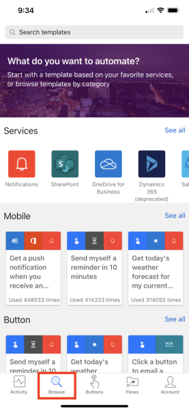
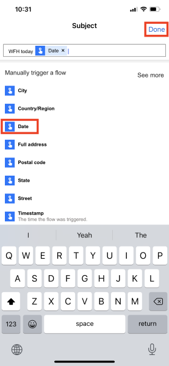
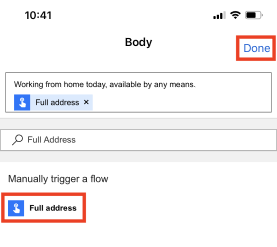
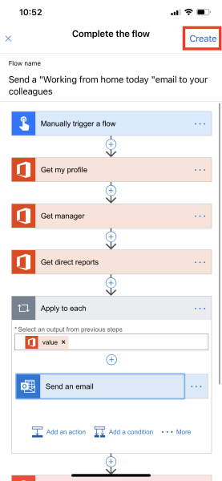
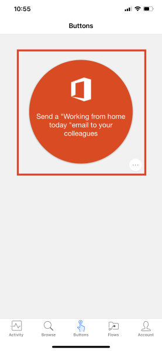
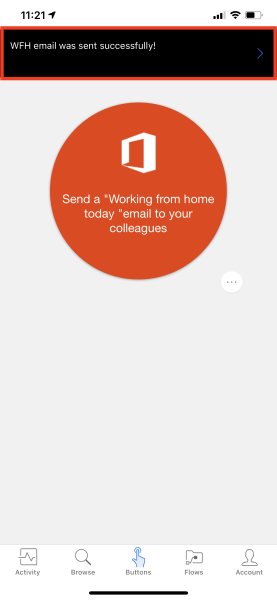

You can build button flows that use information like Global Positioning System (GPS) data, date information, or email. This information is available as *trigger tokens*. Trigger tokens are data points that are known and available to the device that a button flow is running on. These tokens change, based on factors like the current time or the current geographic location of the device.

For example, if you run a button flow on a phone, the phone probably knows the time at your current location, the date, and your current address. In other words, the time and date, and the address where the phone is located, are all determined when the button flow runs. They're automatically available for use in any button flows that are run on the device.

You can use these trigger tokens to build useful flows that minimize repetitive tasks like providing your location to someone or tracking how much time you spent on a particular job/service call.

### List of button trigger tokens

Here's the list of button trigger tokens that are available to you when you create button flows.

| Parameter | Description |
| --- | --- |
| City | The city where the device that's running the flow is located. |
| Country/Region | The country/region where the device that's running the flow is located.|
| Full address | The full address where the device that's running the flow is located. |
| Latitude | The latitude where the device that's running the flow is located. |
| Longitude | The longitude where the device that's running the flow is located. |
| PostalCode | The postal code where the device that's running the flow is located. |
| State | The state where the device that's running the flow is located. |
| Street | The street where the device that's running the flow is located. |
| Timestamp | The time in the area where the device that's running the flow is located. |
| Date | The date in the area where the device that's running the flow is located. |
| User name | The user name of the person who's signed in to the device that's running the flow. |
| User email | The email address of the person who's signed into the device that's running the flow. |

## Create a button flow that uses trigger tokens

When you create a button, you can use trigger tokens to add rich functionality to it.

Let's create a button flow on a mobile device to let your colleagues know you are working from home today. 

Although the procedures in this unit show screenshots from an Apple iOS device, the experience is similar on Android and Windows Phone devices.

### Prerequisites

- A work or school email address, or a [Microsoft account](https://account.microsoft.com/about?refd=www.microsoft.com/?azure-portal=true) that has access to Power Automate

- The Power Automate mobile app for [Android](https://aka.ms/flowmobiledocsandroid/?azure-portal=true) or [iOS](https://aka.ms/flowmobiledocsios/?azure-portal=true).

### Create the button flow

1. Launch the Power Automate mobile app and sign in using your organizational account.

1. Select **Browse**.

    

1. Search for *Working from home today* and select the **Send a "Working from home today "email to your colleagues** service.

    

1. Select **Use this template**.

    

1. Press the title of the **Send an email** card to expand your options. This is a part of simultaneous actions.

    

1. Select the **Subject** field, and enter *WFH today*. Notice that when you selected the **Subject** field, a list of tokens appeared. While the cursor is still in the **Subject** field, scroll through the list of tokens, and select **Date**. Notice that the date token now appears in the **Subject** field.

    

1. Scroll to the **Body** field and select the default message so that you can add tokens there.

1. In the Search field, enter *Full Address* and select the **Full Address** token.

    

1. In the upper right corner, select **Done**.

1. Select **Create**.

    

1. Select **Done**. Your button flow is now created.

## Run the button flow

> [!NOTE]
> This button flow will send your current location via email.

1. Select the **Buttons** tab at the bottom of the window. You'll see a list of the buttons that you have permissions to use. Select the button that represents the button flow that you created:

    

1. Your device may prompt you to let the button flow access your device's location information. If necessary, press **Allow**

    In a few moments, you'll notice that the email was sent successfully.

    

Congratulations! You just created a button flow that uses both the **Date** and **Full Address** trigger tokens.

