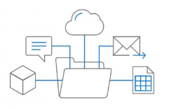
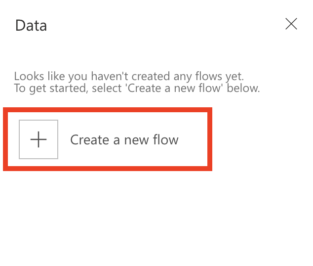

The data that fuels business processes is often buried in separate systems that are difficult to connect to and navigate. This is one reason why business processes continue to be complex, and why people rarely stop worrying about them.

But the Microsoft Power Platform with Power Automate, Power Apps, and Power BI along with tools like Microsoft SharePoint make it all easier. Together, these apps and services provide these advantages:

- The data can easily be tapped.
- Critical business decisions can be made more quickly and more intelligently.
- People can worry less about what their data is doing and concentrate more on moving their business forward.

This unit gives an overview of:

- Integration of Power Automate with Power Apps.
- Integration of Power Automate and Power Apps with SharePoint for easy sharing of data in lists.

## Add a flow in Power Apps

Adding a flow to a Power Apps application is straightforward.

1. Go to [https://make.powerapps.com](https://make.powerapps.com/?azure-portal=true), and sign in by using your organizational account.

1. Open your app for editing.

1. On the **Action** tab, select **Power Automate** on the toolbar.

    

1. In the **Data** dialog box, select **+ Create a new flow**.

    

    Power Automate is started and shows templates filtered by the trigger **PowerApps Button**.

    

For more about how to create flows, see [Create a flow from a template in Power Automate](/flow/get-started-logic-template/?azure-portal=true).

## Add a Power Apps application from Power Automate

You can also go in the other direction. You can start in Power Automate and then select a template to add an app from Power Apps.

1. Launch Power Automate and sign in using your organizational account.

1. In the left pane, select **Templates**.

1. Select one of the many Power Apps templates.

    To see all the Power Apps templates that are available, you can search for *Power Apps*.

    Once the template is selected and opened, you can start building your flow.

For more about how to create apps by using Power Apps, see [Create a canvas app from a template in Power Apps](/powerapps/maker/canvas-apps/get-started-test-drive/?azure-portal=true).

## Integration of SharePoint with Power Automate

Customers regularly exchange data between Microsoft Lists and other systems to support business processes. These scenarios become more powerful through the deep integration of Power Automate with Microsoft Lists.

Power Automate lets you automate the exchange of workflows and data between SharePoint and various Microsoft and third-party services. You can create and start flows directly from a list in Microsoft Lists, and store and change that data in SharePoint.

1. From a list in Microsoft Lists, select **Integrate** on the top toolbar, and then hover your cursor over **Power Automate**.

1. Select **Create a flow**.  

    

1. In the **Create a flow** pane, select the template to use.

    Power Automate is started, and you can finish creating the flow.

## Integration of SharePoint with Power Apps

Power Apps lets you connect to, create, and share business apps on any device in minutes. You can build efficient mobile forms and apps directly from Microsoft Lists, without writing a line of code.

Power Apps and Power Automate share a common connector framework. The framework lets you weave in dozens of data sources that are located on premises or in the cloud. These data sources include:

- Microsoft Exchange
- Microsoft SQL Server
- Microsoft Dataverse
- Salesforce
- Google
- MailChimp
- Twitter
- Wunderlist

1. From a list in Microsoft Lists, select **Integrate** on the top toolbar, and then hover your cursor over **Power Apps**.

1. Select **Create an app**.

    

1. In the **Create an app** pane, enter a name for your app, and then select **Create**.

    Power Apps is started, and you can finish creating the app.
