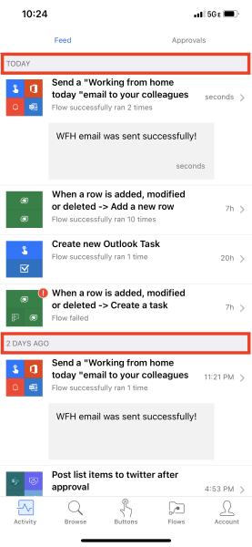
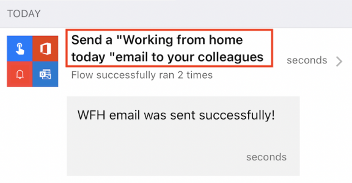
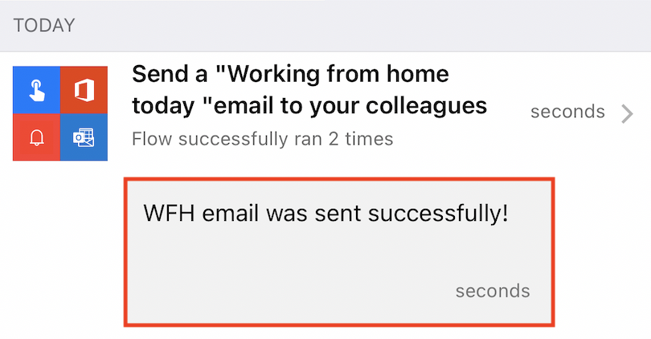
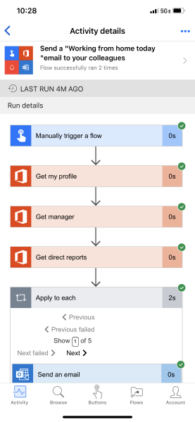
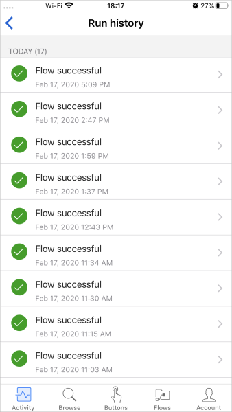

You can view a summary of the number of times that each flow succeeded or failed today, yesterday, and on previous days. You can also explore details about each run, like when it ran, how long each step took, and, if a step failed, why it failed.

## Prerequisites

- Install the Power Automate mobile app for [Google Android](https://aka.ms/flowmobiledocsandroid/?azure-portal=true) or [Apple iOS](https://aka.ms/flowmobiledocsios/?azure-portal=true) on a supported device. The screenshots in this unit were taken on the Apple iPhone version of the app, but the mobile app for Android and Windows Phone is similar.

- If you have completed all of the Units in this Learning Path, you will have many flow runs available for review. If you don't already have a flow, you will want to create one now on the [Power Automate website](https://flow.microsoft.com/?azure-portal=true) before proceeding with this unit. For easier testing, use a flow that you can trigger yourself instead of waiting for an external event.

> [!TIP]
> For testing, you can set up the flow with your personal email address. Then, when the flow is ready for real use, you can set it up with a different address (for example, your manager's).

## Show a summary of activity

1. If your flow hasn't run before, trigger a run to generate data.

    It might take some time for the data to appear in the app.

1. From your phone, open the Power Automate Mobile app.

1. At the bottom of the screen, select the **Activity** tab. This tab organizes data by day, and today's data appears at the top.

    

    Each entry shows the name of the flow and icons that correspond to the flow's trigger events and actions.

    

    If at least one run of a flow has succeeded in a day, an entry shows the number of successful runs and the time of the most recent success. A different entry shows similar information if a flow has failed.

    

    If a flow sends push notifications, the text of the most recent notification appears at the bottom of the entry for successful runs.

    

## Show details of a run

1. From the Activity Feed, select the **>** icon next to one of your flows to show details about the flows run.

    For each event and action, a green **Checkmark** symbol indicates the step was successful and a red **X** symbol indicates that there was an issue with the step. If it succeeded, the amount of time that it took (in seconds) also appears.

    

1. In the upper right-hand corner of the screen, select the **...** and then select **See previous runs**. 

    

Any of the runs in your flow history can be selected to show run details and or Resubmit the Flow, if one or more had failed.
