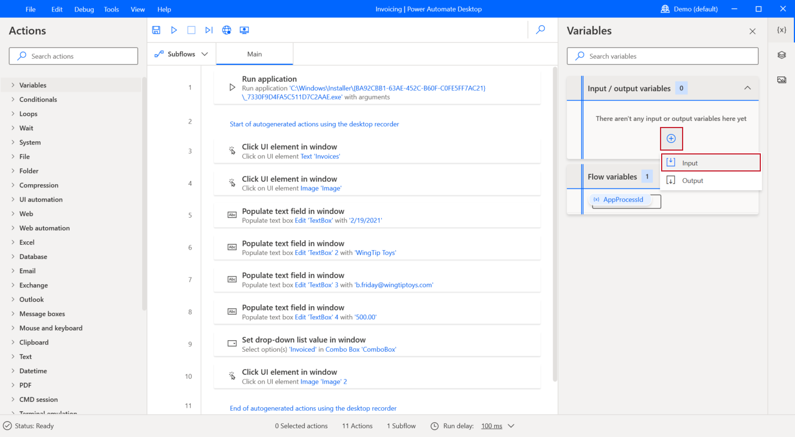
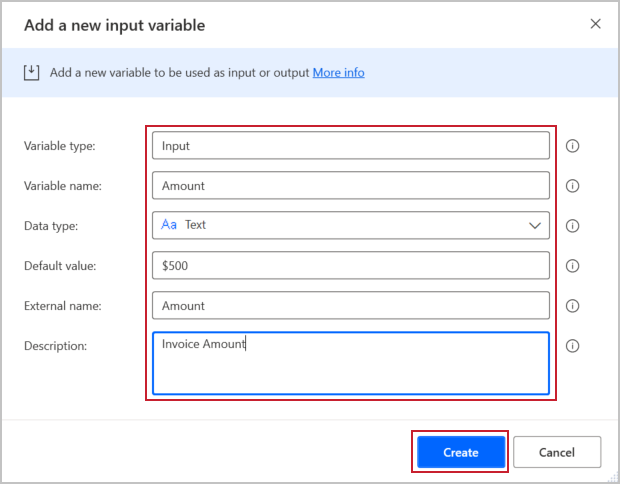
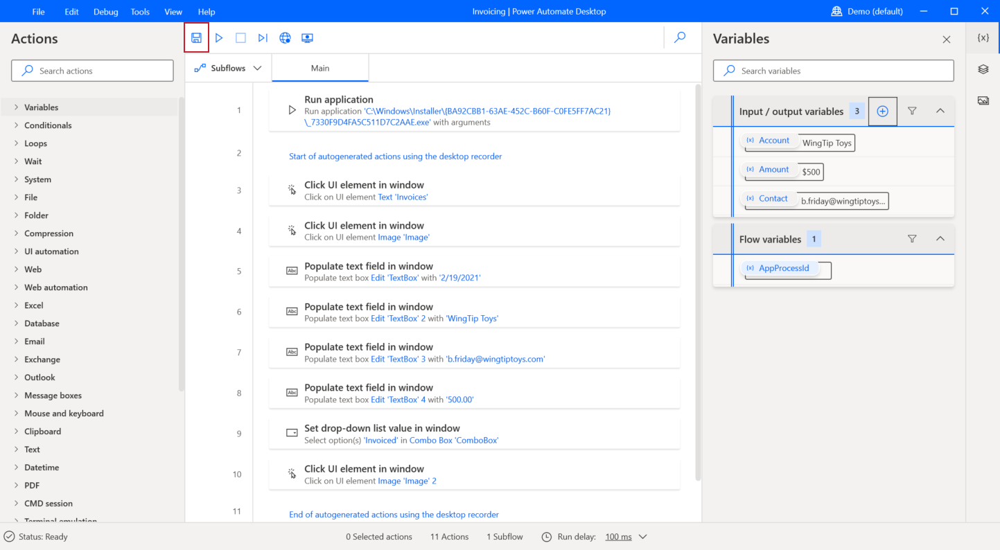

Variables allow information to change or be variable for every run of your flow. If you are using a flow for any type of data entry, you will need variables to define the fields you need to enter. Input variables are information you input into the flow before or during the run. Output variables are outcomes the flow gives back to you after running. Power Automate Desktop provides the ability to receive input values from Cloud flows and return values using output variables. This way, all of your automations can be seamlessly integrated. To begin defining input variables, begin in your Power Automate Desktop app and open the designer by editing a desktop flow.

> [!div class="mx-imgBorder"]
> 

Once in the designer, click the **plus icon** under Input/output variables and select **Input**.

> [!div class="mx-imgBorder"]
> 

The variable type can be input or output. For this example, we will use input and cover output variables later. The variable name will be used and referenced inside the desktop flow. The external name will be used outside of the desktop flow, and the description will give you more information on the variable, which can be especially helpful if you have many different input and output variables in the same desktop flow. The default value allows you to define a value if no input is provided. Data type helps to further define your variable and how Power Automate will handle it. For example, using the data type "Sensitive text" will encrypt the values, offering security on sensitive data. You can use this for passwords to open secure programs or for other personal or private information. Feel free to set your own values for your variable, or you can use those displayed below. Press **Create** to finish your variable.

> [!div class="mx-imgBorder"]
> 

Continue to press the plus icon and create additional input variables for your flow. If you are using the desktop flow built on the Contoso Invoice App, define two additional variables based on the values below.

Variable 2

- Variable Type: Input

- Variable Name: Contact

- Data type: Text

- Default value: `b.Friday@wingtiptoys.com`

- External name: Contact email

- Description: Contact email

Variable 3

- Variable Type: Input

- Variable Name: Account

- Data type: Text

- Default value: WingTip Toys

- External name: Account Name

- Description: Name of the account being invoiced

Once you are finished defining your input variables click **Save**.

> [!div class="mx-imgBorder"]
> 

Now that we have defined the input variables, let's set their use in the desktop flow.
