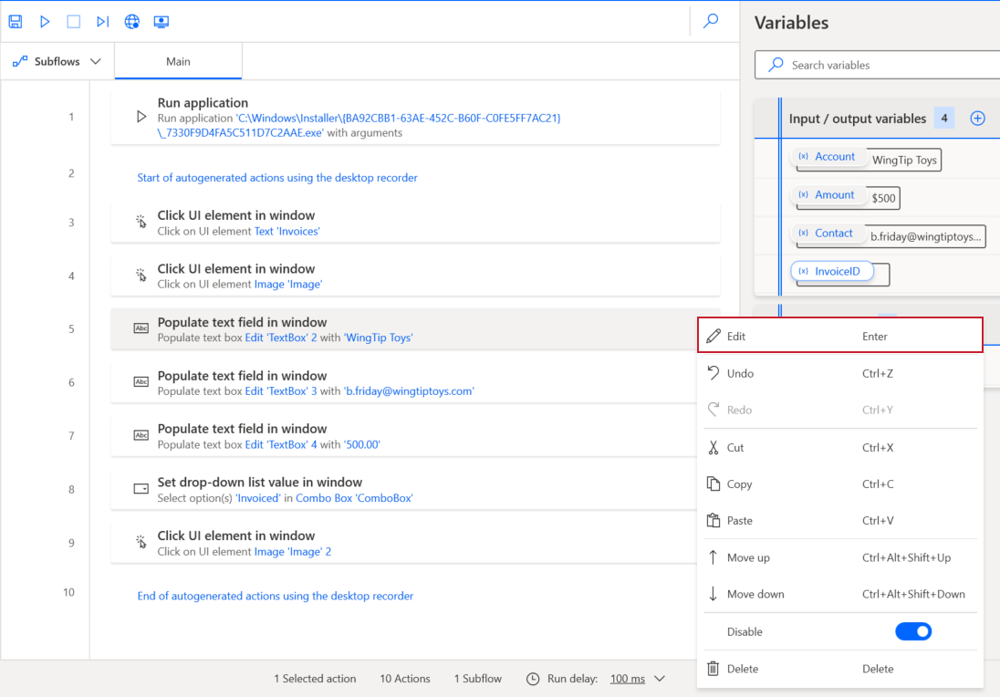
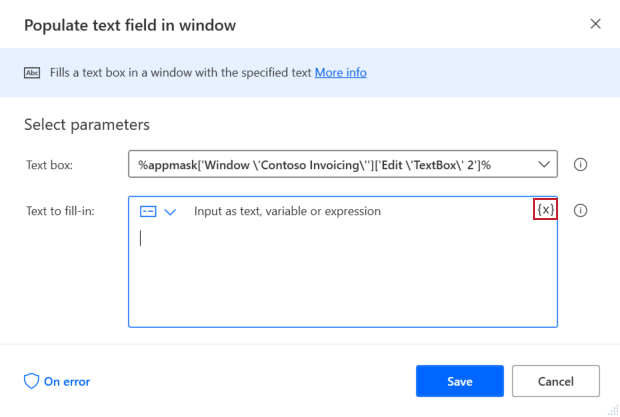
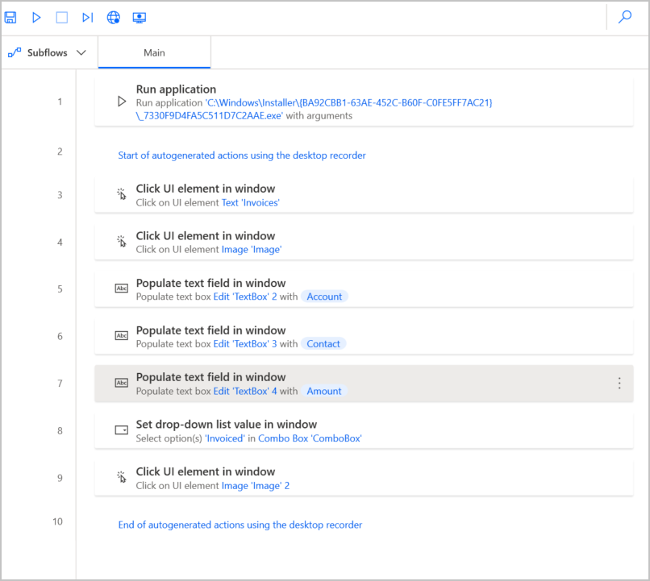

Input variables are used to set information for your desktop flow. To make use of your input variables, determine at which step of your flow you will utilize that data and edit that step. If you are using the desktop flow created using the Contoso Invoice App, the first step which requires a variable is step five. Click on the ellipses to the right of the step and select **Edit**.

> [!div class="mx-imgBorder"]
> 

Delete the value in Text to fill-in: and select the **{x}**.

> [!div class="mx-imgBorder"]
> 

Double click on the desired variable, in this case, **Account**.

> [!div class="mx-imgBorder"]
> 

Click **Save** to close the dialogue box and complete your variable setup. After setting the remaining variables, your steps will look like the below.

> [!div class="mx-imgBorder"]
> 

Now the values filled in for the desktop app will be defined by variables instead of static values.
