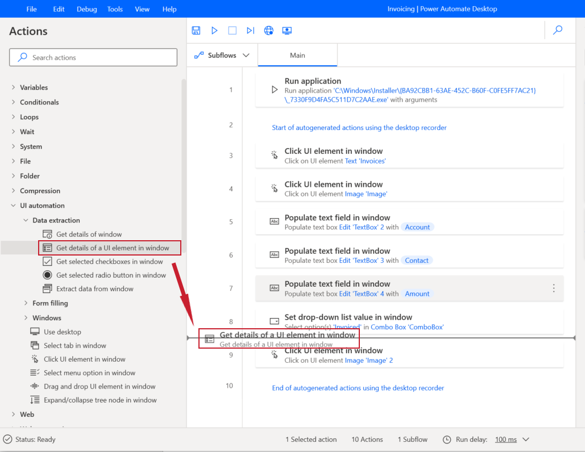
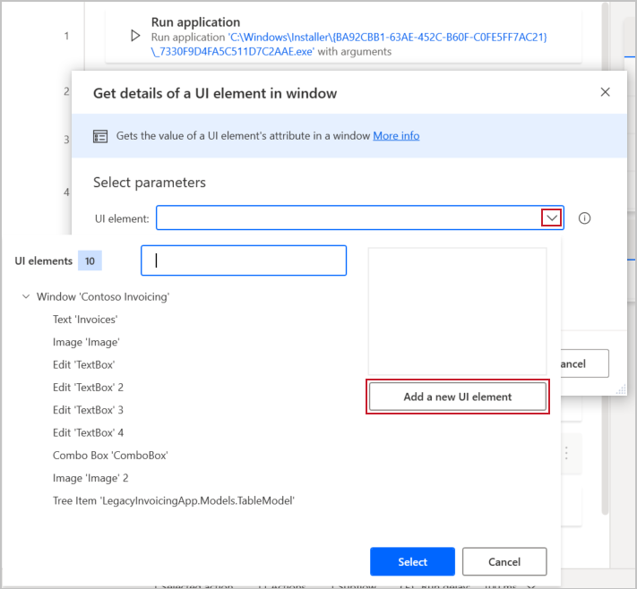
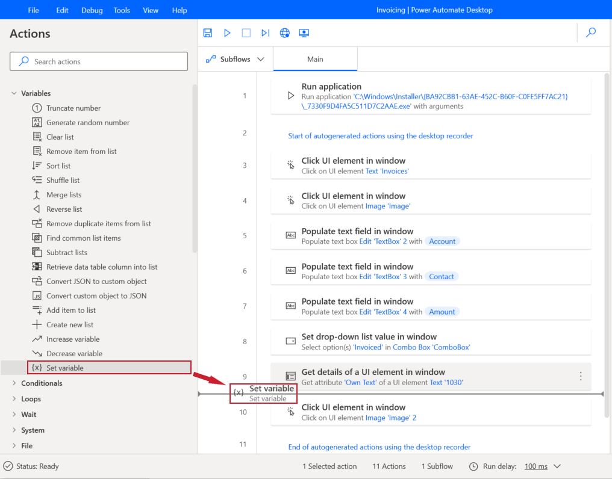

The input variables already had associated steps, but it is difficult to define an output variable when recording actions since the goal is to get information rather than perform an action such as clicking. A new action within the process is required to set an output variable. Ensure the desktop application relevant to your flow is running during this process. On the Actions Pane, expand **UI automation** and **Data extraction**. Select and drag **Get details of a UI element in window** to the appropriate step in your flow (for the Contoso Invoice flow, this will be between steps 8 and 9).

> [!div class="mx-imgBorder"]
> 

In the subsequent dialogue box, click the **down arrow** to expand options and select **Add a new UI element**.

> [!div class="mx-imgBorder"]
> 

Power Automate Designer will minimize, revealing your desktop application and a small window containing your tracking session. Unlike when you record actions, the tracking session is looking for you to click on an element to capture. You can perform actions without affecting the tracking session. To choose the desired element, hover over it until you see a red border, hold down **Ctrl** and click on the desired element (in this case the Invoice ID) to record it in the tracking session.

> [!div class="mx-imgBorder"]
> 

Once you see the selected element display in the tracking session, click **Done**.

> [!div class="mx-imgBorder"]
> 

The tracking session will disappear, leaving the Power Automate Designer and the edit dialogue box for Get details of a UI element in window. Click **Save**.

> [!div class="mx-imgBorder"]
> 

This action will automatically create a variable called AttributeValue as an output that we can refer to in subsequent actions within Power Automate Desktop.

When we retrieved the element (Invoice ID) from the application, there was a specific value that was returned based upon a new invoice being created. To ensure that our value can be dynamic, we need to perform a few additional steps.

Click the stacked paper icon on the right side of your screen. Find the element you just selected. It should say Text and have the text you added in apostrophes like the below. Select the **ellipses** and in the menu, select **Edit selectors**.

> [!div class="mx-imgBorder"]
> 

In the subsequent dialogue box, hovering over the text will reveal **ellipses**. Click these and then **Edit selector**.

> [!div class="mx-imgBorder"]
> 

Click on the element you wish to edit and ensure that the **Name Equal to 1030** (or your text) is not selected. This allows the value to be dynamic instead of static. Select Update and Close the Edit Selector dialogue box.

> [!div class="mx-imgBorder"]
> 

Now that we are gathering a dynamic UI element, we can set the output variable. On the Actions Pane, expand Variable and select and drag Set variable after the step 'Get details of a UI element in window'.

> [!div class="mx-imgBorder"]
> 

You can now set the output variable you defined in the previous unit. Setting the output variable will allow you to use it in downstream processes such as a cloud flow. To set the variable, simply put the variable name between two percentage symbols like so: **%InvoiceID%**. You can fill in 'To' in a similar manner or by using the **{x}** button. Select **Save**.

> [!div class="mx-imgBorder"]
> 

If you forget the names of your variables, you can always see them by clicking {x} in the upper right corner of Power Automate Designer.

You now know how to define and set both input and output variables. These variables will allow you to make your desktop flows much more powerful and dynamic.

**Save** and **Run** your flow to see your hard work at play.
