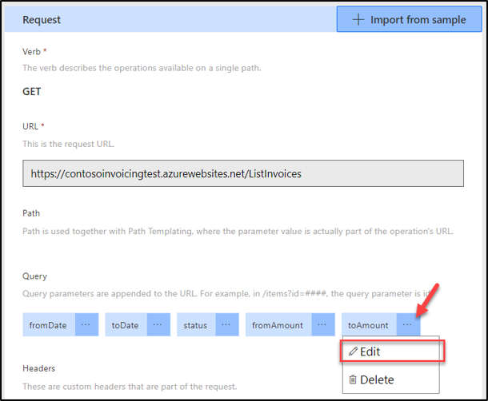
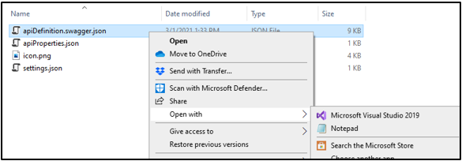
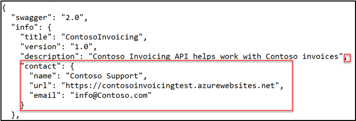

In this exercise, you'll use CLI to download a connector, validate the definition, and resolve any issues. This simulates what you would do to prepare for open-sourcing and certifying a custom connector.

This exercise requires you to install Python and access the command prompt on the machine that you're using for the exercise.

> [!Important]
> Use a test environment with Microsoft Dataverse provisioned. If you do not have one you can sign up for the community plan **[linked here](https://powerapps.microsoft.com/communityplan/?azure-portal=true)**.

## Task 1: Import solution

In this task, you'll import an unmanaged solution that contains a Contoso Invoicing custom connector. You'll use this connector to complete the tasks in this exercise.

1. Navigate to [Power Apps maker portal](https://make.powerapps.com/?azure-portal=true) and make sure you are in the correct environment.

1. Select **Solutions** and select **Import**.

1. Select **Browse**.

1. Select the **ContosoInvoicingOpenSource_1_0_0_0.zip** solution and select **Open**.

1. Select **Next**.

1. Select **Import** and wait for the import to complete. You should get a success message after the import completes.

1. Select to open the **Contoso Invoicing - Open Source** solution you imported.

1. You should see **Contoso Invoicing - Open Source** custom connector component.

   > [!div class="mx-imgBorder"]
   > [](../media/3-01-open-source.png#lightbox)

## Task 2: Install Microsoft Power Platform CLI

The Microsoft Power Platform CLI includes the paconn command-line tool that is designed to aid Microsoft Power Platform custom connector development. The paconn tool uses the Python runtime so you'll also be installing that.

1. Navigate to [Download Python](https://www.python.org/downloads/?azure-portal=true) and select **Download Python**. You can use any version greater than 3.5.

1. Select the downloaded .exe file to start installation.

1. Select the **Add Python xx to Path** checkbox, select **install**, and wait for the installation to complete.

   > [!div class="mx-imgBorder"]
   > [](../media/3-02-install-python.png#lightbox)

1. Close the installation wizard after the installation completes.

1. Start the command prompt and run the command below to install paconn.

   `pip install paconn`

   > [!div class="mx-imgBorder"]
   > [](../media/3-03-install-paconn.png#lightbox)

1. Wait for the installation to complete.

## Task 3: Download the connector locally

In this task, you'll download the connector definition files locally so you can add the Host URL property.

1. Run the login command.

   `paconn login`

1. Copy the provided **Code**.

   > [!div class="mx-imgBorder"]
   > [](../media/3-04-log-in-code.png#lightbox)

1. In a browser logged in with the same credentials as your environment. Navigate to [Microsoft Device Login](https://microsoft.com/devicelogin/?azure-portal=true) paste the **Code** you copied and select **Next**.

1. Provide your credentials.

1. You should get a successful sign-in message.

   > [!div class="mx-imgBorder"]
   > [](../media/3-05-success.png#lightbox)

1. Go back to the command prompt and you should see a Login successful message.

1. Run the download command.

   `paconn download`

1. When prompted to select an environment, enter a number for the environment where you installed the solution and press [ENTER].

1. Provide the number of the **Contoso Invoicing - Open Source** connector and press [ENTER].

1. The download should complete successfully. Make a note of the location where the connector was downloaded.

## Task 4: Validate

In this task, you'll validate the connector and fix some common errors. You'll also add the required connector metadata.

1. Copy the path where the connector was downloaded.

   > [!div class="mx-imgBorder"]
   > [](../media/3-06-connector-path.png#lightbox)

1. Run the validate command using the path you copied plus the API definition swagger file name **\apiDefinition.swagger.json**.

   `paconn validate --api-def [Path to apiDefinition.swagger.json]`

   > [!div class="mx-imgBorder"]
   > [](../media/3-07-validate-command.png#lightbox)

1. You should get an error for missing summary for the fourth parameter of ListInvoices action and a missing contact property.

   > [!div class="mx-imgBorder"]
   > [](../media/3-08-validation-errors.png#lightbox)

1. You'll first fix the missing summary. Navigate to [Power Apps maker portal](https://make.powerapps.com/?azure-portal=true) and make sure you are in the correct environment.

1. Select the **Contoso Invoicing - Open Source** connector and select **Edit**.

   > [!div class="mx-imgBorder"]
   > [](../media/3-09-edit-connector.png#lightbox)

1. Select the **Definition** tab and then select the **ListInvoices** action.

1. Scroll down to the **Request** section, select the **...** button of the **toAmount** parameter, and select **Edit**.

   > [!div class="mx-imgBorder"]
   > [](../media/3-10-edit-parameter.png#lightbox)

1. Provide a summary **To amount** and select **Update connector**.

   > [!div class="mx-imgBorder"]
   > [](../media/3-11-update-connector.png#lightbox)

1. Wait for the connector update to complete.

1. Now delete the connector you previously downloaded (and re-add it in a moment). Delete the connector you downloaded from your machine.

1. Download the connector again. Go back to the command prompt and run the download command again.

   `paconn download`

1. When prompted to select an environment, enter the number for the environment where you installed the solution and press [ENTER].

1. Provide the number of the **Contoso Invoicing - Open Source** connector and press [ENTER].

1. The download should complete successfully. Make a note of the location where the connector was downloaded.

1. Run the validate command using the path you copied plus the API definition swagger file name **\apiDefinition.swagger.json**.

   `paconn validate --api-def [Path to apiDefinition.swagger.json]`

1. You should now get just one error for the missing contact parameter.

   > [!div class="mx-imgBorder"]
   > [](../media/3-12-validation-error.png#lightbox)

1. Go to the connector folder you downloaded and open the apiDefinition.swagger.json file using the text editor of your choice such as Notepad.

   > [!div class="mx-imgBorder"]
   > [](../media/3-13-open-file.png#lightbox)

1. Add a contact property to the info after the description property.

   ```json
   "contact": {
     "name": "Contoso Support",
     "url": "https://contosoinvoicingtest.azurewebsites.net",
     "email": "info@Contoso.com"
   }
   ```

   > [!div class="mx-imgBorder"]
   > [](../media/3-14-add-contact.png#lightbox)

1. Add connector metadata after the info.

   ```json
   "x-ms-connector-metadata": [
     {
      "propertyName": "Website",
      "propertyValue": "https://contosoinvoicingtest.azurewebsites.net"
     },
     {
      "propertyName": "Privacy policy",
      "propertyValue": "https://contosoinvoicingtest.azurewebsites.net"
     },
     {
      "propertyName": "Categories",
      "propertyValue": "Productivity"
     }
   ],
   ```

   > [!div class="mx-imgBorder"]
   > [](../media/3-15-add-metadata.png#lightbox)

1. Select file and save your changes.

1. Run the validate command one more time.

   `paconn validate --api-def [Path to apiDefinition.swagger.json]`

1. The connector should now get validated successfully.

> [!div class="mx-imgBorder"]
> [](../media/3-16-validation-success.png#lightbox)

You've successfully prepared the connector for open-sourcing and certification. If this was a real connector you were building, you would go on to publish the connector to GitHub.
