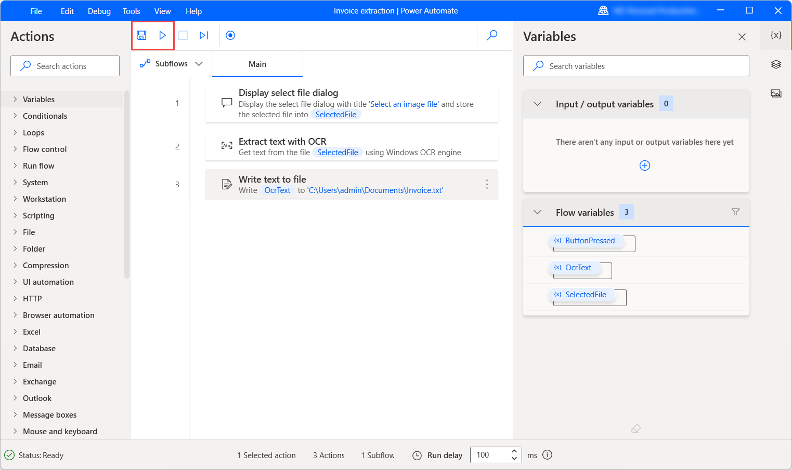

In this exercise, you'll create a flow that extracts invoice data from scanned documents and saves it to a text file. The wanted functionality can be implemented with both **MODI** and **Tesseract** OCR engines.

1. Launch the Power Automate for desktop console and create a new flow named **Invoice extraction**.

    

1. Use the **Display select file dialog** action to prompt users to select an image file. In the **File filter** field, enter the value **\*.jpg** to limit the selectable files.

    

1. Add an **Extract text with OCR** action to the workspace and configure it to extract text from the previously selected image. In the **OCR engine settings**, set the image width and height multipliers to 2.

    

1. Use a **Write text to file** action to write the extracted text to a .txt file. For this example, we chose to overwrite the existing content of the file in each execution.

    

1. Save the flow and run it to ensure that the extraction is completed successfully.

    > [!NOTE]
    > To test the flow, you can use the [newinvoice.jpg](https://github.com/MicrosoftDocs/mslearn-developer-tools-power-platform/raw/master/power-automate-desktop/newinvoice.zip) image file. Select **Download** on the right side of the page and extract the downloaded file to your local computer.

> [!div class="mx-imgBorder"]
> 
