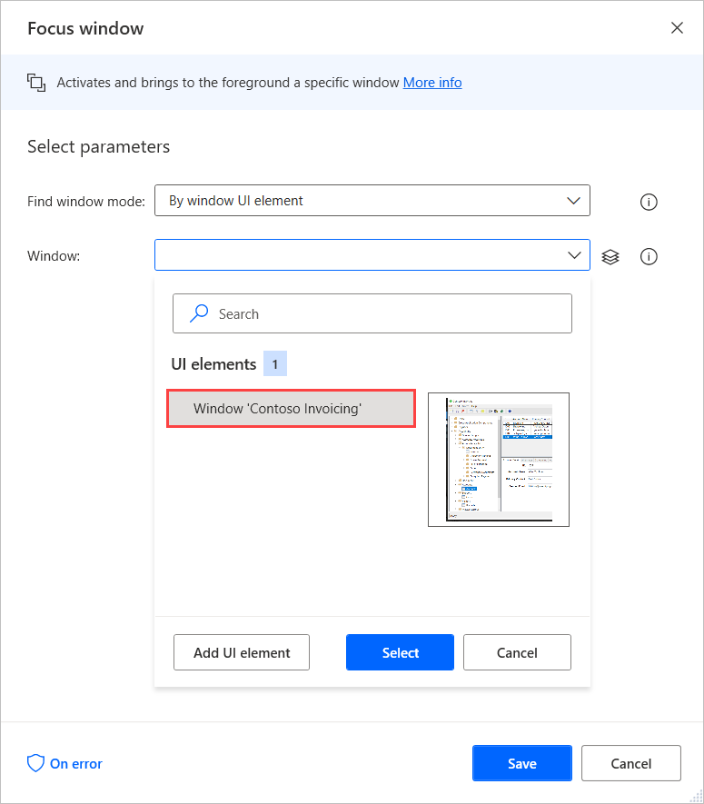
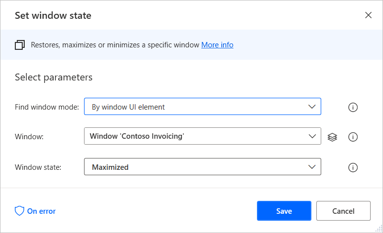
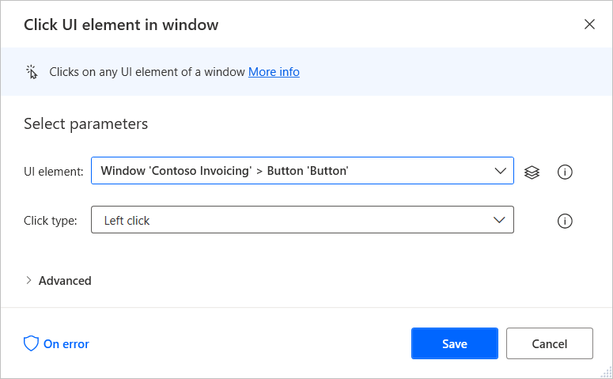
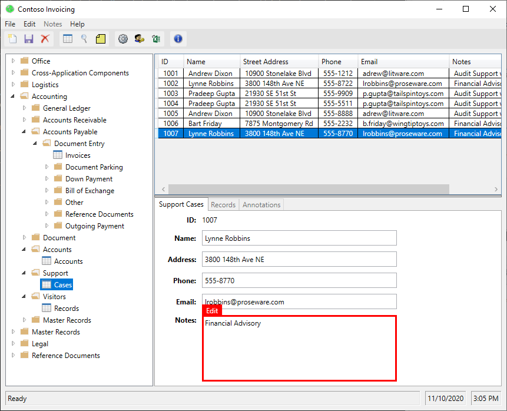
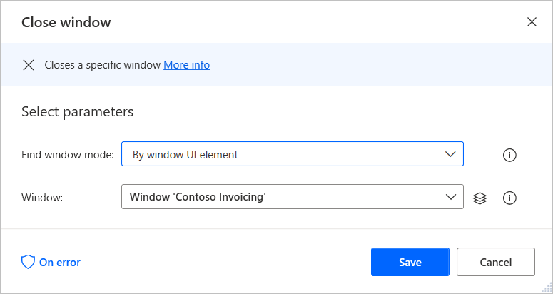

## Window handling

The windows sub group of actions is responsible for helping you interact with entire UI windows.

Use the **Focus Window** action to bring a window to the foreground. You can identify the window by its UI element and then capture it, or you can use an already captured window element, as shown in the following screenshot:

Similarly, you can add a **Set Window State** action to maximize the now focused application.

## Element interaction

Use the **Click Element in Window** action to perform a mouse click on a UI element.

> [!NOTE]
> The **Click Element in Window** action requires a simple UI element, in contrast to the previous actions that required a window element.

To edit the contents of a text field, use the appropriate action:

To save the changes, Select the **Save** button by using the **Press Button in Window** action.

Your final task is to use the **Close Window** action to close the app, as shown in the following screenshot.

