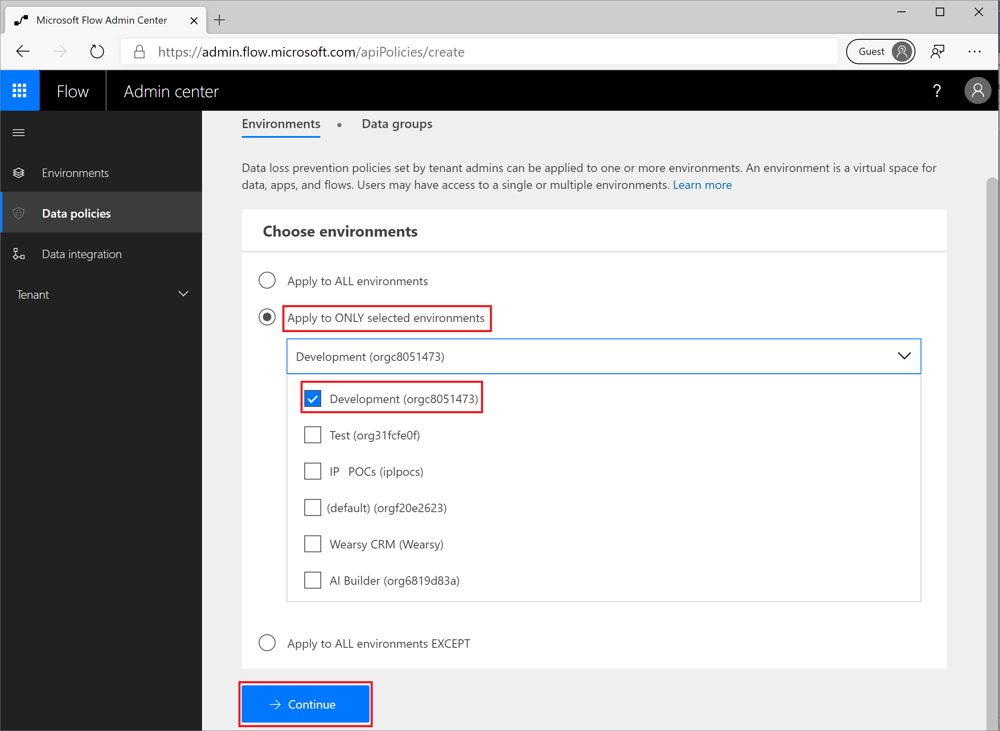
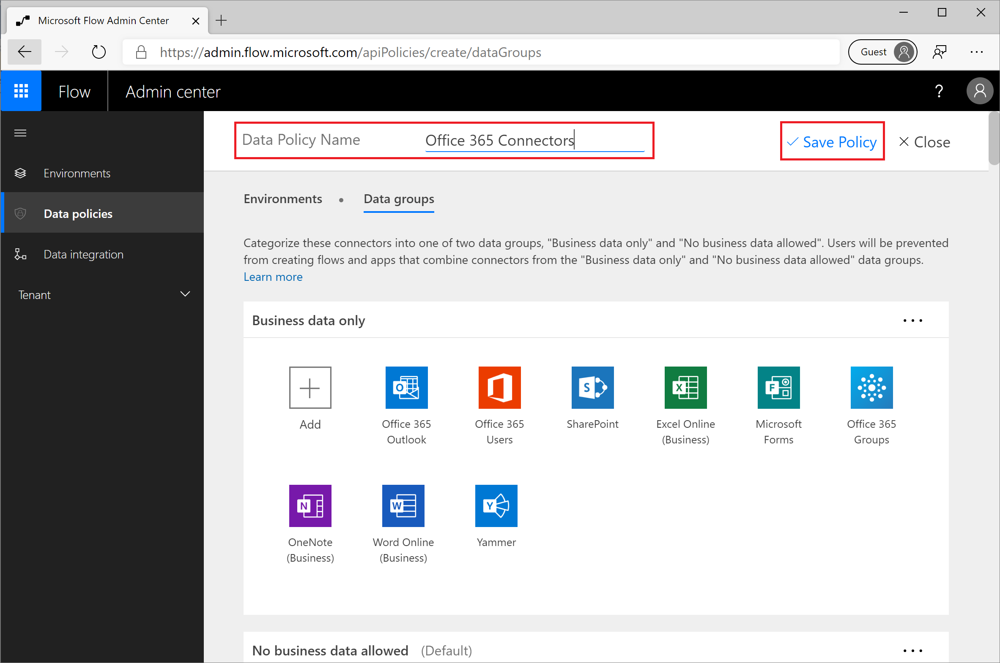
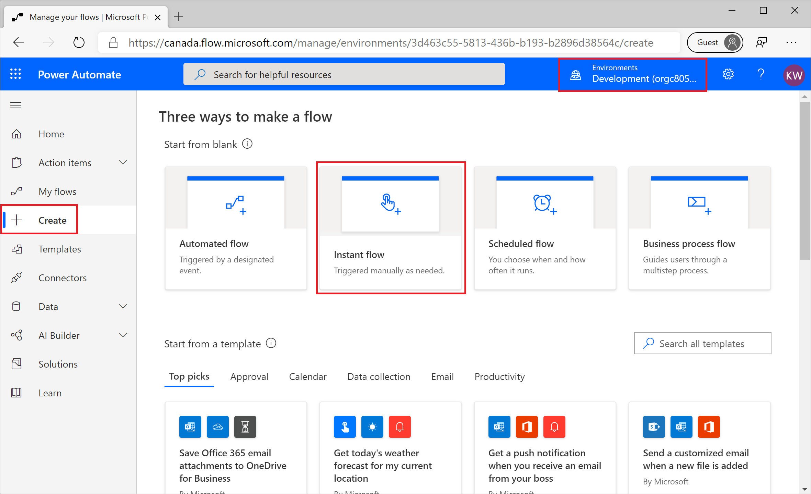

In this exercise, you will create an environment-specific DLP policy that
applies to Office 365 use cases. The driver behind this scenario is an
organization that wants to ensure that makers can build automation
solutions for the Office 365 platform by using Power Automate.

This exercise will take advantage of the environment that was created in the
Introduction to Power Automate security and governance module, which is the 
first module of this learning path. In addition, you should review the DLP 
prerequisites that were outlined at the beginning of this module.

1.  Sign in to the [Power Automate Admin Center](https://admin.flow.microsoft.com/?azure-portal=true) as an environment or tenant administrator.

2.  Select **Data policies** from the left navigation pane.

3.  From the upper-right corner, select **+ New policy**.

4.  Select the **Apply to ONLY selected environments** button, select the environment that was created in the previous module, or any test environment, and then select the **Continue** button.

	

5.  Within the **Business data only** data group, select the **+ Add** button and then select the following connectors: 
    - Office 365 Outlook
    - Office 365 Users
    - SharePoint
    - Excel Online (Business)
    - Microsoft Forms
    - Office 365 Groups
    - OneNote (Business)
    - Word Online (Business)
    - Yammer 

6.  After you have selected all of these connectors, select the **Add connectors** button.

    Your **Business data only** data group should now resemble the following image.

    

7.  Update the auto generated **Data Policy Name** that starts with **Policy** by selecting it at the top of the screen. Enter **Office 365 Connectors** and then select **Save Policy**.

    

8.  With your DLP policy in place, you can now create a flow that will validate that your DLP policy is working. To create this flow, go to the [Power Automate maker portal](https://flow.microsoft.com/?azure-portal=true).

9.  Ensure that you are in the environment that you created previously. You can switch environments by selecting the environment picker in the upper-right corner.

10. Select **Create** from the left navigation pane.

11. Select the **Instant flow** link.

    

12. Provide a **Flow name** of **Test DLP**, select **Manually trigger a flow** as your trigger, and then select the **Create** button.

    

13. From within the flow designer, select **+ New Step**.

14. Search for **MSN Weather** in the **Search connectors and actions** text box.

15. Select the **Get forecast for today** action.

16. Enter **Seattle** for the **Location** and select **Imperial** for the **Units**.

17. Select the **+ New Step** to add an Office 365 Outlook action.

18. Search for **Office 365 Outlook** in the **Search connectors and actions** text box.

19. Select the **Send an email (V2)** action.

20. Provide values for the **To:**, **Subject**, and **Body** fields.

	

21. Select the **Save** button to save the flow. The DLP enforcement job will run.

22. You should get an error as a result of violating your DLP policy that you created. As a result, your flow will be disabled, and it cannot be enabled while it conflicts with any DLP policies. In this specific example, it is disabled because you have included an **MSN Weather** connector in a flow that also contains an **Office 365 Outlook** connector. If you want this flow to run, you can either add the **MSN Weather** connector to the **Business data only** data group in your Office 365 DLP policy that you previously created, or you can remove the **Office 365 Outlook** connector from the **Business data only** data group.

	
