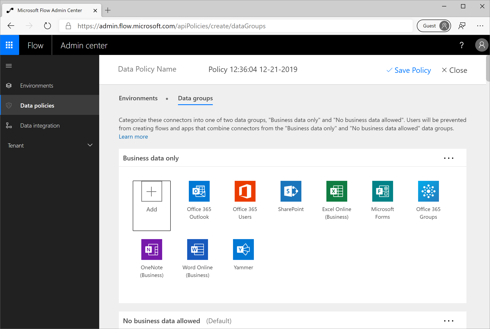
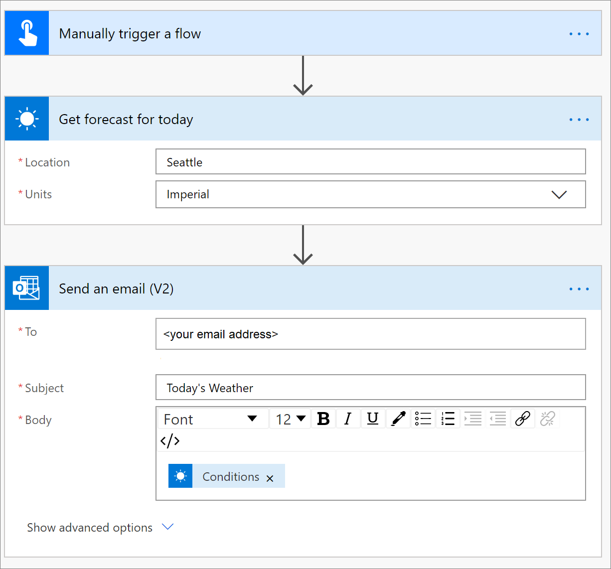

In this exercise, we will create an environment specific DLP policy that
applies to Office 365 use cases. The driver behind this scenario is an
organization that wants to ensure that makers can build automation
solutions for the Office 365 platform, using Power Automate.

This exercise will take advantage of the environment that we created in the
Introduction to Power Automate security and governance module, which is the 
first module of this learning path. In addition, you should review the DLP 
prerequisites that were outlined at the beginning of this module.

1.  Log into the [Power Automate Admin Center](https://admin.flow.microsoft.com/?azure-portal=true) as an environment or tenant administrator.

2.  Click on **Data policies** from the left navigation section.

3.  From the upper right-hand corner, click on **+ New policy**.

4.  Click on the **Apply to ONLY selected environments** radio button, click on the environment we created in the previous module, or any test environment, and then click the **Continue** button.

	

5.  Within the **Business data only** data group, click on the **+ Add** button and select the following connectors: Office 365 Outlook, Office 365 Users, SharePoint, Excel Online (Business), Microsoft Forms, Office 365 Groups, OneNote Business, Word Online (Business) and Yammer. Once you have selected all of these connectors, click on the **Add connectors** button.

6.  Your **Business data only** data group should now look like the following.

    

7.  Update the auto-generated **Data Policy Name** that starts with Policy by clicking it at the top of the screen and enter **Office 365 Connectors** and then click **Save Policy**.

    

8.  With our DLP policy in place, let's go ahead and create a flow that will validate that our DLP policy is working. To create this flow, go to the [Power Automate maker portal](https://flow.microsoft.com/?azure-portal=true).

9.  Ensure that you are in the environment that you created earlier. You can switch environments by clicking on the environment picker in the upper right-hand corner.

10. Click on **Create** from the left navigation.

11. Click on the **Instant flow** link.

    

12. Provide a **Flow name** of **Test DLP**, select **Manually trigger a flow** as your trigger and then click on the **Create** button.

    

13. From within the flow designer, click on **+ New Step**.

14. Search for **MSN Weather** in the **Search connectors and actions** text box.

15. Click on the **Get forecast for today** action.

16. Type in **Seattle** for the **Location** and select **Imperial** for the **Units**.

17. Click on the **+ New Step** to add an Office 365 Outlook action.

18. Search for **Office 365 Outlook** in the **Search connectors and actions** text box.

19. Click on the **Send an email (V2) action**.

20. Provide values for the **To:**, **Subject** and **Body** fields.

	

21. Click on the **Save** button to save the flow, and as a result, the DLP enforcement job will run.

22. We should get an error as a result of violating our DLP policy that we just created. As a result, our flow will be disabled and it cannot be enabled while it conflicts with any DLP policies. In our specific example, it is disabled since we have included an **MSN Weather** connector in a flow that also contains an **Office 365 Outlook** connector. If we want this flow to be able to run, we can either add the **MSN Weather** connector to the **Business data only** data group in our Office 365 DLP policy that we previously created, or we can remove the **Office 365 Outlook** connector from the **Business data only** data group.

	
