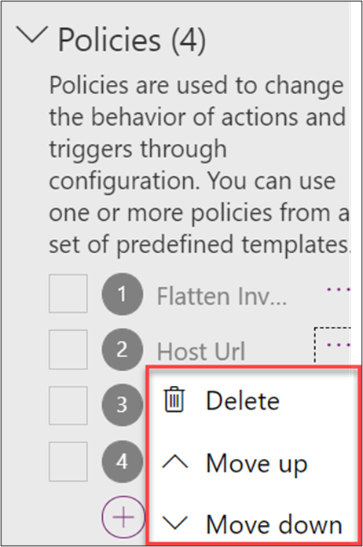

This module explores using policies with custom connectors and introduces you to how to configure them using policy templates.

In this module, you will:

-   Gain an understanding of how policies can modify the behavior of custom connectors at runtime.

-   Apply policy templates to a custom connector.

Policies allow you to modify the behavior of a custom connector at runtime. You can use policies to perform data conversion, route requests, set parameter values, and more. Policies can be configured directly in the custom connector API properties file before import, or you can do it from the maker portal in the custom connector designer by applying policy templates. The following are examples of common policy use cases:

-   **Set host URL:** By default, the host URL is hardcoded into the connector configuration. A policy combined with a connection parameter allows that to be specified each time you create a connection using the connector. For example, this could handle a dev, test, and production version of the backend API.

-   **Set header:** Use this to promote data from the connection parameters, query, or body of the request to the header. Commonly this is done to accommodate APIs that want specific information configured in the header. For example, this could be a correlation ID to track the full business process being performed.

-   **Set query parameter:** Use for handling default values if necessary, but the maker doesn't configure one. For example, if an API required a top parameter for how many records to return using a policy, you could set a default value to be used if the maker doesn't configure one.

You can use policies to handle specific API needs and make the connector easier to use by hiding unnecessary complexities.

## Applying a policy

Applying a policy template to a custom connector allows you to select a policy that you want to use from a list of templates. Each template selected will prompt you to fill out the necessary configuration for that policy. When you complete the form, the policy is activated after you update the connector. The following is an example of creating a new policy using one of the templates.

> [!div class="mx-imgBorder"]
> 

When you're applying a policy template, you can choose to have it apply to all actions and triggers or just for specific ones.

> [!div class="mx-imgBorder"]
> 

For example, the **Set host URL** template is typically applied to all. On the other hand, the **Convert an array to an object** might only be applied to one or two actions that return similar data.

When configuring a policy to run on all actions and triggers, you need to ensure that any data paths used in the policy parameters are valid for all actions and triggers or you'll encounter runtime errors.

In the list of configured policies, you can select the "..." option next to each policy and move it up or down in the list. This allows you to configure the order the policies are applied at runtime. This can be helpful in scenarios where you use multiple policy templates to accomplish your data conversion. For example, one could parse a delimited string into an array, and another could convert the array into an object. In this example, the order of execution would be important.

> [!div class="mx-imgBorder"]
> 

Configuring a policy template results in modification of the connector's API properties. API properties are stored separately from the API definition for the connector. You can import an updated API definition through the portal without overwriting any of the policies you've configured.

## Viewing and modifying using the CLI

In addition to viewing policies in the portal, you can also export them as part of the API properties file using the paconn download command from the [CLI](https://docs.microsoft.com/connectors/custom-connectors/paconn-cli/?azure-portal=true).

-   The download includes four files (apiDefintion.swagger.json, apiProperties.json, icon.png, settings.json).

-   If you open the apiProperties.json and locate the policyTemplateInstances, you would see all the policies configured.

The following is an example of that section:

> [!div class="mx-imgBorder"]
> 

You can also modify the apiProperties.json file directly if you're comfortable working in JSON. There are some policies like Set host URL that if you want to prompt for the URL when a connection is created you'll have to modify the connectionParameters in apiPropertiess.json to complete the policy configuration. The paconn update command can be used to import the changes.

It can also be helpful to look at how other connectors use policies. The [Power Platform Connectors](https://github.com/Microsoft/PowerPlatformConnectors/?azure-portal=true) GitHub repository has many great examples of both certified and non-certified connectors you can look at. You can browse and look at the connectors apiProperties.json file. Search the repository using a policy template name like setHeader can also quickly reveal which connectors are using that policy.