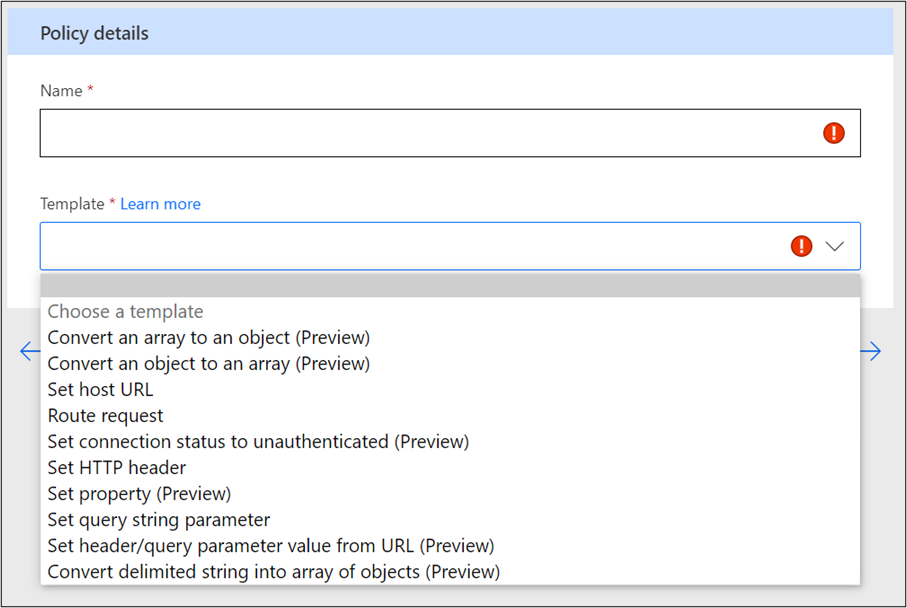
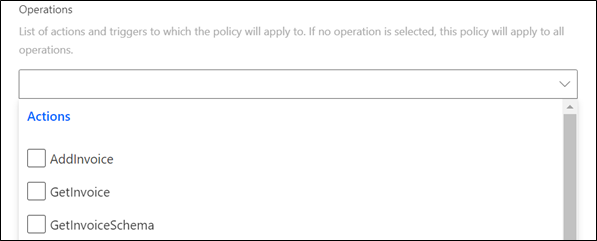

This module explores using policies with custom connectors and explains how you can configure them by using policy templates.

In this module, you will:

-   Discover how policies can modify the behavior of custom connectors at runtime.

-   Apply policy templates to a custom connector.

Policies allow you to modify the behavior of a custom connector at runtime. You can use policies to perform data conversion, route requests, set parameter values, and more. You can configure policies directly in the custom connector API properties file before import, or you can do it from the maker portal in the custom connector designer by applying policy templates. 

Common policy use cases are:

-   **Set host URL** - By default, the host URL is hardcoded into the connector configuration. A policy, combined with a connection parameter, allows the host URL to be specified every time you create a connection by using the connector. For example, this use case could handle a dev, test, and production version of the system API.

-   **Set header** - Use to promote data from the connection parameters, query, or body of the request to the header. Commonly, this process is done to accommodate APIs that want specific information configured in the header. For example, this use case could be a correlation ID to track the full business process that is being performed.

-   **Set query parameter** - Use for handling default values, if necessary, but the maker doesn't configure one. For example, if an API required a top parameter for how many records to return by using a policy, you could set a default value to be used if the maker doesn't configure one.

You can use policies to handle specific API needs and make the connector easier to use by hiding unnecessary complexities.

## Apply a policy

Applying a policy template to a custom connector allows you to select a policy that you want to use from a list of templates. Each selected template will prompt you to fill out the necessary configuration for that policy. When you complete the form, the policy is activated after you update the connector. The following screenshot shows an example of creating a new policy by using one of the templates.

> [!div class="mx-imgBorder"]
> 

When you're applying a policy template, you can choose to have it apply to all actions and triggers or only for specific ones.

> [!div class="mx-imgBorder"]
> 

For example, the **Set host URL** template is typically applied to all actions and triggers. Contrarily, the **Convert an array to an object (Preview)** template might only be applied to one or two actions that return similar data.

When configuring a policy to run on all actions and triggers, you need to ensure that any data paths that are used in the policy parameters are valid for all actions and triggers; otherwise, you'll encounter runtime errors.

In the list of configured policies, you can select the ellipsis (**...**) next to each policy and move it up or down in the list. This feature allows you to configure the order in which policies are applied at runtime, which can be helpful in scenarios where you use multiple policy templates to accomplish your data conversion. For example, one policy could parse a delimited string into an array, and another policy could convert the array into an object. In this example, the order of implementation would be important.

> [!div class="mx-imgBorder"]
> 

Configuring a policy template results in modification of the connector's API properties. API properties are stored separately from the API definition for the connector. You can import an updated API definition through the portal without overwriting the policies that you've configured.

## View and modify by using CLI

In addition to viewing policies in the portal, you can also export them as part of the API properties file by using the paconn download command from [CLI](https://docs.microsoft.com/connectors/custom-connectors/paconn-cli/?azure-portal=true).

-   The download includes four files (apiDefintion.swagger.json, apiProperties.json, icon.png, settings.json).

-   If you open the apiProperties.json file and locate the **policyTemplateInstances** section, you will see all policies configured.

The following screenshot is an example of the **policyTemplateInstances** section.

> [!div class="mx-imgBorder"]
> 

You can also modify the apiProperties.json file directly if you're familiar with working in JSON. With some policies, such as **Set host URL**, if you want to prompt for the URL when a connection is created, you'll have to modify **connectionParameters** in the apiPropertiess.json file to complete the policy configuration. The paconn update command can be used to import the changes.

It might be beneficial to consider how other connectors use policies. The [Microsoft Power Platform Connectors](https://github.com/Microsoft/PowerPlatformConnectors/?azure-portal=true) GitHub repository has many great examples of certified and non-certified connectors that you can look at. Additionally, you can browse through and look at the connectors' apiProperties.json file. Searching the repository by using a policy template name, such as **setHeader**, can also quickly reveal which connectors are using that policy.
