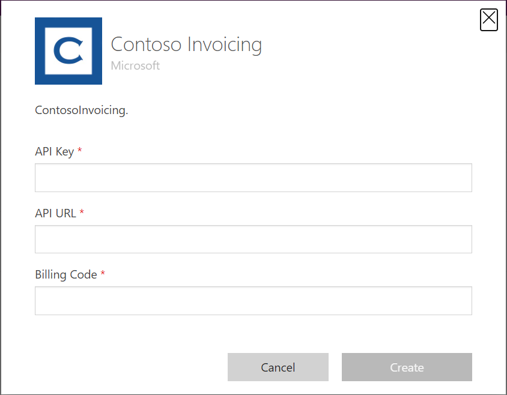

Expressions enable policy template parameters to get their values from runtime data. The functions can access and transform runtime data from the headers, query, and body of the request and response from the API. It's also common to use expressions to access data from the connector's connection properties. For example, @connectionParameters('HostUrl') would get the value configured for the connection property HostUrl, which would allow a maker to change service URL as part of the connection, think of test vs. production API scenarios. In this topic, we'll cover some of the common expressions used with policy templates.

## Expression basics

Expressions are evaluated at runtime. An expression is a sequence of one or more functions, operators, or explicit values. When you define an expression in a parameter you prefix the expression with the at-sign (@). If your expression results in a numeric value where string input is expected, you can use the curly braces ({}) notation and it will automatically convert the numeric value into a string. The following is an example of using both notations:

@{connectionParameters('HostPortNumber')}

To ensure your expressions don't fail due to null properties make sure anything in the path isn't null. The following example would fail if summary was null:

@body().summary.amount

If you're including explicit values (string literals) in your expressions use a single quotation mark. Don't use double quotes as it will conflict with the mark-up used around the expression.

## Working response body

You can use the body() functions to access the response body at runtime. For example, if you look at the List Invoice action it returns the following data:

{
“invoices”: [ { “invoiceid”:”1234”}]
}


In this example, the outer {} is what body() references and it has a property invoice that is an array.

You could build an expression that references the invoices array using the following:

@body().invoices

You could also build an expression that accesses the invoiceid from the first item in the array using the following:

@body().invoices[0].invoiceid

## Working with header values

Using @headers('headerName') you can access values from the header. You can also use the @headers as a destination template parameter when using the Set Header from URL policy template. This would allow you to retrieve a value from a URL and set it in the header. For example, a connector could use this to get an access token from the service to allow posting to a page. The following is an example of what the policy template configuration might look like to get the access token for Post to Page action:

> [!div class="mx-imgBorder"]
> [](../media/header-value.png#lightbox)

## Working with query values

Like headers, you can use @queryParameters('queryParameterName') to access the query parameters of the request. The following is a similar example to the one above with headers but instead this places the retrieved token into the query parameters.

> [!div class="mx-imgBorder"]
> [](../media/query-value.png#lightbox)

## Working with connection values

Using @connectionParameters('connectionParameterName') you can access values input when the connection was set up for the custom connector. This allows you to collect information from the user of your custom connector like authentication or host url values. You can use these parameter values to build URLs and fill in other connection-specific configuration values.

Connection parameters are configured in the apiProperties.json file are used to build the connection dialog the user fills out when they create a new connection.

When you configure authentication on a custom connector, it automatically edits the apiProperties for you to add the required authentication properties. If you were to download your connector definition using paconn and looked in apiProperties.json, you would see the following added if you configured API key authentication:

```json
"api_key": {
        "type": "securestring",
        "uiDefinition": {
          "displayName": "API Key",
          "description": "The API Key for your environment",
          "tooltip": "Provide your API Key",
          "constraints": {
            "tabIndex": 2,
            "clearText": false,
            "required": "true"
          }
        }
```

This results in you seeing the following input field when creating a connection.

> [!div class="mx-imgBorder"]
> [](../media/api-key.png#lightbox)

You can also manually add other input fields to collect other data that is unique to each user of the custom connector. For example, a common one is Host URL to allow the connector to work with multiple endpoints of the underlying API. The following is an example of the apiProperties.json file where in addition to API key we're allowing input of Host URL and a Billing Code.

```json
"properties": {
    "connectionParameters": {
      "hostUrl": {
        "type": "string",
        "uiDefinition": {
          "constraints": {
            "required": "true"
          },
          "description": "Specify your API Url e.g. https://test.contoso.com",
          "displayName": "API URL",
          "tooltip": "Specify your API Url e.g. https://test.contoso.com"
        }
      },
      "billingCode": {
        "type": "string",
        "uiDefinition": {
          "constraints": {
            "required": "true"
          },
          "description": "billing code",
          "displayName": "Billing Code",
          "tooltip": "Billing Code"
        }
      },
      "api_key": {
        "type": "securestring",
        "uiDefinition": {
          "displayName": "API Key",
          "description": "The API Key for your environment",
          "tooltip": "Provide your API Key",
          "constraints": {
            "tabIndex": 2,
            "clearText": false,
            "required": "true"
          }
        }
      }
    }
```

Using this configuration, the following connection dialog would be shown:

> [!div class="mx-imgBorder"]
> [](../media/connection-dialog.png#lightbox)

You could then use the expressions @connectionParameters('hostUrl') and @connectionParameters('billingCode') to use the values in your policy template configurations.

You'll see examples of using expressions throughout the rest of this module as we explore how you can use policy templates.