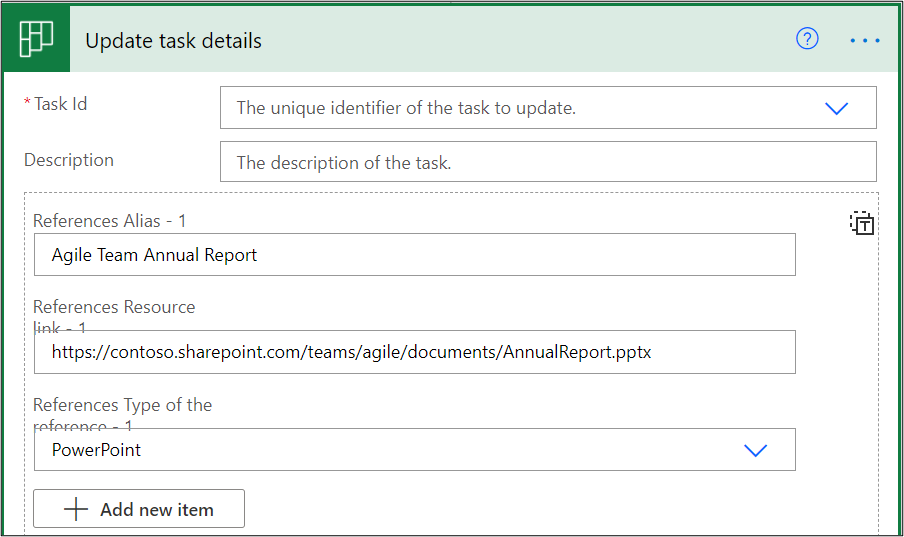
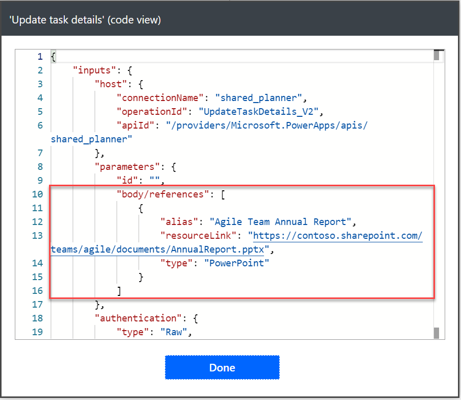
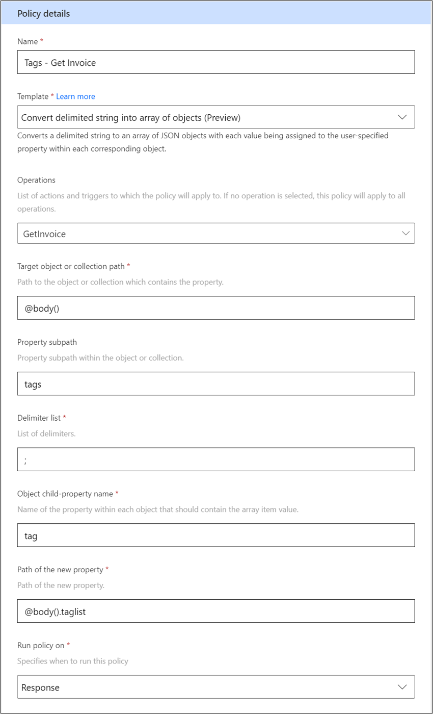
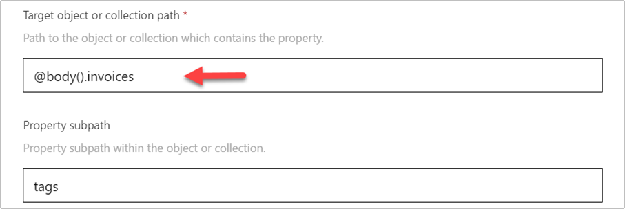

Policy templates can be used to convert data from one structure to another. This is commonly done to make it easier for the maker using a custom connector to provide data to the actions or to work with the response data from the action results. For example, the API might provide a comma-separated list of users who have access to the record and converting that to an array would make it easier to use the list in an app or flow. The following are the policy templates that currently support converting data structures:

-   Convert an array to an object

-   Convert an object to an array

-   Convert delimited string into an array of objects

Each of these policies can be run against the request (input data) or the response (output data) from one or more actions. When done on the request you're shaping the data provided by the maker for how the API would like to see it. For example, the Microsoft Planner connector uses the Convert array to an object on its Update task details action. This action allows the user to provide an array of external reference links and associate them with the task. By allowing the maker to specify them as an array the users are presented with a nice interface allowing them to easily add multiple links by clicking Add new item.

> [!div class="mx-imgBorder"]
> 

If you use the peek feature on the action step, you can see how the data is structured and would be presented to the API if there weren't any transformations done by the policy templates on the connector.

> [!div class="mx-imgBorder"]
> 

If you were to look at the Microsoft Planner API [docs](https://docs.microsoft.com/graph/api/plannertaskdetails-update?view=graph-rest-1.0&tabs=http/?azure-portal=true) for this operation you would see that it wants the data structured like the following:

> [!div class="mx-imgBorder"]
> 

To convert what was provided by the flow action to what is expected by the API the connector is configured to execute multiple policy templates to transform the data. The following are the policy templates used and their purpose:

-   Set Property: to set the previewPriority field to "!"

-   Set Property: to set the @odata.type

-   Convert array to object: to reshape the array and include type and alias as properties

The convert array to object would look like the following example:

> [!div class="mx-imgBorder"]
> 

Policy templates that run on the response allow you to reshape the output from the API. For example, Contoso Invoicing response from its Get Invoice action includes a semicolon separated list of tags as part of the invoice object. The data returned from the API looks like the following:

> [!div class="mx-imgBorder"]
> 

A string with multiple values like this is harder for apps and flows to work with than an array. To improve the usability, you could use the Convert delimited string policy template on the response. The following is the policy template you would configure:

> [!div class="mx-imgBorder"]
> 

This would result in a new array named taglist being added to the response as you can see in the following image:

> [!div class="mx-imgBorder"]
> 

Now that we've explored a couple of examples of policy templates in use let's review a few of the key configuration details. The run policy on parameter decides if the policy applies to the request or response. If you need both, you'll need to configure two policy templates.

> [!div class="mx-imgBorder"]
> 

Each of the convert policy templates has a target object or collection parameter. This gives the starting point for where the policy logic will get the data to transform. The most common starting point is using the expression @body(). This expression points to the body of the request or response. In the following example @body() is an object and has a property named tags.

> [!div class="mx-imgBorder"]
> 

If instead the response was an object with a property named invoices that was an array of invoice objects, each having a tags property the configuration would look like the following:

> [!div class="mx-imgBorder"]
> 

As you're configuring policies, it's important to apply them only to the actions with request/response data matching these configurations. For example, Get Invoice that returns a single invoice object would need different policy templates applied than List Invoice that returns an array of invoice objects. If you're adding policy templates to an existing connector with all actions enabled, it's important to test all actions and triggers to ensure they work with the new policy.

It's also important after you configure any response policy templates that you reimport the sample data on the action response. This is required so apps and flows can have visibility to the transformed data.

If your configuration of a policy template creates an error, you'll typically see it in the tester as either an HTTP status of 500 or it will fail to do any processing. While it isn't possible to disable a policy, it's possible to remove an action from the list of operations to allow testing to isolate if the policy is causing any problems. The following shows only two operations selected:

> [!div class="mx-imgBorder"]
> 

The convert policy templates offer a configuration focused approach to transforming data to and from your underlying API. They can be used to make your connector actions easier to use.