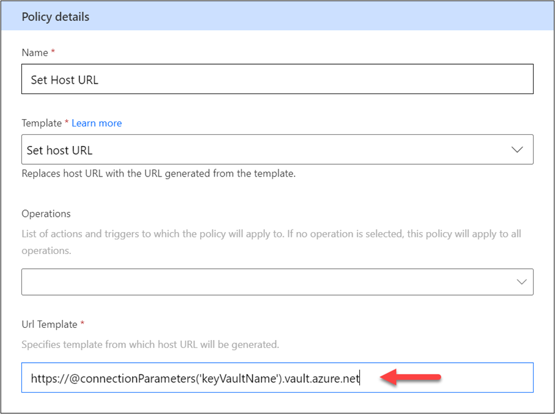

A common use of policy templates is to allow dynamic configuration of the API endpoint triggers and actions will use at runtime. The following are the policy templates available:

-   **Set host URL:** replaces the full host URL with one built by the policy.

-   **Route Request:** routes an incoming request to a specified endpoint on the configured host URL.

## Set host URL

By default, the host URL used is statically configured and the same for all triggers and actions on your connector. Using the Set host URL policy template, you can configure the URL for the triggers and actions individually. For example, if you had order-related actions at one URL (for example, `ordersapi.contoso.com`) and user-related actions at another (for example, `userapi.contoso.com`). In this scenario, you would configure two policy templates each selecting the appropriate user or order actions to apply the new host URLs.

Probably the most common use is allowing the user to provide the host URL at runtime when they create a new connection using your custom connector. You saw an example of that previously in this module. In that example, we added a property named hostURL to the connectionParameters and the user provided the full host URL at connection time.

Another common way of using this is dynamically building part of the host URL and making part of it static. Using this approach, the user only has to provide their account name or other key data that make the full URL. An example of this is the Azure Key Vault connector where the host URL is unique for each vault. Instead of asking the user to provide the full vault URL `https://contosokv.vault.azure.net` you can add a connection property named keyVaultName and prompt the user to provide that part of the URL only (contosokv in this example). The following is an example of what this policy template would look like:

> [!div class="mx-imgBorder"]
> 

You can also include data using the @headers and @queryParameters expressions in addition to using @connectionParameters. We discussed using these in the expression topic.

## Route request

Each action on your custom connector has a fully qualified URL (for example, `https://api.contoso.com/AddInvoice`) that is used to make the request to the underlying API. This comes from the combination of the Host (for example, `api.contoso.com`) you specify on the general tab and the path (for example, /AddInvoice) that either came from a definition you imported or was extracted from a sample request when you did an import sample request. The Set Host URL policy we discussed above allows you to modify the Host, and the Route Request allows you to modify the path.

One of the other scenarios you can accomplish with the Route Request policy is having multiple actions that point to the same path. For example, if you had List Invoices action that took fromAmount as a parameter and wanted to create a List Big Invoices action that had a default value for fromAmount you would get an error because they both pointed to the same path /ListInvoices. Instead, you can define the List Big Invoices with a path of /ListBigInvoices which doesn't exist on the API. You then use a Route Request to send those action calls to /ListInvoices. The following is an example of what the policy template would look like:

> [!div class="mx-imgBorder"]
> 

You can also include parameters and other expressions to help you build the path. For example, the Microsoft Outlook Tasks connector has a default path on the List folders in a group of /v2/me/taskgroups('{group_id}')/taskfolders. Using the following Route Request they route to the new path:

> [!div class="mx-imgBorder"]
> 

Notice the {group_id} where just like in the original path they referenced one of the parameters on the action.

Using the Set Host URL and the Route Request policy templates give you some flexibility to route requests as needed to the underlying API.