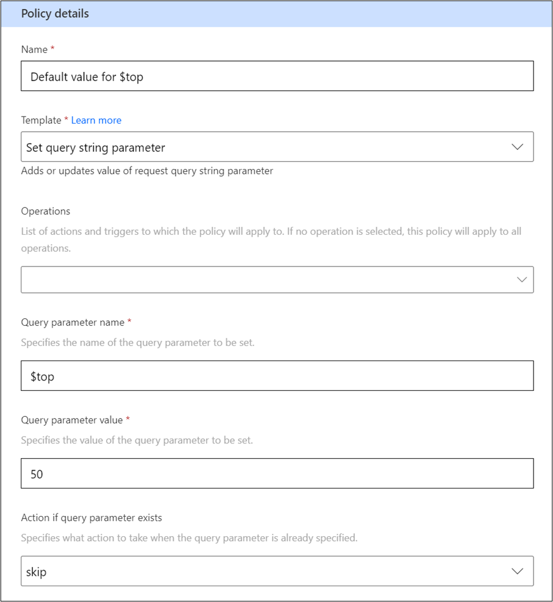
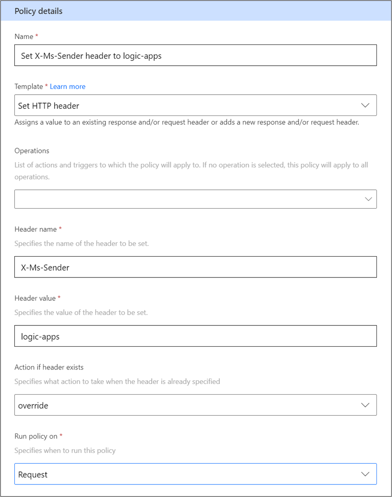

In this topic, we'll explore the policy templates you can apply to set data values in the request to and response from the API. The most common scenario is to set values required by the API in the body, header, or query of the request so the maker doesn't have to provide it. The policies are flexible to handle various tasks related to setting data on both request and response. The following are the policy templates available and focused on setting data values:

-   **Set property:** Add or update a property on an object or collection.

-   **Set query string parameter:** Add or update a parameter in the query string.

-   **Set HTTP header:** Add or update a value in the request and/or response header.

## Using set property

The Set property policy template can be used to set or update values in the body of either the request or response objects. You can set a constant value using a string value or an expression using @body() to get another existing value from the body object. The following example shows setting a constant value on the response body:

> [!div class="mx-imgBorder"]
> 

If you looked at the response after the policy template executed, you would see the following:

> [!div class="mx-imgBorder"]
> 

As you can see in the above example the ListInvoice operation returns an object with a property invoice that is an array of invoice objects. If you wanted to set the prefix property on each invoice in the invoices array, you would change your Parent object or collection path to look like the following:

> [!div class="mx-imgBorder"]
> 

The output you would have after making that change would be like the following:

> [!div class="mx-imgBorder"]
> 

You can also reference other values in the body that are already set. For example, in the following image we set a property FullValue that includes the Prefix property:

> [!div class="mx-imgBorder"]
> 

Notice in the above Value to add we used the expression @body(). Prefix to get the prefix value from the body. You must surround the expression with curly braces {expression} in order for it to work.

Only referencing @body works here, using other expressions such as @connectionProperties, @headers, or @queryParameters isn't supported.

## Using set query string parameter

The Set query string parameter template policy can be used to add or update query parameters on the request. Since the query string only matters on the request you don't have to set Run policy on value. Unlike the Set property policy that always sets the value even if it exists, this policy is configurable. You can set the action if the parameter exists to one of the following:

-   **Override:** Replaces existing value.

-   **Skip:** Existing value isn't replaced.

-   **Append:** Policy template value is appended to existing value.

This can give you control over when the value is used and makes it a good approach for providing default values. An example of this is the Microsoft Outlook connector that has a Set query string parameter policy to set a default value of 50 for its $top parameter. The following is an example of what the policy template would look like:

> [!div class="mx-imgBorder"]
> 

Notice skip was used for the Action if exists to ensure this is only used as a default.

## Using set HTTP header

The Set HTTP header policy template can be used to add or update values in the header of the request, response, or failure. Like the Set query string policy template, you can choose the action if the value exists already. The policy template is used most frequently to set header values expected by the API such as sender identification, etag for change tracking or special API key headers not handled by the normal connector settings. For example, the Azure Cognitive Services connector uses a Set header policy template to set the X-Ms-Sender header value to logic-apps. The following is an example of what that policy template would look like:

> [!div class="mx-imgBorder"]
> 

Using these policy templates allow you to set values expected by the API. You can also use them to set values in the response that might make it easier for the maker to consume the data. These policies can also be used to set default values when one isn't already provided. You can use multiple of them in a specific order to compose more complex values.