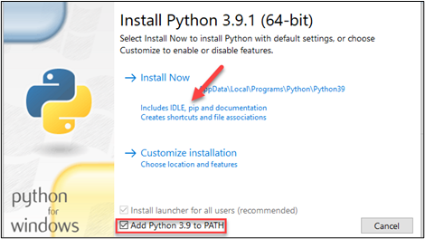
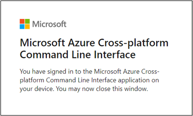
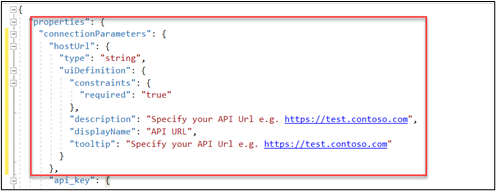
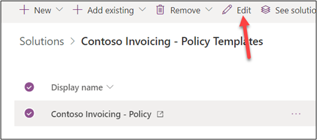
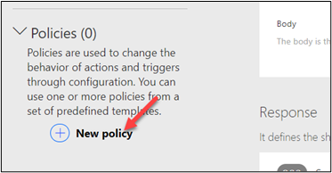
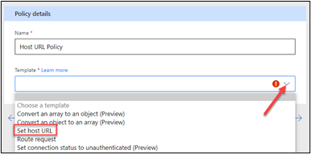
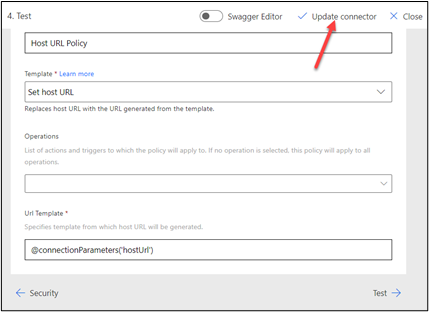
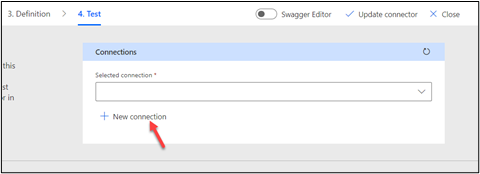
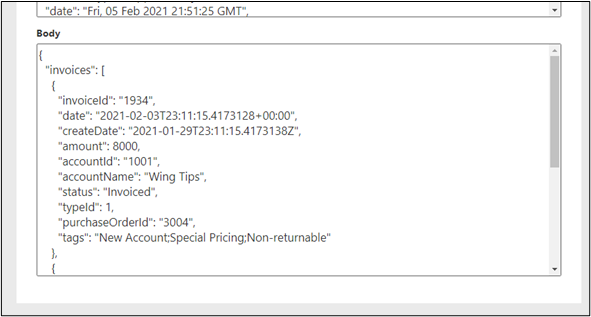

In this exercise, you'll create a policy template to set the host URL at connection creation. This would allow a connection to work with either test or production.

This exercise requires you to install Python and access the command prompt on the machine that you're using for the exercise.

> [!IMPORTANT]
> Use a test environment with Microsoft Dataverse provisioned. If you do not have one you can sign up for the [community plan](https://powerapps.microsoft.com/communityplan/?azure-portal=true).

## Task 1: Import solution

In this task, you'll import an unmanaged solution that contains a Contoso Invoicing custom connector. You'll use this connector to complete the tasks in this exercise.

1.  Navigate to [Power Apps maker portal](https://make.powerapps.com/?azure-portal=true) and make sure you are in the correct environment.

1.  Select **Solutions** and select **Import**.

1.  Select **Browse**.

1.  Select the **ContosoInvoicingPolicyTemplates_1_0_0_2.zip** solution and select **Open**.

1.  Select **Next**.

1.  Select **Import** and wait for the import to complete. You should get a success message after the import completes.

1.  Select **Publish all customizations** and wait for the publish to complete.

1.  Select to open the **Contoso Invoicing - Policy Templates** solution you imported.

1.  You should see **Contoso Invoicing - Policy** custom connector component.

    > [!div class="mx-imgBorder"]
    > [](../media/custom-connector-component.png#lightbox)

## Task 2: Install Microsoft Power Platform CLI

The Microsoft Power Platform CLI includes the paconn command-line tool is designed to aid Microsoft Power Platform custom connectors development. The paconn tool uses the Python runtime so you'll also be installing that as well.

1.  Navigate to [Download Python](https://www.python.org/downloads/?azure-portal=true) and select **Download Python**. You can use any version greater than 3.5.

1.  Select the downloaded .exe file to start installation.

1.  Check the **Add Python xx to Path** checkbox, select **install**, and wait for the installation to complete.

    > [!div class="mx-imgBorder"]
    > [](../media/python-install.png#lightbox)

1.  Close the installation wizard after the installation completes.

1.  Start command prompt and run the command below to install paconn.

    pip install paconn

    > [!div class="mx-imgBorder"]
    > [](../media/pip-install.png#lightbox)

1.  Wait for the installation to complete.

## Task 3: Download the connector locally

In this task, you'll download the connector definition files locally so you can add the Host URL property.

1.  Run the login in command.

    paconn login

1.  Copy the provided **Code**.

1.  In a browser logged in with the same credentials as your environment. Navigate to [Microsoft Device Login](https://microsoft.com/devicelogin/?azure-portal=true) paste the **Code** you copied and select **Next**.

1.  Provide your credentials.

1.  You should get a successful sign-in message.

    > [!div class="mx-imgBorder"]
    > [](../media/success-message.png#lightbox)

1.  Go back to the command prompt and run the download command.

    paconn download

1.  When prompted to select an environment, enter a number for the environment where you installed the solution and press enter.

1.  There should be just one connector listed **Contoso Invoicing Policy**. Press enter again to select that connector.

1.  The download should complete successfully. Make a note of the location where the connector was downloaded.

## Task 4: Edit apiProperties.json to add Host URL property

In this task, you'll edit apiProperties.json to configure the hostUrl property. Once configured, users creating a connection will be prompted for this value along with the API key.

1.  Go to the folder where you downloaded above and select to open the **apiProperties.json** file.

1.  Paste the json below inside the ConnectionParameters, before the "api_key" property.

    ```json
    "hostUrl": {
            "type": "string",
            "uiDefinition": {
              "constraints": {
                "required": "true"
              },
              "description": "Specify your API Url e.g. https://test.contoso.com",
              "displayName": "API URL",
              "tooltip": "Specify your API Url e.g. https://test.contoso.com"
            }
          },
    ```

    > [!div class="mx-imgBorder"]
    > [](../media/code.png#lightbox)

1.  Save your changes.

1.  Change directory to the folder you downloaded.

1.  Go back to the command prompt and run the update command.

    paconn update --api-def apiDefinition.swagger.json --api-prop apiProperties.json --icon icon.png

1.  Select the correct environment where you installed the solution.

1.  Select **Contoso Invoicing - Policy** connector.

1.  The update should complete successfully.

## Task 5: Add policy Set Host Name

In this task, you will configure a Set Host Name policy template to use the connection property you configured in the last task.

1.  Navigate to [Power Apps maker portal](https://make.powerapps.com/?azure-portal=true) and make sure you have the correct environment selected.

1.  Select Solutions and select to open the **Contoso Invoicing - Policy Template** solution you imported.

1.  Select the **Contoso Invoicing - Policy** custom connector and select **Edit**.

    > [!div class="mx-imgBorder"]
    > [](../media/edit.png#lightbox)

1.  Select the **Definition** tab.

1.  Scroll down to the **Policies** section and select **+ New policy**.

    > [!div class="mx-imgBorder"]
    > [](../media/new-policy.png#lightbox)

1.  Enter **Host URL Policy** for **Name** and select **Set host URL** for **Template**.

    > [!div class="mx-imgBorder"]
    > [](../media/set-host-url.png#lightbox)

1.  Enter **@connectionParameters('hostUrl')** for **URL Template** and select **Update connector**.

    > [!div class="mx-imgBorder"]
    > [](../media/update-connector.png#lightbox)

1.  The connector should update successfully.

1.  Don't navigate away from this page.

## Task 6: Test

In this task, you'll create a connection using the new configuration and test using it.

1.  Start a new browser window and navigate to [Contoso Invoicing](https://contosoinvoicingtest.azurewebsites.net/?azure-portal=true).

1.  Select the **API Key** link.

1.  Copy the **API Key**.

1.  Go back to the connector.

1.  Select the **Test** tab.

1.  Select **+ New connection**.

    > [!div class="mx-imgBorder"]
    > [](../media/new-connection.png#lightbox)

1.  Enter `https://contosoinvoicingtest.azurewebsites.net/` for **API URL**, paste the **API Key** you copied, and select **Create connection**.

1.  Select **Refresh connections**.

    > [!div class="mx-imgBorder"]
    > [](../media/refresh.png#lightbox)

1.  Select **ListInvoice** and select **Test operation**.

    > [!div class="mx-imgBorder"]
    > [](../media/test-operation.png#lightbox)

1. The test should return invoices.

    > [!div class="mx-imgBorder"]
    > [](../media/returned-invoices.png#lightbox)