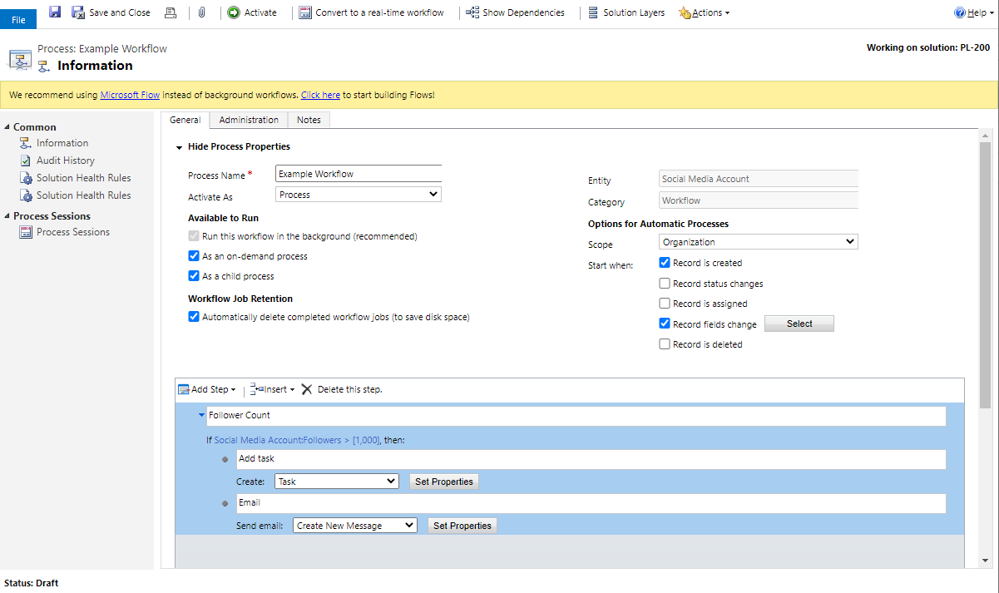

The Solution Architect is responsible for the overall design of the solution. Understanding the capabilities of Power Automate is imperative when designing the automation for the solution. This module is concerned with Power Automate and its capabilities.

## Options for automation and custom logic

Dataverse provides many options for automation and custom logic

- Business rules
- Dataverse Classic workflows
- Dataverse Plug-ins
- Power Automate cloud flows
- Power Automate desktop flows

How does the solution architect decide when they should use each of these options? We will compare these options.

## Business rules

Business rules have two purposes. The first way that business rules are used is within model-driven app forms, to change how columns are displayed. The second way that business rules are employed is at the data layer to validate data and calculate values.

Business rules:

- Are good for simple validation or setting of values.
- Are optimized to run as part of the transaction for modifications that occur on the rows.
- Can be configured to run in model-driven apps for basic UX operations like hide/show of columns.
- Cannot access related records.
- Cannot use connectors.

Business rules can be configured to run on different scopes: single form, all forms, or on table create and update operations.

## Classic workflows

Classic workflows can be used to remove the need for users to manually perform complex tasks in sequence and control the activities required to deliver business processes consistently and repetitively.

The primary scenario for Classic workflows is when real-time processing is required.

Classic workflows:

- Cannot only access related records in many-to-one relationships.
- Are limited to operations on Dataverse data

> [!IMPORTANT]
> Power Automate should be the first choice for background operations

## Plug-ins

A plug-in is a .NET assembly that you can upload to the Microsoft Dataverse. Classes within the assembly can be registered to specific events (steps) within the event framework. The code within the class provides a way for you to respond to the event so that you can augment or modify the default behavior of the platform.

Plug-ins:

- Are custom logic is an extension of the Dataverse operation.
- Have the ability to modify the request and response on the fly.
- Are able to handle complex logic.
- Require developer skills.
- Can be either synchronous or asynchronous.

## Power Automate cloud flows

Power Automate cloud flows are workflows that automate repetitive tasks and streamline processes both within and across systems.

You can use Power Automate for the following:

- Personal productivity
- Sending notifications
- Handling approvals
- Gathering data
- Automating processes
- Integrating systems
- Orchestration across systems

Power Automate cloud flows are the primary choice for non-real time automation. Power Automate cloud flows can be triggered in near real time triggering by Dataverse events.

Power Automate cloud flows can use over 400 connectors to other cloud services and data sources. Power Automate can connect to any cloud service that has a REST API by creating a custom connector.

## Power Automate desktop flows

Power Automate desktop flows are for automation where there is no connector or API available to use. There are many legacy applications that do not have a method for accessing their data or functionality except through their user interface. Power Automate desktop flows use Robotic Process Automation (RPA) techniques to automate user actions on these legacy applications.

Power Automate desktop flows can automate desktop and web applications. Power Automate desktop flows can be run attended with the user manually initiating the flow, or unattended with desktop flows running on Virtual Machines in Azure.

Power Automate desktop flows are a valid way to perform integrations and automation when there is no other alternative, or when developing an integration would be expensive and time consuming.

## Connectors for Dataverse

There are three connectors for Microsoft Dataverse:

- Dynamics 365: This connector is deprecated and should not be used.
- Common Data Service: This connector is used when you are not using solutions. It allows connection to any Dataverse environment.
- Common Data Service (Current Environment): This connector is used when you use solutions. This is the connector of choice and has more options that the other connectors and is more flexible in the triggers available.

## The cost of doing nothing

A solution architect should consider the effort it will take to build an automation and decide whether it is justified. This involves weighing business value against the cost of automating the process. Business value is the ongoing benefit that the business receives from the project.

To figure out whether it is worth automating the process, you first must understand the cost of not solving the problem. As a part of defining the business value that you hope to achieve from the Power Platform solution, you should get a better understanding of what it is costing the organization to solve the problem in the current manner. In other words, measure the cost of doing nothing.

If the business value you will receive by automating the process does not compare favorably to the cost of doing nothing, you must ask yourself whether this is the right business problem to focus on.

However, if the business value you receive by solving the business problem is greater than the cost of doing nothing, plus development time, and the monthly cost of any software licenses, it makes sense to automate the process.
