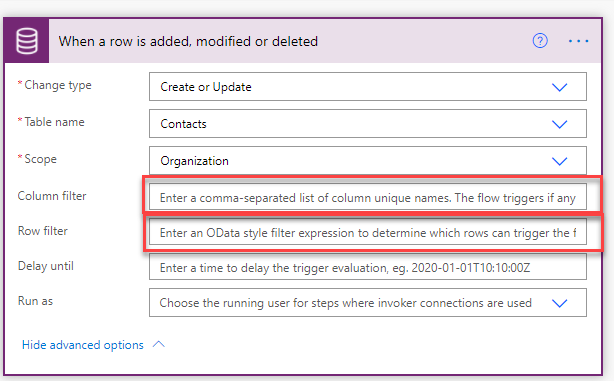

Power Automate defines a trigger as an event that starts a cloud flow. These events can be initiated by a user, are scheduled, or are generated by a connector, including custom connectors.

The triggers used in Power Automate are defined by connectors. Each connector has its own set of triggers. Connectors fall in to two groups:

Tabular: Tabular connectors are for data sources where the data is stored in tables. Dataverse is a tabular connector. Tabular connections will have triggers around creating, updating, and deleting of records.
Function-based: Function-based triggers are for cloud services such as Twitter or Outlook. The triggers are related to functions in those services. For instance, the Outlook connector has a trigger. When an email is received.

## Types of Trigger

There are three types of trigger for initiating Power Automate cloud flows:

- Automated: A flow that is started by an event defined in a connector, such as a record being created or a file being added to a file location.
- Instant: A flow that is run manually by a user, such as a button being pressed.
- Scheduled: A flow that is run on a recurring basis, such as at 9 a.m. every workday, or every hour

We will focus on using the triggers for Dataverse. Automated flows can be triggered from data events in the platform's Event Framework. The Common Data Service (current environment) connector has a single automated trigger. When a record is created, updated, or deleted.

In the trigger step, you have to specify the trigger condition:

- Create
- Create or update
- Create or delete
- Create or update or delete
- Delete
- Update
- Update or delete

The Common Data Service (current environment) connector has a single instant trigger. When a flow step is run from a business process flow. This allows a Power Automate cloud flow to be manually initiated by a user as a step in a Business process flow.

The Common Data Service connector has a single instant trigger. When a row is selected. This allows a Power Automate cloud flow to be manually initiated by a user from within a form for a row in a Model-driven app.

A common pattern used with Power Automate cloud flows is to use the Scheduled trigger to run, for example daily, retrieve all the rows due for the day and then loop through and process them.

## Poll vs Push

Triggers represent notifications to Power Automate cloud flows that an event has occurred. They are grouped into two types of triggers: Poll and Push triggers. A polling trigger makes a call into the API at a reoccurring frequency to check for new messages. When new data is available, the trigger will run the flow. Examples include timer triggers. A push trigger responds to a push of new data from the service.

Whether a triggers poll or pushes is normally invisible to you when using the triggers. The deprecated Dynamics 365 connector used polling, the more modern Common Data Service triggers use push triggers. Push are more efficient and are more real time.

Not every connector has a trigger. In such cases you can use a scheduled trigger and retrieve the data changed since the previous run, that is, use a polling pattern. If you use this pattern, you need to ensure you do not run the flow too often and should leave several minutes between each iteration.

## Using filters

The solution architect should look to minimize the number of flows runs for each cloud flow. A common mistake that many makers make with Power Automate on create and update triggers is to a) retrieve the row and b) have a condition that checks if the flow needs to do anything. With the Common Data Service connectors, you do not need to retrieve the row, the trigger step contains the new/changed data.

Additionally, like other triggers, the Common Data Service connectors can have a filter applied to the trigger. A filter will prevent the flow run being executed, reducing unnecessary executions of the flow.

In the previous diagram, the When a row is added, modified, or deleted trigger for the Common Data Service (current environment) trigger has two filters that can be used:

- Column filter: If columns are specified, the flow will only execute if any of the columns listed are modified.
- Row filter: If an OData query is specified, the filter expressions determine which rows can trigger the flow.

In Dataverse, if a column is included in a trigger's output, this does not mean that the value of the column has changed. If you need to ensure that you only process changed values, you need to use a plug-in with Pre and Post-Images.

> [!NOTE]
> Instant triggers are not currently visible from apps if the flow is in a solution.
