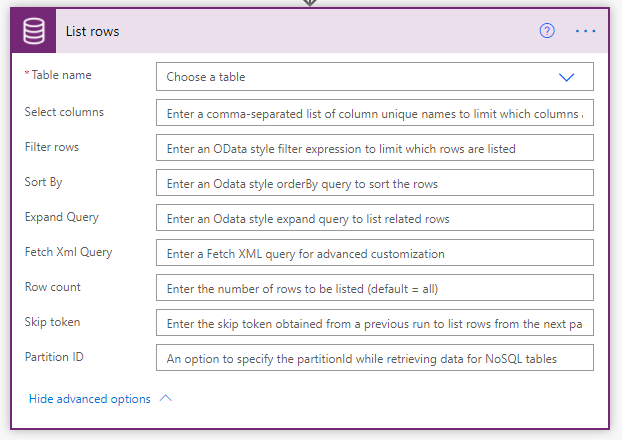

The actions that are used in Power Automate are defined by connectors. Each connector has its own set of actions. The following sections explain the common actions between Power Automate and Dataverse.

The **Dataverse** connector has the following actions:

- Create a new record
- Get record
- List records
- Update a record
- Delete a record

The **Common Dataverse (current environment)** connector has the same actions, including several more:
- Create a new row
- Get a row by ID
- List rows
- Update a row
- Delete a row
- Relate rows
- Unrelate rows
- Perform a changeset request
- Download a file or an image
- Upload a file or an image
- Perform a bound action
- Perform an unbound action
- Predict by using AI Builder models

The **Dataverse** connector also allows the creation and use of child flows.

> [!NOTE]
> The **Dataverse** connector has many advantages over other connectors and should be your first choice with Power Automate.

## Retrieve data

When using the **Get a row by ID** or **List rows** actions to retrieve data, you should make sure that you specify only the column fields that are required for the flow.

Most Dataverse triggers provide all fields, and you don’t need to explicitly retrieve the record immediately after the trigger runs. However, the following exceptions apply:

- The **When a record is selected** trigger doesn’t include many-to-one lookup fields, and a **Get a row by ID** action will be required.
- The **Delete** option only includes the ID of the row, but no other columns.

> [!NOTE]
> When you are referencing data that was previously retrieved in a flow, the data is not updated automatically after the original step runs.

## Get lists of data

The **List rows** action can help you filter data by using an OData query or a FetchXML query to retrieve data.

When using the **List rows** action, you should:

- Filter the data on the **List rows** action, not in a later step with **Data Operation** actions.
- Consider that the **Fetch Xml Query** filters can do more advanced criteria, including related entities.
- Use the **Expand Query** filter to include related rows in the result.
- Use the FetchXMl Builder tool in XrmToolBox to create your OData and FetchXML queries.
- Enable pagination if you want more than one page of data. The page size is determined by the connector, and Dataverse is 1024. Pagination is enabled through the action settings. The limit is 100,000 rows.

> [!NOTE]
> The **Expand Query** filter can help reduce the complexity of your flows, reduce the number of API calls made, and speed up your flows.

## Update data

When using the **Update a row** action, you should:

- Include only the columns that have changed. This approach avoids triggering other automation and audit logging.
- Use the null expression to clear values.
- Provide a GUID for the primary ID, if you are using an **Alternate** key, which will perform an Upsert operation by using the other data columns that you supply.

## Call custom actions

Microsoft uses the term *action* for several different behaviors in processes, for a type of process, and for steps within processes and flows. Custom actions are processes that are similar to classic workflows in their capabilities in terms of what can be performed with steps; in other words, action processes can use conditions and can create and update rows.

Custom actions are reusable processes that can be initiated from code and Power Automate. Microsoft also includes several built-in actions such as:

- **Set Word Template** - Creates a Microsoft Word document from a Word template.
- **Add To Queue** - Adds a record to a queue.

Power Automate cloud flows can call custom actions by using the **Dataverse** connector. You should use **Perform a bound action** for action processes that are associated with a table and use **Perform an unbound action** for action processes that are set as **Global**.
