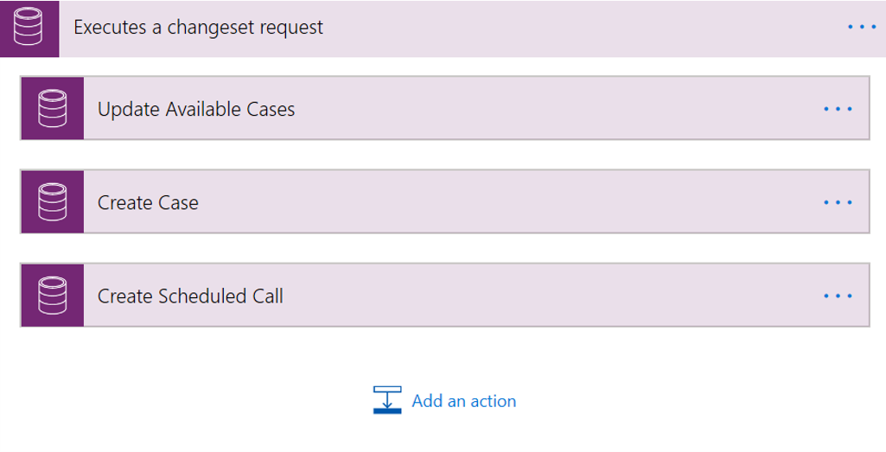

When a failure happens in a Power Automate cloud flow, the default behavior is to stop processing. You may want to handle errors and rollback earlier steps in the case of failure.

A solution architect should specify how errors are to be handled within cloud flows.

## Run after

The way errors are handled is by changing the run after settings in the steps in the flow as shown in the following image.

## Parallel branches

When using Run after you can have different actions for success and failure by using parallel branches.

## Changesets

If your flow needs to perform a series of actions on Dataverse data and you must ensure that all of these steps work or none of them work, the you should use a Changeset.

If you define a changeset, the operations run in a single transaction. If any of the steps error, the changes made by the prior steps will be rolled back.

> [!NOTE]
> Changesets are only available with the Create, Update, and Delete actions in the Common Data Service (current environment) Connector.

## API limits

The platform has API limits and service protection limits. Power Automate observes these limits; each step in a flow consumes an API call.

There are also limits for certain actions in Power Automate and for Power Automate itself:

- Many operations like Apply for Each loop only work up to 100,000 iterations. You might require partitioning work when working with large sets of items.
- The Do Until loop has a default of 60 loops or 1 hour of execution. If it exceeds these, it exits the loop without error. You can increase the number of loops and time in the settings for the action
- Flows can execute for a maximum of 30 days. You should not use long running flows; use scheduled flows that check if the row needs to be processed instead.
- Connectors have throttling limits, for instance the Common Data Service (current environment) permits only 6,000 API calls per connection every 300 seconds.
