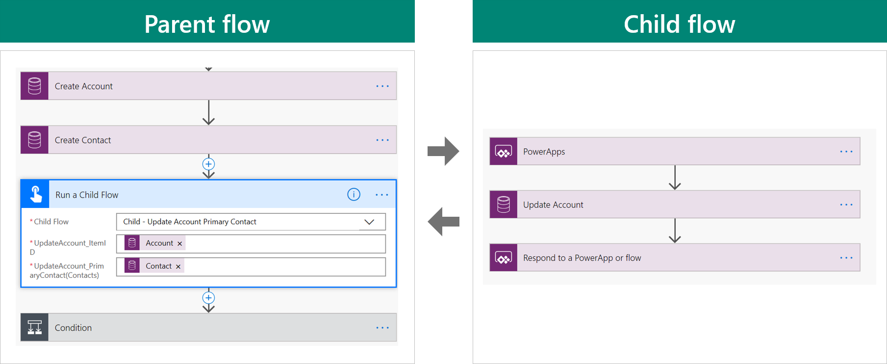

There are several things your team do to make flows they build more maintainable:

- Use meaningful naming conventions – consider both admins and users.
- Rename each action, e.g.,  List wows to List Account Contacts.
- Use comments on actions to document purpose.
- Use child flows to prevent overly complex flows or repeated logic.

## Parent and Child flows

Using child flows allows breaking out parts of a flow into reusable child flows.

To create a child flow, you must create the flow in a solution and use the Common Data Service (current environment) trigger. The child flow can use the following triggers.

- Manually triggered button
- Power Apps
- HTTP Request

The parent flow must also be in a solution, and then can use the Run a child flow action. The child flow can pass data back to the parent flow with the Power Apps or HTTP response as shown in the following image.

## Using Service Principals

When running flows, you need to understand the user context the flow runs in. For Automated an Scheduled flow, the flow runs as the owner of the flow and the existing connections in the flow are used. An owner can edit and change the connection(s) used. For Instant flows, the owner can define that the flow runs as the owner, or will run as the user and require the user to create connections using their own credentials.

By default, when adding an action and signing into a connector uses the current interactive user's credentials and thus will executes in that user's context. Alternatively, you can sign in with a service principal using an app user created in Azure AD. This allows actions to be executed using a Dataverse app user context.

