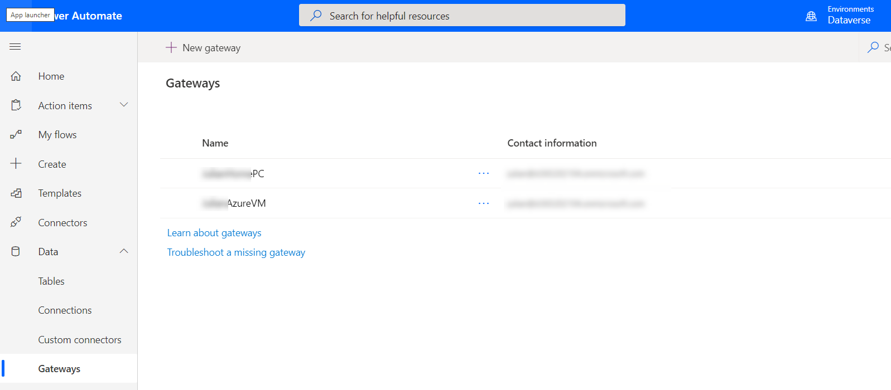

Desktop flows can be run in one of two modes:

- Attended
- Unattended

> [!div class="mx-imgBorder"]
> 

## Attended

Attended flows are aimed at automating individual tasks across desktop and web applications. The user can interact with the desktop flow if necessary, for example if a decision is required.

Attended flows are initiated on demand. A user can start an attended desktop flow from their local computer.

The user must be logged in to run an attended desktop flow.

## Unattended

Unattended desktop flows are used for high volume automation where no interaction is required. Unattended desktop flows are initiated from Power Automate cloud flows. The cloud flow sets the input variables and receives the output variables.

> [!IMPORTANT]
> If a user is logged in, an unattended desktop flow cannot run.

### Virtual machines

One option for running unattended desktop flows is to use the user's computers when they aren't working, for example overnight or at weekends. This does require the user actually signs out and the software is configured the same on each of the teams' computers. This isn't always the case.

A more robust option is to create Virtual Machines in Azure. This has several advantages:

- The software configuration can be consistent across the machines.
- The number of Virtual machines can be scaled as necessary.
- The desktop flows can run during working hours.

If using virtual machines, the solution architect will need to define the specification for the virtual machines and determine the costs of running the virtual machines. The solution architect should ensure autoscaling rules are defined to reduce costs when the virtual machines aren't required and to maximize hardware productivity.

### On-premises data gateway

An on-premises data gateway must be installed on each computer to allow the computer to take part in an unattended desktop flow. On-premise data gateways once installed, are managed from the cloud.

> [!div class="mx-imgBorder"]
> 

Gateways can be grouped into clusters that will run instances of a desktop flow.

> [!div class="mx-imgBorder"]
> 

The solution architect should define the clusters that are required and the priorities for desktop flow jobs.
