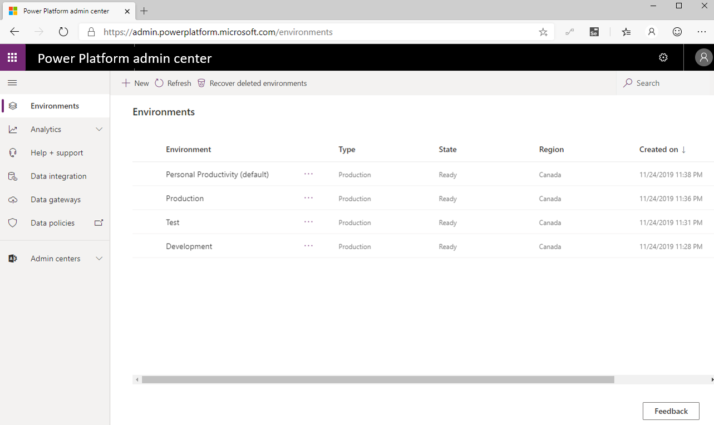

Environments are an important consideration when you are trying to help secure and
govern Power Apps and Power Automate usage. Environments act as a security
container for apps and flows to run within. Every flow must be
assigned to an environment. Every licensed user belongs to the default environment.

Additional environments can be provisioned where opt-in access is possible.
A strategy that some organizations adopt includes [renaming the default environment](/power-platform/admin/environments-administration?azure-portal=true#rename-your-environment)
to be called **Personal Productivity**, which implies permission to build
flows that improve their own productivity.

Organizations can subsequently create additional environments for development,
testing, and production purposes. Using this strategy might also align flow creation
with existing IT change management requirements.

By default, anyone can create environments, but administrators can also
[control who can create and manage environments in Microsoft Power Platform Admin center](/power-platform/admin/control-environment-creation/?azure-portal=true) and
limit it to a set of administrators.

When creating an environment, organizations can choose which region they
want their environment to reside in. This approach is important because it allows
organizations to store data closer to actual users and to maintain
and meet compliance requirements for their geography. Regions already
available to store data include Asia, Australia, Canada, Europe, France, India,
Japan, South America, United Kingdom, United States, and US Government (GCC).

Regions are also important when it comes to Admin Analytics because the
Microsoft Power Platform Analytics feature isolates analytics through
environments. The telemetry that is generated in one region is not
allowed to leave that region. For administrators to view analytics, they
need to select an environment first before they can view telemetry.
