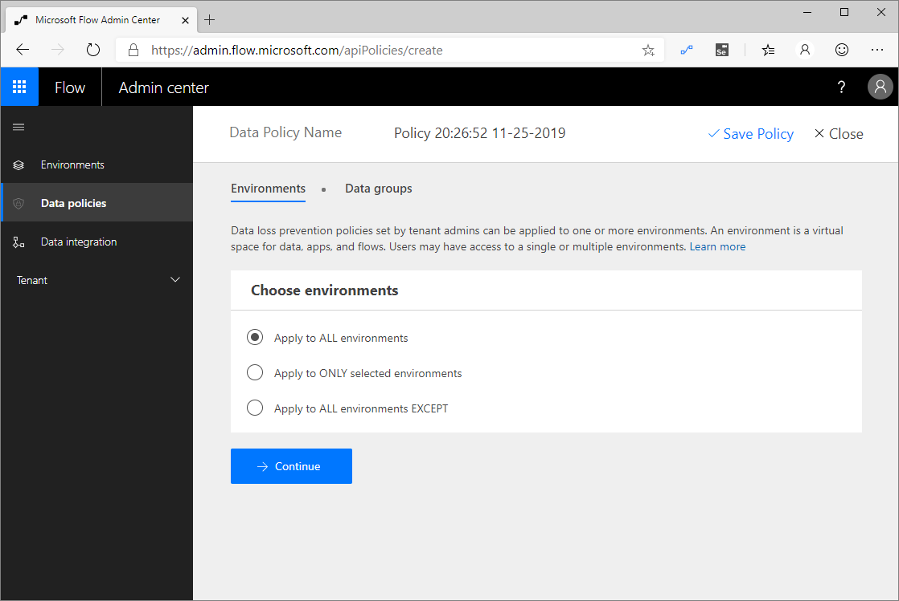

Data Loss Prevention (DLP) policies allow organizations to construct
rules that permit and prevent connectors from communicating with each
other within the same flow. Microsoft accomplishes this by establishing
two data groups: **Business data only** and **No business data
allowed**. The intent of these two data groups is to put connectors, who
have the same data profile, in the same data group. By grouping
connectors, those connectors can communicate with each other within the
same data group, but are not able to communicate across data groups.

To illustrate this concept, consider the following scenario where we
have connectors that have been distributed across the two data groups.
We want to build a flow that includes the **Microsoft Word Online**,
**Approvals** and **Power BI connectors**. Since all of these connectors
belong to the **Business data only** data group, this flow can safely be
created and executed. Similarly, in the **No business data allowed**
data group we can combine the **Salesforce**, **Dropbox** and **10to8
Appointment** connectors within the same flow as all these connectors
belong to the same data group. However, we cannot create a flow that
includes the **SQL Server** connector and **Act!** connector as these
connectors belong to different data groups. If we did want to create a
flow that included these two connectors, we will need to move one of the
connectors into the other data group.

Also notice that you can specify one data group to be the default data
group. Beside the name of the default data group we will see the
**(Default)** label appended. To change the default data group, click on
the ellipses (**...**) in the upper right corner of the data group.

The default data group is significant as it becomes the data group that
all new connectors get added to. For example, if Microsoft deploys a new
connector to the Power Automate service, that connector will be added to
the default data group. This behavior is also true for custom connectors
that get deployed to an environment.

There are a couple different scopes that DLP policies can belong to:
environment and tenant. An environment scoped DLP policy only applies to
that specific environment. Whereas a tenant scoped DLP policy applies to
all environments in that tenant. When creating a new DLP policy, the
policy author has a few options that they can choose, including the
ability to **Apply to** **ALL environments** (tenant), **Apply to ONLY
selected environments** and **Apply to All environments EXCEPT.**

When a DLP author selects **Apply to ALL environments,** this setting
also ensures that new environments have this DLP policy applied.

Environments can have multiple DLP policies applied, which provides for
more governance scenarios to be implemented. However, when multiple DLP
policies have been implemented, the most restrictive policy is applied.
We will further discuss DLP policy layering in the **Planning** module.

Configuring DLP policies is very dependent upon an organization's design
and cyber security principles. For some organizations, they may allow
for the mixing of business-related connectors with consumer-based
services. Other organizations may choose to strictly prevent
business-related connectors from connecting with consumer-based
services. Organizations should begin by cataloguing the business systems
that exist within their organization and then create DLP policies that
align with that business mapping. We will further discuss DLP strategies
in the **Implementation Recommendations** module.

Organizations should also carefully evaluate which data group they would
like to declare as their default data group. Regardless of which data
group they designate, administrators should pay attention to new
connectors that are being deployed into environments so they can place
them into the appropriate data group. We will further discuss how
administrators can detect these new connector events in the **Relevant
Templates** module.
