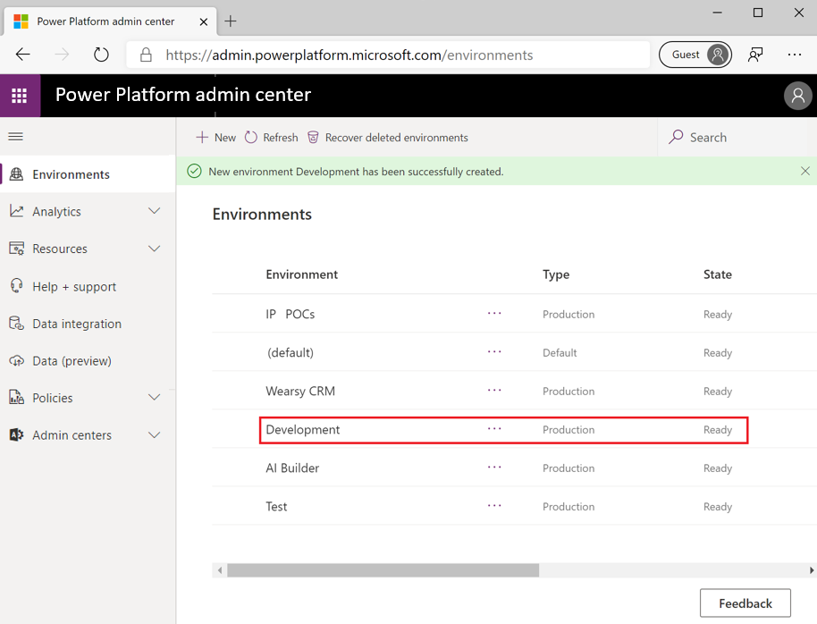

In this exercise, we are going to create a Power Automate environment by completing the following steps:

1.  To complete this exercise, ensure that your account meets the following [licensing criteria](https://docs.microsoft.com/power-platform/admin/create-environment#who-can-create-environments/?azure-portal=true). 
If necessary, sign up for a [trial account](https://flow.microsoft.com/#home-signup/?azure-portal=true).

2.  Log into the [Power Platform Admin Center](https://admin.powerplatform.microsoft.com/?azure-portal=true).

3.  Click on **Environments** from the left navigation pane.

4.  Click on **+ New**.

	

5.  Provide a **Name** of **Development** and select a **Type** of
    environment. Depending upon your circumstances, create a **Trial** or
    **Production** environment. If you plan to dispose pf this environment
    after you complete this learning path, choose **Trial**. If you anticipate this
    environment will be used beyond 30 days, choose **Production**.

	> [!NOTE]
	>  When selecting the **Type** of environment, we do have three options including: Sandbox, Production and Trial. Sandbox environments are for building proof of concept applications and flows that may need to be reset without recreating the entire environment. Production environments are suited for stable workloads where you have predictable usage. Trial environments will expire after 30 days. These environments are best suited for evaluating technologies.

6.  Choose an appropriate **Region** for your organization, provide a
    relevant **Purpose** for this environment and indicate that you
    would like a **Database** to be created. Once you have populated
    these values, click on the **Next** button to proceed.

	When deciding to include a database for future environments, 
    evaluate how the environment will be used. For example, if you 
    have plans to use the Common Data Service, AI Builder, UI Flows 
    or apps that use Common Data Service, then you need to include 
    a database in your environment. If you have no plans to use these 
    features, then a database is not required.

	

7.  Provide the **Language** of your choice and **Currency**. For the purposes of this exercise, 
    we will not enable    **Dynamics 365 apps** or **sample apps and data**. Click **Save** to 
    create your environment.

8.  After a couple minutes, your environment should be provisioned 
    and you should see the following status message being
    displayed in the admin center. You may need to press **Refresh** to
    get the **State** field to update.

	
