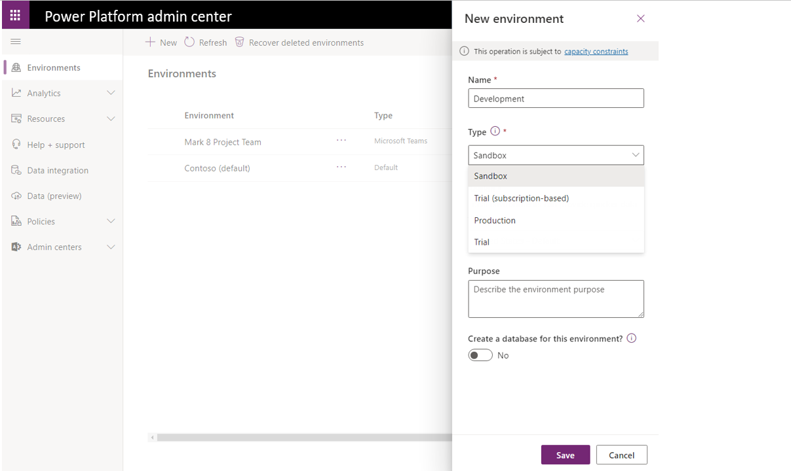

In this exercise, you'll create a Power Automate environment by completing the following steps:

1. To complete this exercise, ensure that your account meets the licensing criteria discussed
here in the [Who can create environments](https://docs.microsoft.com/power-platform/admin/create-environment#who-can-create-environments/?azure-portal=true) section.
If necessary, sign up for a [trial Power Automate account](https://flow.microsoft.com/#home-signup/?azure-portal=true).

2. Sign in to the [Power Platform Admin Center](https://admin.powerplatform.microsoft.com/?azure-portal=true).

3. Select **Environments** from the left navigation pane.

4. Select **+ New**.

    

5. Provide a **Name** of **Development** and then select a **Type** of
    environment. Depending on your circumstances, create a **Trial** or
    **Production** environment. If you plan to dispose of this environment
    after completing the modules in this learning path, select **Trial**.
    If you anticipate that this environment will be used beyond 30 days,
    select **Production**.

    > [!NOTE]
    >  When selecting the **Type** of environment, you do have three options: **Sandbox**, **Production**, and **Trial**. Sandbox environments are for building proof-of-concept applications and flows that might need to be reset without recreating the entire environment. Production environments are suited for stable workloads where you have predictable usage. Trial environments will expire after 30 days. These environments are best suited for evaluating technologies.

6. Select an appropriate **Region** for your organization, provide a
    relevant **Purpose** for this environment, and indicate that you
    want a **Database** to be created. After you have populated
    these values, select the **Next** button to proceed.

    When deciding to include a database for future environments,
    evaluate how the environment will be used. For example, if you
    have plans to use Microsoft Dataverse, AI Builder, UI flows,
    or apps that use Dataverse, then you need to include
    a database in your environment. If you have no plans to use these
    features, then a database is not required.

    

7. Provide the **Language** of your choice and **Currency**. For the purposes of this exercise,
    do not enable Dynamics 365 apps or sample apps and data. Select **Save** to
    create your environment.

8. After a couple minutes, your environment should be provisioned
    and you should see the following status message
    displayed in the Admin center. You might need to select **Refresh** for
    the **State** field to update.

    
